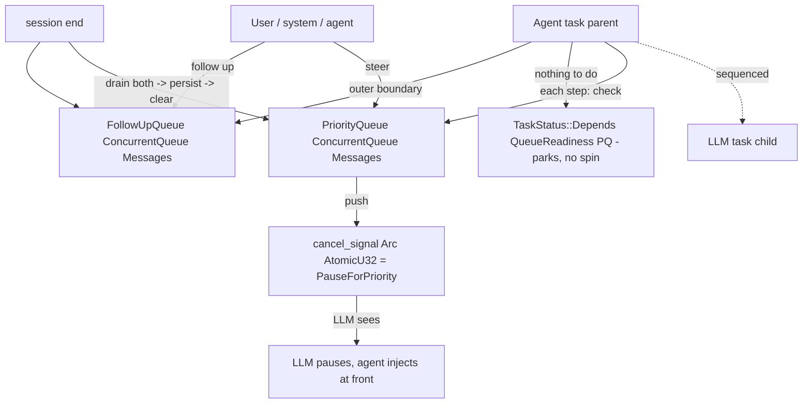

# Feature 25: Steering Queues & Depends

> **Review status (2026-06-14) — self-review against code (subagent unavailable):**
> 1. **Decision 05's `pub enum CancelCode: u32 { None = 0, .. }` is INVALID Rust** (line 36) — Rust has
>    no `enum: u32` syntax. The correct form is `#[repr(u32)] pub enum CancelCode { None = 0,
>    PauseForPriority = 1, Abort = 2 }`. F25 ships the valid version. The signal itself is an
>    `Arc<AtomicU32>` carrying `CancelCode as u32` (Decision 05 line 32 `cancel_signal: Arc<AtomicU32>`).
> 2. **`ConcurrentQueue` is the `concurrent_queue` crate** (verified: `task.rs:4`, `synca/mpp.rs:6`
>    both `use concurrent_queue::ConcurrentQueue`), already a workspace dep. Queues are
>    `Arc<ConcurrentQueue<Messages>>` (Decision 05 line 31-32) — `push`/`pop`/`is_empty` from that crate.
>    Steering messages are **always `Messages::User`** (Decision 05 line 26); the **queue** decides
>    urgency, not the message — same message in PriorityQueue interrupts, in FollowUpQueue defers.
> 3. **`Depends` + `QueueReadiness` ALREADY EXIST and are the whole point** (verified
>    `task.rs:91-116`): `QueueReadiness<T>(Arc<ConcurrentQueue<T>>)` impls `EventReadiness`
>    (`is_ready = !queue.is_empty()`), and `TaskStatus::Depends(Arc<dyn EventReadiness>)` (`task.rs:253`)
>    parks the task until ready. So the agent waiting for steering / follow-up uses
>    `TaskStatus::Depends(Arc::new(QueueReadiness::new(queue)))` — **NOT** a `Pending`/`Delayed` spin
>    (Decision 08 TODO line 132; requirements §8). `BoolSignal` (`task.rs:44`) is the cancel-ready
>    primitive. F25 does NOT build these — it consumes them and the `MessageRole` enum is from F01.
> 4. **Decision 05's `DualSequeunceChildAndParentLinkedTask` is the sequenced composition** (Decision 05
>    line 52/69, from valtron's `dependent_lift.rs`): the agent (parent) polls between each LLM (child)
>    step, giving it a chance to check the PriorityQueue and set the cancel signal mid-generation.
>    **Verify the exact valtron API name** (`sequenced()` spawn) before coding — Decision 05 names it but
>    I have not opened `dependent_lift.rs`. (OD-25-4.)
> 5. **F25 is consumed by F23 (tool interruption) and F27 (the loop).** F25 owns the *primitives*
>    (queues, `CancelCode`, the readiness wiring, the sequenced-composition helper); F23 checks the
>    PriorityQueue between tool stages; F27 drains PriorityQueue at the FRONT of the inner loop and
>    FollowUpQueue at the outer-loop boundary (Decision 05 §Agent Loop Integration). Keep the boundary
>    crisp: F25 = mechanism, F23/F27 = policy.
> 6. **PriorityQueue interrupts, FollowUpQueue does NOT** (Decision 05 table): PriorityQueue sets the
>    cancel signal checked each LLM/tool step; FollowUpQueue never sets it and is read only at the outer
>    boundary. On session end (F31/Decision 01), both queues are drained → persisted to the Message API
>    → cleared; nothing survives resume.

> Implements Decision 05 (queues) + Decision 08 (`Depends`). Owns the steering **primitives**: the two
> `Arc<ConcurrentQueue<Messages>>` queues, a valid `#[repr(u32)] CancelCode`, the sequenced agent+LLM
> composition, and the `TaskStatus::Depends(QueueReadiness)` waits that keep the loop off the CPU.

## WHY: Problem Statement

A user must be able to both **interrupt** ("stop, do this now") and **defer** ("after that, also do
this") an in-flight session. One queue can't serve both — interruption cancels in-progress work; defer
waits for completion (Decision 05). And the agent must wait for queue/tool readiness **without
spinning** `Pending` in a tight loop (Decision 08's explicit TODO; requirements §8) — valtron's
`Depends` + `QueueReadiness` exist precisely for this. This feature provides those primitives so F23
and F27 can implement interruption/continuation policy on top.

## WHAT: Solution

```rust
// backends/foundation_ai/src/agentic/queues.rs
use concurrent_queue::ConcurrentQueue;
use foundation_core::valtron::{EventReadiness, QueueReadiness, BoolSignal, TaskStatus};

#[repr(u32)]                       // VALID Rust (Decision 05's `enum: u32` was not)
#[derive(Debug, Clone, Copy, PartialEq, Eq)]
pub enum CancelCode { None = 0, PauseForPriority = 1, Abort = 2 }

pub struct SteeringQueues {
    pub priority: Arc<ConcurrentQueue<Messages>>,   // Messages::User — interrupt now
    pub followup: Arc<ConcurrentQueue<Messages>>,   // Messages::User — defer to outer boundary
    pub cancel_signal: Arc<AtomicU32>,              // holds CancelCode as u32
}

impl SteeringQueues {
    pub fn new() -> Self;                                   // both unbounded, signal = None
    pub fn steer(&self, msg: Messages);                    // push to priority + set PauseForPriority
    pub fn follow_up(&self, msg: Messages);                // push to followup (no signal)
    pub fn set_cancel(&self, code: CancelCode);            // store(code as u32)
    pub fn cancel_code(&self) -> CancelCode;               // load → CancelCode
    pub fn clear_cancel(&self);                            // store(None)

    /// Readiness signal for TaskStatus::Depends — parks the agent until priority steering arrives.
    pub fn priority_readiness(&self) -> Arc<dyn EventReadiness>;   // QueueReadiness::new(priority)
    pub fn followup_readiness(&self) -> Arc<dyn EventReadiness>;   // QueueReadiness::new(followup)

    /// Drain on session end (Decision 01): pop all → caller persists to Message API → clear.
    pub fn drain_priority(&self) -> Vec<Messages>;
    pub fn drain_followup(&self) -> Vec<Messages>;
}
```

### Using `Depends` instead of spinning (Decision 08)

```rust
// In the agent loop (F27) when there is nothing to do but await steering/follow-up:
fn next_status(&mut self) -> Option<TaskStatus<R, P, S>> {
    if let Ok(msg) = self.queues.priority.pop() { /* handle interrupt */ }
    // else park until the priority queue is non-empty — zero CPU spin:
    Some(TaskStatus::Depends(self.queues.priority_readiness()))
}
```

### Sequenced agent+LLM composition (interrupt mid-generation)

The agent (parent) is composed with the LLM task (child) via valtron's **sequenced** mode
(`DualSequeunceChildAndParentLinkedTask`, Decision 05). Each executor step: LLM yields one
token/pending, then the agent runs once — checks `priority`, and if non-empty sets
`cancel_signal = PauseForPriority`; the LLM observes the signal on its next step and pauses, the agent
drains the queue and injects at the FRONT of the message list. This gives interruption **between every
LLM iteration**, not just after the full response.

| Queue | Interrupts LLM? | Interrupts tools? | Checked | Sets cancel? |
|-------|-----------------|-------------------|---------|--------------|
| **PriorityQueue** | yes | yes (F23) | each LLM/tool step | `PauseForPriority` |
| **FollowUpQueue** | no | no | outer-loop boundary (F27) | never |

## Architecture



## Fundamentals Documentation (zero-to-expert) — REQUIRED

Author `fundamentals/` covering: steering vs follow-up (interrupt-now vs defer, why two queues beat
priority levels); lock-free `ConcurrentQueue` producer/consumer; **`#[repr(u32)]` enums + atomic signal
codes** (why `AtomicU32` beats `AtomicBool` for multi-state cancel; the invalid `enum: u32` syntax
pitfall); **`TaskStatus::Depends` + `EventReadiness`/`QueueReadiness`** (parking a task until a queue is
non-empty — zero-spin waiting vs `Pending`/`Delayed` busy loops, and the wasm relevance); valtron
**sequenced** composition (`DualSequeunceChildAndParentLinkedTask`) for mid-generation interruption;
drain-persist-clear on session end. (Task — see list.)

## HOW: Implementation Steps

1. `#[repr(u32)] CancelCode` (valid syntax) + `Arc<AtomicU32>` get/set/clear helpers.
2. `SteeringQueues` over `Arc<ConcurrentQueue<Messages>>` (priority + followup); `steer`/`follow_up`.
3. `priority_readiness`/`followup_readiness` returning `Arc<dyn EventReadiness>` (`QueueReadiness`).
4. `drain_*` for session end (caller persists to Message API, then clears).
5. Sequenced composition helper: compose an agent parent with an LLM child via valtron `sequenced`
   (verify the exact spawn API in `dependent_lift.rs`, OD-25-4).
6. Tests: steer sets cancel signal; follow_up does not; `Depends(QueueReadiness)` parks then wakes on
   push (no spin); drain returns + clears; CancelCode round-trips through AtomicU32; multi-producer
   push from several "sources" all land as `Messages::User`; wasm build.

## Open Decisions

- **OD-25-1 — queue bound:** unbounded (rec, Decision 05 uses ConcurrentQueue without backpressure) vs
  bounded with force-flush. Rec: unbounded; steering volume is low.
- **OD-25-2 — steer auto-sets signal:** `steer()` pushes AND sets `PauseForPriority` (rec) vs caller
  sets separately. Rec: auto-set (atomic intent).
- **OD-25-3 — Abort semantics:** `Abort` ends the session vs only the current turn. Rec: `Abort` ends
  the turn (loop returns to outer boundary); session end is `end()` (F31). Confirm.
- **OD-25-4 — sequenced spawn API:** confirm the valtron `sequenced()`/`DualSequeunceChildAndParentLinkedTask`
  entrypoint name + signature in `dependent_lift.rs` before coding. Flag.
- **OD-25-5 — readiness timeout:** `Depends` `is_ready(dur)` — pass `None` (immediate, executor parks)
  vs a timeout. Rec: `None` (full park; the executor wakes on push).

## Target Files

- `backends/foundation_ai/src/agentic/queues.rs` (new) — `SteeringQueues`, `CancelCode`
- coordinates F01 (`Messages`/`MessageRole`), valtron (`ConcurrentQueue`, `QueueReadiness`,
  `EventReadiness`, `TaskStatus::Depends`, sequenced), F23 (tool interruption), F27 (loop policy),
  F31 (drain on end)

## Tests

```bash
cargo test -p foundation_ai -- agentic::queues
cargo build -p foundation_ai --no-default-features --features agentic --target wasm32-unknown-unknown
```

## Verification

```bash
cargo build -p foundation_ai
cargo build -p foundation_ai --no-default-features --features agentic --target wasm32-unknown-unknown
cargo clippy -p foundation_ai -- -D warnings
cargo test  -p foundation_ai -- agentic::queues
```

## Done When

- `PriorityQueue`/`FollowUpQueue` (`Arc<ConcurrentQueue<Messages>>`) + a valid `#[repr(u32)] CancelCode`
  over `Arc<AtomicU32>`; priority steering sets the cancel signal, follow-up does not; queue waits use
  `TaskStatus::Depends(QueueReadiness)` (no `Pending`/`Delayed` spin); sequenced agent+LLM composition
  enables mid-generation interruption; drain-persist-clear on end; builds native + wasm.
- OD-25-1..5 resolved (OD-25-4 flagged); fundamentals authored.
