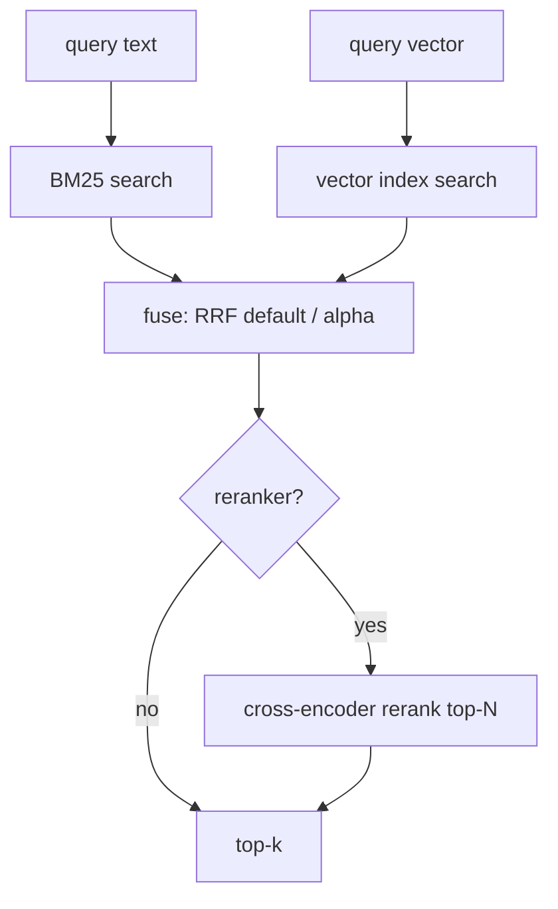

# Feature 26: foundation_vectors — BM25 + hybrid fusion

> **RESEARCH REQUIRED:** Fundamentals docs must cover BM25 scoring, inverted indexes, tokenization/
> stemming, hybrid retrieval, RRF, and cross-encoder reranking from zero to expert. Web research
> needed to validate parameter defaults and platform-specific tokenizer availability.

> Implements Decision 07's **TODO #7**: pure vector search misses exact keyword matches; pure keyword
> misses semantic intent. The production answer is a **hybrid** of BM25 (keyword) + vector
> (semantic), fused with Reciprocal Rank Fusion (RRF). Adds BM25 and the fusion layer to
> `foundation_vectors`. Pure Rust, WASM-safe.

## WHY: Problem Statement

Semantic recall over messages/observations (F16) needs both: "find where I mentioned `auth_check(`"
(exact keyword → BM25) and "what did I decide about authentication?" (semantic → vector). Running
both and fusing the rankings (RRF — no score normalization needed) captures both. Decision 07 also
notes alpha-weighting and cross-encoder rerank as alternatives. We own the algorithms (consistency,
WASM).

## WHAT: Solution

### BM25 keyword index

```rust
/// Classic BM25 over a tokenized corpus. Higher score = more relevant (matches F24 convention).
/// &self everywhere (Decision 08) — interior RwLock for concurrent insert/search.
pub struct Bm25Index { inner: RwLock<Bm25Inner> /* inverted index: term → postings(doc_id, tf); doc lengths; avgdl; df */ }

impl Bm25Index {
    pub fn new(tokenizer: Box<dyn Tokenizer>) -> Self;
    pub fn insert(&self, id: &str, text: &str);    // tokenize → update postings (&self + write lock)
    pub fn remove(&self, id: &str);                 // &self + write lock
    pub fn search(&self, query: &str, k: usize) -> Vec<VectorMatch>;  // BM25(k1=1.2, b=0.75), read lock
    pub fn to_bytes(&self) -> Vec<u8>;              // persistence (F29)
}
pub fn load_bm25(bytes: &[u8]) -> Result<Bm25Index, VectorError>;  // reconstruct from bytes
```

- **Tokenization (OD-26-1 resolved):** two-tier via a `Tokenizer` trait:

  ```rust
  pub trait Tokenizer: Send + Sync {
      fn tokenize(&self, text: &str) -> Vec<String>;
  }

  pub struct SimpleTokenizer;      // lowercase + unicode word-split, always available, zero deps
  pub struct NlpRuleTokenizer;     // nlprule-based: stemming, lemmatization, sentence-split
  ```

  **`NlpRuleTokenizer`** (nlprule crate) is the default on platforms where it builds (native +
  emscripten); **`SimpleTokenizer`** is the fallback on wasm or when nlprule data files are absent.
  The index is constructed with a tokenizer instance — no feature flag, runtime selection. nlprule
  ships Rust-native language data for English (primary); additional languages are additive.
  `SimpleTokenizer` handles the cold-start and any platform where nlprule can't build.
- **Params:** `k1=1.2`, `b=0.75` defaults (tunable). Standard BM25 scoring with `df`/`idf`,
  term-frequency saturation, length normalization.
- Returns `VectorMatch { id, score }` (BM25 score; higher better) — same shape as vector results so
  fusion is uniform.

### Hybrid fusion

```rust
pub enum FusionStrategy {
    /// Reciprocal Rank Fusion (default): score = Σ 1/(rrf_k + rank_i). No score normalization.
    Rrf { k: f32 },               // rrf_k default 60
    /// Weighted sum of min-max-normalized scores. alpha=1.0 pure vector, 0.0 pure BM25.
    Alpha { alpha: f32 },
}

/// Fuse two ranked lists (vector + BM25) into one top-k.
pub fn fuse(vector: &[VectorMatch], keyword: &[VectorMatch], k: usize, strat: FusionStrategy)
    -> Vec<VectorMatch>;
```

- **RRF (default):** rank-based, robust, no score-scale issues across BM25 vs cosine. Decision 07's
  recommended default.
- **Alpha:** min-max normalize each list, weighted sum. Needs score normalization (the thing RRF
  avoids) — offered for tuning.
- **Rerank (concrete implementation, OD-26-2 resolved):** a cross-encoder pass over the fused top-N
  for precision. Both the trait AND a concrete `ModelReranker` are implemented here:

  ```rust
  pub trait Reranker: Send + Sync {
      fn rerank(&self, query: &str, candidates: Vec<VectorMatch>, texts: &[&str]) -> Vec<VectorMatch>;
  }

  /// Routes (query, candidate_text) pairs through the agentic ProviderRouter (F12) to get a
  /// relevance score per pair. Re-sorts candidates by model-assigned relevance, returns top-k.
  pub struct ModelReranker { router: Arc<dyn RoutableProvider> }
  impl Reranker for ModelReranker { /* score pairs via router, re-sort by relevance */ }
  ```

  `hybrid_search` accepts `Option<&dyn Reranker>` — when provided, the fused top-N is re-ranked
  before returning top-k. The `ModelReranker` uses the session's embedding/chat model via F12's
  `RoutableProvider` to score relevance (a lightweight inference call, not a full generation).

### Hybrid search entry point

```rust
/// Run vector + BM25 in parallel (native) / sequentially (wasm), fuse, optionally rerank.
pub fn hybrid_search(
    query_text: &str, query_vector: &[f32],
    vector_index: &dyn VectorIndex, bm25: &Bm25Index,
    k: usize, strat: FusionStrategy, reranker: Option<&dyn Reranker>,
) -> Vec<VectorMatch>;
```

Retrieve top-N from each (N≥k, e.g. 2k), fuse to k, optional rerank. Used by F16's `search()`
(semantic + memory + graph).

## Architecture



## HOW: Implementation Steps

1. `Bm25Index` — tokenizer, inverted index, BM25 scoring, insert/remove, serialize.
2. `FusionStrategy` + `fuse` (RRF + alpha); RRF rank-based, alpha min-max normalized.
3. `Reranker` trait + `ModelReranker` (concrete, routes through F12) + `hybrid_search` orchestration.
4. Tests: BM25 correctness vs known rankings; RRF fusion on synthetic lists; alpha bounds (0→BM25,
   1→vector); hybrid end-to-end with F24/F25 indexes; serialize round-trip; wasm32 build.

## Open Decisions

- **OD-26-1 — tokenization: RESOLVED (user, 2026-06-15).** Implement BOTH: `SimpleTokenizer`
  (lowercase + unicode word-split, fallback) AND `NlpRuleTokenizer` (nlprule crate, stemming/
  lemmatization, default where it builds). Pluggable `Tokenizer` trait. No "deferred" — get it right
  at the start.

- **OD-26-2 — reranker: RESOLVED (user, 2026-06-15).** Implement BOTH: the `Reranker` trait AND a
  concrete `ModelReranker` that routes through F12's `RoutableProvider`. Not hook-only — full depth.

- **OD-26-3 — RRF default k: RESOLVED (user, 2026-06-15).** 60 (common default), configurable.

- **OD-26-4 — BM25 persistence: RESOLVED (user, 2026-06-15; Item #7 / §H4).** The index **trait exposes
  `to_bytes()`/`from_bytes()`** (self-contained, trivial to unit-test); the **backend** (disk/R2/KV/fjall)
  decides where to persist the bytes. The BM25 **inverted index is columnar → arrow is the default
  encoding** (near-zero-copy); plain serde for smaller structures. Same `to_bytes`/`from_bytes` shape as
  `VectorIndex` (F28/F29).


- **OD-26-5 — where hybrid lives: RESOLVED (user, 2026-06-15).** The `fuse()` function (named for
  "rank fusion" — merging two ranked result lists into one, NOT the FUSE filesystem) and the BM25
  primitives live in `foundation_vectors` (algorithms crate). F16 wires the actual session search by
  calling `hybrid_search()` from here. Clarification: `fuse(vector_results, keyword_results, k,
  strategy)` takes two `Vec<VectorMatch>` and produces one merged `Vec<VectorMatch>` — it is a pure
  rank-fusion function, nothing to do with filesystems.

## Target Files

- `backends/foundation_vectors/src/{bm25.rs, fusion.rs, hybrid.rs}` (new)
- builds on F24 (`VectorMatch`), F25 (`VectorIndex`)

## Tests

```bash
cargo test -p foundation_vectors -- bm25 fusion hybrid
cargo build -p foundation_vectors --target wasm32-unknown-unknown
```

## Verification

```bash
cargo build -p foundation_vectors --all-features
cargo build -p foundation_vectors --target wasm32-unknown-unknown
cargo clippy -p foundation_vectors --all-features -- -D warnings
cargo test  -p foundation_vectors
```

## Fundamentals Documentation (zero-to-expert) — REQUIRED

Author `fundamentals/` covering: information retrieval basics; TF-IDF & **BM25** (term frequency
saturation `k1`, length normalization `b`, idf); inverted indexes & tokenization/stemming; **hybrid
retrieval** & why fusion is needed; **Reciprocal Rank Fusion** (rank-based, no score normalization)
vs alpha-weighting (min-max); cross-encoder rerankers. (Task — see list.)

## Done When

- `Bm25Index` (`&self`, interior `RwLock`, insert/search/remove/serialize) is correct; two tokenizers
  implemented (`SimpleTokenizer` + `NlpRuleTokenizer`); `fuse` (RRF default + alpha) and
  `hybrid_search` work with F24/F25 indexes; `ModelReranker` (concrete, via F12) + `Reranker` trait.
- Builds native + wasm (nlprule on native, simple-unicode fallback on wasm); BM25 + fusion + rerank
  tested vs known rankings.
- OD-26-1..5 resolved.
