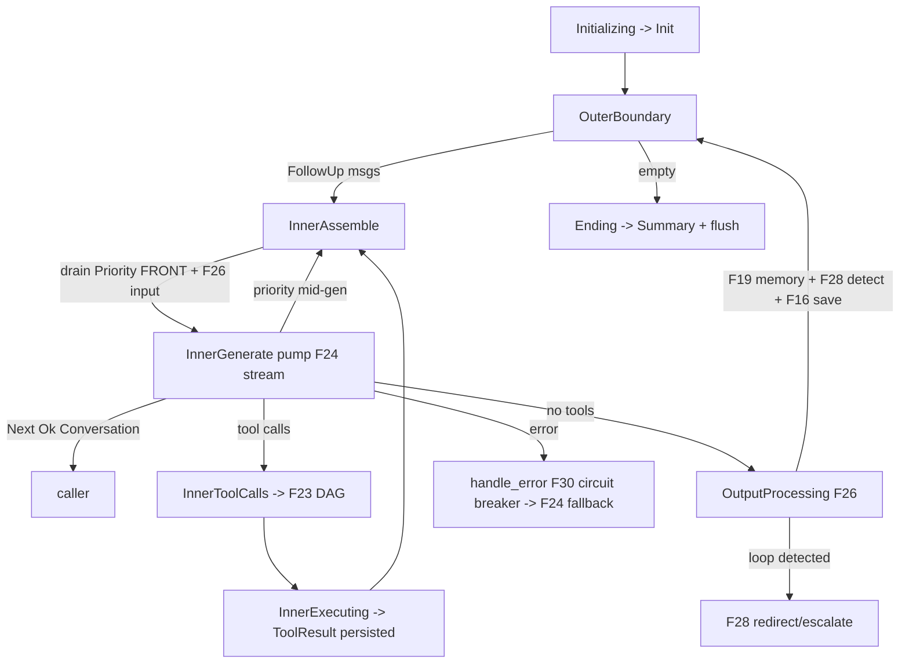

# Feature 27: Agentic Loop

> **Review status (2026-06-14) — self-review against code (subagent unavailable):**
> 1. **The stream contract is F02's, and F02 already RESOLVED Decision 11's "this is all stupid" TODO**
>    (Decision 11 line 145). F02 pins it:
>    `StreamIterator<D = SessionRecord, P = AgentProgress>` — **pure `SessionRecord`
>    on `Stream::Next`** (errors are `SessionRecord::FailedAction` records, NOT a `Result`), thin
>    `AgentProgress` on `Pending`. So F27 emits
>    `TaskStatus::Ready(SessionRecord::Conversation{ message })` for real messages (NOT the
>    `AgentEvent{MessageUpdate{content:String}}` Decision 08/11 sketched — those `String`-payload events
>    are SUPERSEDED). `AgentProgress` (F02:79) carries the "expect-next" status only. Decision 08/11's
>    `AgentEvent` enum is **dead** — do not implement it.
> 2. **The loop is a `TaskIterator`** (`task.rs:392`): `type Ready = SessionRecord` (errors are
>    `SessionRecord::FailedAction` records, not a `Result`), `type Pending = AgentProgress`,
>    `type Spawner = <object-safe action>` (Decision 08 line 137 used `BoxedSendExecutionAction` — verify
>    the real spawner type), `fn next_status(&mut self) -> Option<TaskStatus<..>>` (:412). It returns
>    `Init` on setup, `Pending(AgentProgress)` while working, `Ready(SessionRecord)` per record (a failure
>    is `Ready(SessionRecord::FailedAction{..})`), **`Depends`** when waiting on queues/tools (F25/F23),
>    never a `Pending` spin.
> 3. **The loop ORCHESTRATES; it owns almost no logic.** It sequences: F26 input pipeline → F24 generate/
>    stream → extract tool calls → F23 execute workflow → F26 output pipeline (which fires F19 memory +
>    F28 loop detection) → F25 queue checks. Decision 05 §Agent Loop Integration + Decision 11 §Loop
>    Structure are the exact control flow. F27 must NOT re-implement memory/tools/detection — it drives them.
> 4. **Inner loop = tool calls + steering; outer loop = follow-up** (Decision 05/11). Inner: drain
>    PriorityQueue at FRONT (Decision 11 line 43) → if steering, F23 cancel → input pipeline → generate →
>    tool calls? → F23 execute → repeat-inner-if-more-tools. Outer: after inner settles, run output
>    pipeline, check FollowUpQueue → continue-outer-if-messages else end. **PriorityQueue front-inject is
>    load-bearing** (interrupt overrides current direction).
> 5. **Mid-generation interruption uses F25's sequenced composition** (Decision 05): the LLM generate/
>    stream runs as a child task sequenced under the loop so the loop checks PriorityQueue between LLM
>    steps and sets `CancelCode::PauseForPriority`. With F24's **boxed** stream (`Box<dyn StreamIterator>`,
>    F24 OD-24-2), the loop pumps the stream and interleaves queue checks. (OD-27-3.)
> 6. **Errors via `Stream::Next(SessionRecord::FailedAction{ error, trace })`** (F30/Decision 16, F01 §5): generation errors → F30 circuit
>    breaker (`handle_error` → Continue/RetryReducedContext/SwitchModel/Terminate); tool errors already
>    became `ToolResult{error_detail}` in F23 (back to LLM, loop continues); loop detection → redirect
>    from memory (F28). The loop's `handle_error` is Decision 16's `AgentAction` dispatcher.
> 7. **Circuit breaker needs the multi-provider router** (F24 + Decision 16 §Circuit Breaker): on repeated
>    generation failure, switch `current_model` to a fallback via F24. `AgentConfig{ primary_model,
>    fallback_models, memory_model, circuit_breaker_threshold, .. }` (Decision 16 line 257). F24's `Vec`
>    routes enable same-model multi-provider fallback later.
> 8. **No blocking, ever.** Generate/stream pumped step-wise; tool execution is F23's task; memory/detect
>    are spawned. Waits are `TaskStatus::Depends`; backoff is `Delayed` (never `SleepIterator`); on wasm
>    the valtron engine yields to the JS loop. (requirements §8, memory `feedback_async_iterators`.)

> Implements Decision 11 (inner/outer loop) + Decision 08 (valtron `TaskIterator`) on F02's stream
> contract. The orchestrator that drives the whole turn: processors → model (routed) → tool DAG →
> processors, with steering interruption, follow-up continuation, memory triggers, loop detection, and
> the circuit breaker. Emits rich `SessionRecord` on `Next`, thin `AgentProgress` on `Pending`.

## WHY: Problem Statement

Everything else in this spec is a component; nothing yet runs a *turn*. The loop is the spine: it must
assemble context, call the (routed) model, extract and execute tool calls in dependency order, persist
everything, feed results back, distil memory, detect loops, accept steering mid-flight, continue on
follow-up, and stream rich records + thin progress to the caller — all as a non-blocking valtron task
that survives interruption and resumes deterministically. This feature is that orchestrator.

## WHAT: Solution

```rust
// backends/foundation_ai/src/agentic/loop.rs
pub struct AgentLoop {
    session: Arc<SessionInner>,   // F31 bundle: message_api, context(F18), tools(F23), queues(F25),
                                  // router(F24), memory(F19), detector(F28), processors(F26), ledger(F03)
    state: AgentLoopState,
    current_model: ModelId,
    failure_count: u32,
    config: AgentConfig,
}

pub enum AgentLoopState {
    Initializing,
    OuterBoundary,                      // check FollowUpQueue / end
    InnerAssemble,                      // run input processors → AgentContext
    InnerGenerate { stream: Box<dyn StreamIterator<D = Messages, P = ModelState>> }, // F24, pumped
    InnerToolCalls { calls: Vec<ToolCallRequest> },
    InnerExecuting { task: ToolCallExecTask },   // F23
    OutputProcessing { turn: TurnOutput },        // run output processors (memory/detect/save)
    Ending,
}

impl TaskIterator for AgentLoop {
    type Ready   = SessionRecord;   // F02 contract — errors are SessionRecord::FailedAction, not a Result
    type Pending = AgentProgress;                          // F02
    type Spawner = BoxedSendExecutionAction;               // verify real type

    fn next_status(&mut self) -> Option<TaskStatus<Self::Ready, Self::Pending, Self::Spawner>> {
        // state machine implementing Decision 11 §Loop Structure (see HOW)
    }
}
```

### Control flow (Decision 05/11)

```text
Initializing -> Init ; load context (resume = F31)
OuterBoundary:
    drain FollowUpQueue (F25) -> if msgs, append as pending User, -> InnerAssemble
    else -> Ending
InnerAssemble:
    drain PriorityQueue at FRONT (F25) -> if steering: F23.cancel(); inject at front
    InputPipeline.run(&mut ctx) (F26)  -> InnerGenerate
InnerGenerate (sequenced under loop for interruption, F25/OD-27-3):
    pump F24 stream; Pending(AgentProgress::Generating); on each msg -> Ready(Conversation{message:msg})
    between steps: check PriorityQueue -> set PauseForPriority -> break to InnerAssemble
    on done: extract tool calls
        has tools -> InnerToolCalls ; none -> OutputProcessing
InnerToolCalls -> F23.execute_workflow -> InnerExecuting
InnerExecuting:
    drive ToolCallExecTask; Ready(Conversation{message:ToolResult}) per result (already persisted, F23)
    on complete -> InnerAssemble (feed results back to LLM)   # inner loop repeats
OutputProcessing:
    OutputPipeline.run (F26) -> fires F19 memory triggers, F28 loop detect, F16 save (spawned)
    loop detected? -> handle (F28 redirect / escalate)
    -> OuterBoundary
Ending -> Ready(SessionRecord::Summary{..}) (F02 OD-02-6) ; flush (F16/F31)
```

### Error / circuit breaker (F30 / Decision 16)

```rust
// `report: ErrorTrace<AgenticError>` (foundation_errstacks) — `classify` reads the context kind.
fn handle_error(&mut self, report: ErrorTrace<AgenticError>) -> TaskStatus<...> {
    match self.session.errors.classify(&report) {   // F30
        AgentAction::Continue              => /* tool error already a ToolResult; keep going */,
        AgentAction::RetryWithReducedContext => /* Messages::is_context_overflow → trim, retry */,
        AgentAction::SwitchModel           => { self.current_model = self.next_fallback()?; /* F24 */ },
        AgentAction::Terminate(report)     => return Some(TaskStatus::Ready(SessionRecord::FailedAction{
                                                  error: report.current_context().clone(),
                                                  trace: report.to_structured() })),
    }
}
```

### Waiting without spinning

When parked on steering/follow-up/tool readiness, return `TaskStatus::Depends(readiness)` (F25
`QueueReadiness` / F23 result readiness) — never `Pending` in a tight loop. Backoff (retry) is F23's
`Delayed`.

## Architecture



## Fundamentals Documentation (zero-to-expert) — REQUIRED

Author `fundamentals/` covering: the agentic loop (inner tool-call loop vs outer follow-up loop, why
the nesting maps to interrupt-now vs defer); the ReAct-style generate→tool→observe cycle; **driving an
LLM stream step-wise as a valtron `TaskIterator`** (pumping `Box<dyn StreamIterator>`, emitting rich
`SessionRecord` on `Next` + `AgentProgress` on `Pending`, the expect-next protocol); cooperative
interruption (front-injection, sequenced composition, cancel signal) and zero-spin waiting
(`Depends`); orchestration-vs-logic (the loop sequences components, owns none); circuit-breaker model
fallback; non-blocking discipline (no `sleep`, `Delayed`/`Depends`, wasm JS-loop yielding). (Task —
see list.)

## HOW: Implementation Steps

1. `AgentLoop` + `AgentLoopState`; `TaskIterator` impl (`Ready = SessionRecord` — errors are
   `SessionRecord::FailedAction`, `Pending = AgentProgress`) — verify the real `Spawner` type.
2. `Initializing` (load context / F31 resume) → `Init`.
3. `OuterBoundary`: FollowUpQueue drain (F25) → continue or `Ending`.
4. `InnerAssemble`: PriorityQueue front-drain + F23 cancel on steering; F26 input pipeline.
5. `InnerGenerate`: pump F24 stream sequenced for interruption; emit `Ready(Conversation)` +
   `Pending(Generating)`; mid-gen priority check (OD-27-3); extract tool calls.
6. `InnerToolCalls`/`InnerExecuting`: F23 workflow; emit persisted `ToolResult`s; loop back to assemble.
7. `OutputProcessing`: F26 output pipeline (F19 memory, F28 detect, F16 save); handle loop detection.
8. `handle_error` (F30 `AgentAction`) + circuit breaker model switch via F24.
9. `Ending`: emit `Summary` (F02 OD-02-6), flush (F16/F31).
10. Waits via `Depends`; never block; backoff via F23 `Delayed`.
11. Tests (mostly via F32 MockModelProvider): full turn no-tools; turn with parallel tool calls;
    inner-loop repeats until no tools; PriorityQueue interrupts mid-generation (front-inject);
    FollowUpQueue continues outer; memory trigger fires at threshold; loop detection redirects; circuit
    breaker switches model on repeated failure; error surfaces as `Next(FailedAction)`; resume mid-session;
    `Depends` parks (no spin); wasm build.

## Open Decisions

- **OD-27-1 — Ready payload:** `SessionRecord` (F02 rec) vs `Messages`. F02 already chose `SessionRecord`
  (superset: conversation + memory on one stream). Confirm alignment with F02 OD-02-1.
- **OD-27-2 — AgentEvent is dead:** confirm Decision 08/11's `AgentEvent{MessageUpdate{String}}` enum is
  NOT implemented (superseded by rich `SessionRecord` on `Next`, F02). Rec: dead — delete from scope.
- **OD-27-3 — mid-gen interruption (load-bearing):** sequenced composition pumping F24's boxed stream
  with between-step PriorityQueue checks. Rec: yes; confirm the boxed stream is pumpable step-wise.
- **OD-27-4 — inner-loop termination:** inner repeats while the LLM emits tool calls; a max-iterations
  guard prevents runaway (independent of F28 loop detection). Rec: add `config.max_inner_iterations`.
- **OD-27-5 — Summary record:** emit `SessionRecord::Summary{ message_count, usage }` at end (F02
  OD-02-6 adds the variant to F01). Confirm F01 has it.

## Target Files

- `backends/foundation_ai/src/agentic/loop.rs` (new) — `AgentLoop`, `AgentLoopState`
- coordinates F02 (stream contract), F03 (ledger), F16 (save/recent), F18 (context), F19 (memory),
  F23 (tool DAG), F24 (router), F25 (queues/cancel/sequenced), F26 (processors), F28 (loop detection),
  F30 (errors/circuit breaker), F31 (session bundle + resume)

## Tests

```bash
cargo test -p foundation_ai -- agentic::loop
cargo build -p foundation_ai --no-default-features --features agentic --target wasm32-unknown-unknown
```

## Verification

```bash
cargo build -p foundation_ai
cargo build -p foundation_ai --no-default-features --features agentic --target wasm32-unknown-unknown
cargo clippy -p foundation_ai -- -D warnings
cargo test  -p foundation_ai -- agentic::loop
```

## Done When

- `AgentLoop` is a valtron `TaskIterator` emitting `Stream::Next(SessionRecord)` + `Pending(AgentProgress)`
  (errors as `Next(SessionRecord::FailedAction)`), running the inner (tools+steering) / outer (follow-up) loop per Decision 05/11;
  PriorityQueue interrupts mid-generation with front-injection; FollowUpQueue continues; F26 processors,
  F19 memory, F28 detection, F30 circuit breaker all wired; waits via `Depends` (no spin); the dead
  `AgentEvent` enum is NOT implemented; builds native + wasm.
- OD-27-1..5 resolved (OD-27-2/27-3 flagged); fundamentals authored.
