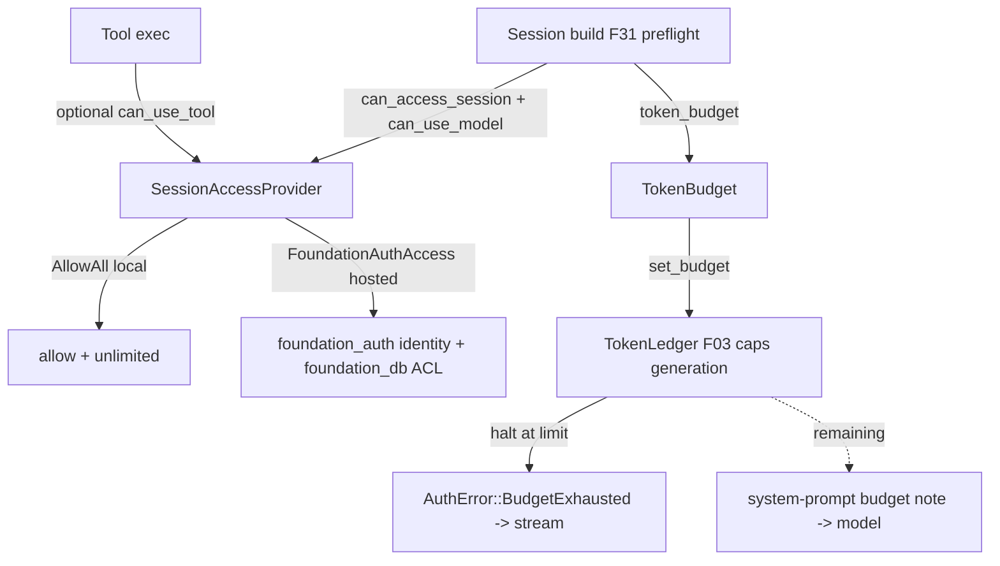

# Feature 29: Access Control & Budget Surfacing

> **Review status (2026-06-14) — self-review against code (subagent unavailable):**
> 1. **The naming collision is REAL and verified.** `foundation_ai::types::AuthProvider`
>    (`types/mod.rs:1457`) is `trait AuthProvider { fn auth(&self) -> Option<&AuthCredential>; }` — it
>    supplies **provider (Anthropic/OpenAI) CREDENTIALS** to a `ModelProvider` (it is `ModelProvider::
>    Config: AuthProvider`, :1462). Decision 12 reused the name `AuthProvider` for session ACL (Decision
>    12 line 132) — that would **shadow/clash**. So the agentic access trait MUST be named
>    **`SessionAccessProvider`** (requirements §6, F16 task). Different concern, different name.
> 2. **`foundation_auth` exists** (`backends/foundation_auth`) with `AuthCredential`/`AuthToken`
>    (OAuth/Jwt/Session/ApiKey, `shared/auth_token.rs:16`) — it is **credential/token** machinery, not a
>    session-ACL or budget store. So F29 defines its OWN `SessionAccessProvider` trait (the security
>    boundary Decision 12 §Rationale justifies) and *bridges* to `foundation_auth` for identity, rather
>    than consuming a ready-made ACL from it. (OD-29-2.)
> 3. **Decision 12's `UserId` collides with nothing but doesn't exist yet** — define `UserId(String)`
>    (or reuse a `foundation_auth` user id if present — none found in shared). `AuthError` is referenced
>    by F30's `AgenticError::Auth(#[from] AuthError)` (Decision 16 line 65) — F29 owns `AuthError`, and it
>    must be `Clone+PartialEq+Debug` so it rides the F02 error stream (F30). (OD-29-3.)
> 4. **The user's TODOs on Decision 12 reshape the scope.** Decision 12 line 9: "Locally we don't need
>    auth — add an always-allowed implementation." → `AllowAllAccess` (every check returns true; budget =
>    unlimited). Decision 12 line 12: "The Agent owns the session, unsure why access control matters" →
>    F29 keeps the trait MINIMAL (ownership + budget), and the heavy RBAC/tool-gating Decision 12 sketched
>    is **optional/server-side**, not required for local. So the core surface is: can this user use this
>    session, can they use this model, what's their token budget. (OD-29-1.)
> 5. **Budget surfacing is the load-bearing new behavior.** The provider retrieves the user's remaining
>    token budget and **surfaces the limit to the model** — concretely, it caps F03's `TokenLedger`
>    budget (`03-token-accounting-budget/feature.md:52` `TokenLedger` has a configurable max-token budget
>    that halts generation). So `SessionAccessProvider::token_budget(user)` → set as the ledger's budget
>    at session build; when the ledger halts (F03), the session reports the limit. The model also *sees*
>    the remaining budget (a system-prompt note) so it can be concise. (OD-29-4.)
> 6. **Tool-call gating is OPTIONAL** (Decision 12 §Tool Call Permission Gating). For local/AllowAll it's
>    a no-op. If present, F23's `execute_workflow` consults `SessionAccessProvider::can_use_tool` before a
>    stage and surfaces `AgenticError::ToolNotAuthorized` (Decision 16 line 33). Wire the hook; default
>    allow-all. (OD-29-5.)

> Implements Decision 12 (DB+auth integration), corrected. Owns the **`SessionAccessProvider`** trait
> (renamed to avoid the `foundation_ai::AuthProvider` credentials collision), an **`AllowAllAccess`**
> impl for local/no-auth, **token-budget retrieval surfaced to the model** (via F03's ledger), and a
> bridge to `foundation_auth`. Storage stays direct-on-`foundation_db` (Decision 12 §No Intermediate
> Layer) — F29 adds only the auth/budget boundary.

## WHY: Problem Statement

The platform serves multiple users, but locally there is no auth (Decision 12 user TODO). The agent
needs one clean boundary that (a) defaults to allow-everything locally, (b) can gate session/model
access and retrieve a per-user token budget in a hosted setting, and (c) surfaces that budget to the
model so it stays within limits. It must NOT collide with the existing `foundation_ai::AuthProvider`
(which feeds provider credentials, an entirely different thing).

## WHAT: Solution

```rust
// backends/foundation_ai/src/agentic/access.rs
#[derive(Debug, Clone, PartialEq, Eq, Hash)]
pub struct UserId(pub String);

#[derive(Debug, Clone, PartialEq)]      // rides AgenticError (F30) — Clone+PartialEq+Debug
pub enum AuthError {
    Unauthenticated,
    SessionForbidden { session: SessionId, user: UserId },
    ModelForbidden   { model: ModelId, user: UserId },
    BudgetExhausted  { user: UserId, limit: u64 },
    Backend(String),
}

pub struct TokenBudget { pub limit: Option<u64>, pub used: u64 }  // None = unlimited

/// The agentic access boundary — DISTINCT from foundation_ai::AuthProvider (provider credentials).
pub trait SessionAccessProvider: Send + Sync {
    /// May this user open/continue this session? (Owner / shared_with — Decision 12.)
    fn can_access_session(&self, user: &UserId, session: &SessionId) -> Result<bool, AuthError>;
    /// May this user use this model?
    fn can_use_model(&self, user: &UserId, model: &ModelId) -> Result<bool, AuthError>;
    /// May this user run this tool? (Optional gating; default true.)
    fn can_use_tool(&self, _user: &UserId, _tool: &str) -> Result<bool, AuthError> { Ok(true) }
    /// The user's remaining token budget — surfaced to the model + caps F03's ledger.
    fn token_budget(&self, user: &UserId) -> Result<TokenBudget, AuthError>;
    /// Record consumption (billing/tracking) — default no-op.
    fn record_usage(&self, _user: &UserId, _tokens: u64) -> Result<(), AuthError> { Ok(()) }
}

/// Local / no-auth: everything allowed, unlimited budget.
pub struct AllowAllAccess;
impl SessionAccessProvider for AllowAllAccess {
    fn can_access_session(&self, _u: &UserId, _s: &SessionId) -> Result<bool, AuthError> { Ok(true) }
    fn can_use_model(&self, _u: &UserId, _m: &ModelId) -> Result<bool, AuthError> { Ok(true) }
    fn token_budget(&self, _u: &UserId) -> Result<TokenBudget, AuthError> {
        Ok(TokenBudget { limit: None, used: 0 })   // unlimited
    }
}
```

### Budget surfacing (the load-bearing behavior, OD-29-4)

```text
session build (F31 preflight):
    budget = access.token_budget(user)
    if let Some(limit) = budget.limit: ledger.set_budget(limit - budget.used)   // F03 caps generation
    context note: "You have ~{remaining} tokens of budget for this session."     // model sees it
runtime:
    F03 ledger halts generation when budget hit -> AgenticError / AuthError::BudgetExhausted surfaced
    on turn end: access.record_usage(user, turn_tokens)
```

### foundation_auth bridge (OD-29-2)

`foundation_auth` provides identity (`AuthToken`/`AuthCredential`). A `FoundationAuthAccess` adapter
maps an authenticated `AuthToken` → `UserId` and looks up ACL/budget from a `foundation_db` store
(Decision 12 keys `session:{id}:metadata` with `owner_id`/`shared_with`). This adapter is the hosted
path; `AllowAllAccess` is the local path.

## Architecture



## Fundamentals Documentation (zero-to-expert) — REQUIRED

Author `fundamentals/` covering: authn vs authz vs credentials (and why naming a session-ACL trait
`AuthProvider` collides with a provider-credentials trait — the rename rationale); the allow-all local
pattern (zero-friction dev, opt-in hosting); token budgets & cost governance (retrieving a per-user
limit, capping generation via the ledger, surfacing the remaining budget to the model so it self-limits);
bridging an external auth crate (identity → UserId → ACL/budget lookup) without coupling the agent to
it; making auth errors `Clone+PartialEq` for the error stream; the security-boundary exception to "no
intermediate traits" (Decision 12). (Task — see list.)

## HOW: Implementation Steps

1. `UserId`, `AuthError` (`Clone+PartialEq+Debug`), `TokenBudget`.
2. `SessionAccessProvider` trait (session/model/tool checks + budget + usage; defaults for optional).
3. `AllowAllAccess` (allow-all, unlimited) — the local default.
4. Budget surfacing: `token_budget` → F03 `ledger.set_budget`; system-prompt remaining-budget note.
5. `FoundationAuthAccess` bridge: `AuthToken` → `UserId`, ACL/budget from `foundation_db` metadata.
6. Optional tool gating hook for F23 (`can_use_tool`, default allow).
7. Tests: AllowAll allows everything + unlimited budget; budget caps the ledger (generation halts at
   limit → `BudgetExhausted`); session/model forbidden errors; remaining-budget note present; bridge
   maps token→user; `AuthError` is `Clone+PartialEq`; wasm build.

## Open Decisions

- **OD-29-1 — trait minimality:** core = session + model + budget; tool-gating + RBAC optional (rec, per
  user's Decision 12 TODO "Agent owns the session"). Confirm the minimal surface.
- **OD-29-2 — foundation_auth coupling:** bridge adapter (rec) — don't make `foundation_auth` a hard dep
  of the core trait; `AllowAllAccess` needs no auth crate. Confirm.
- **OD-29-3 — UserId source:** define `UserId(String)` here vs reuse a `foundation_auth` id (none found).
  Rec: define here; bridge maps.
- **OD-29-4 — budget surfacing mechanism (load-bearing):** cap F03 ledger + system-prompt note (rec) vs
  only error-on-exhaust. Rec: both (proactive note + hard cap). Confirm.
- **OD-29-5 — tool gating placement:** F23 consults `can_use_tool` before a stage (rec, default allow)
  vs F20 at registration. Rec: F23 (per-call, per-user). Confirm.

## Target Files

- `backends/foundation_ai/src/agentic/access.rs` (new) — `SessionAccessProvider`, `AllowAllAccess`,
  `UserId`, `AuthError`, `TokenBudget`, `FoundationAuthAccess` bridge
- coordinates F03 (`TokenLedger` budget cap), F01 (`SessionId`/`ModelId`), F23 (tool gating), F30
  (`AgenticError::Auth`/`ToolNotAuthorized`), F31 (preflight checks), `foundation_auth` (identity)

## Tests

```bash
cargo test -p foundation_ai -- agentic::access
cargo build -p foundation_ai --no-default-features --features agentic --target wasm32-unknown-unknown
```

## Verification

```bash
cargo build -p foundation_ai
cargo build -p foundation_ai --no-default-features --features agentic --target wasm32-unknown-unknown
cargo clippy -p foundation_ai -- -D warnings
cargo test  -p foundation_ai -- agentic::access
```

## Done When

- `SessionAccessProvider` (renamed — no clash with `foundation_ai::AuthProvider`) + `AllowAllAccess`
  (local default, unlimited); token budget retrieved and surfaced to the model (caps F03's ledger +
  system-prompt note); `foundation_auth` bridge for hosted identity/ACL; optional tool gating hook for
  F23; `AuthError` is `Clone+PartialEq+Debug`; builds native + wasm.
- OD-29-1..5 resolved (OD-29-4 flagged); fundamentals authored.
