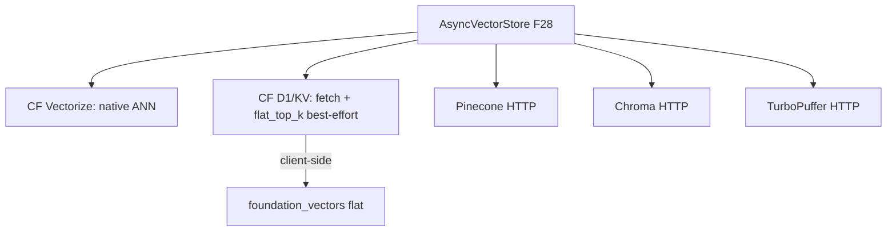

# Feature 30: VectorStore — Cloudflare + external backends

> **RESEARCH REQUIRED:** Fundamentals docs must cover managed/serverless vector DBs (CF Vectorize,
> TurboPuffer REST API), fetch-then-search vs native ANN, wasm HTTP transport, and credential
> management. Web research needed to validate CF Vectorize binding availability (OD-30-1) and
> TurboPuffer REST API shape. If CF Vectorize doesn't have a runtime binding, don't force it — use
> their API if available, otherwise focus on D1 fetch-then-search.

> **Review status (2026-06-14) — broken references + a decision conflict:**
> 1. **F28 never actually defines `AsyncVectorStore`** (it's only in F28's review note, not its trait
>    block) — this dependency is a phantom until **F28's WHAT/HOW/Done-When add the
>    `AsyncVectorStore` signature** (a single `Send` async trait — Item #1 / §A1 / F00e, **not** `?Send`),
>    or F30 owns defining it.
> 2. **External vector DBs — RESOLVED (user, 2026-06-15):** they ARE supported, **behind the existing
>    `VectorStore`/`AsyncVectorStore` trait** (F28) — Decision 07's blanket rejection is reversed (a
>    decisions write-back must amend Decision 07 to record this). **Scope now:** **TurboPuffer is a
>    REQUIRED implementation** — a thin native HTTP adapter over our own HTTP client against its REST
>    API (no third-party crate needed). **Pinecone + Chroma are DEFERRED** — trait-ready, not
>    implemented now. So 14b ships TurboPuffer.
> 3. **No CF Vectorize runtime binding exists** (only deployment DTOs in `foundation_deployment`) —
>    OD-30-1 resolves to **"absent — greenfield `bindgen/cf/vectorize.rs`"**; size accordingly.
> 4. **CF D1/KV inherit F23's hard limits**: KV `list` can't paginate past 1000 yet (binding fix is a
>    prerequisite — recall is *truncated*, not just best-effort); D1 has no batch/`exec()`.
> 5. **Provider impedance mismatch**: Chroma *collections* (own dim/metric/lifecycle) vs Pinecone/
>    TurboPuffer *namespaces* (partitions). Map F28's `namespace: String` per provider; define index/
>    collection provisioning + who creates/deletes (OD-30-7). Dimension is server-side/async-fail for
>    external providers (deviates from F28's insert-time check).
> 6. **Commit the 14a (CF, wasm) / 14b (external HTTP, native) split** (OD-30-2). Client-side flat
>    search over fetched D1/KV vectors needs a **hard cap + truncation policy** (OD-30-8). Credentials
>    via `SessionAccessProvider` makes **F08 a dependency** (declare it) (OD-30-9).
> (Note: the Chroma exploration is at `@formulas/.../src.VectorDB/src.Chroma`, **outside this repo** —
> reference its public REST API, don't assume in-repo source.)

> Implements Decision 07's Cloudflare backends + Decision 03b's external managed vector DBs, behind
> the F28 **`AsyncVectorStore`** trait. Completes the VectorStore backend set (in-memory F28, native
> F29, CF+external F30). Lowest priority — the in-memory + native backends cover the core use cases;
> these are for serverless / large-scale managed deployments.

## WHY: Problem Statement

Serverless (CF Workers) and large managed deployments need vector storage beyond local. CF
**Vectorize** (native ANN) or D1/KV (fetch-then-`foundation_vectors`) cover wasm/edge; Pinecone/
Chroma/TurboPuffer cover managed scale. All behind one trait so the agentic layer is backend-agnostic.

## WHAT: Solution

All implement **`AsyncVectorStore`** (one unified `Send` async trait — Item #1 / §A1 / F00e; single-threaded
wasm wraps the `!Send` fetch/Promise futures in `SendWrapper`) — these are network/Promise-based.

### Cloudflare

- **Vectorize** (if available in the Workers binding): native ANN `query()`; namespace via metadata
  filter. Preferred CF path. **Research:** is the Vectorize binding exposed in our worker stack?
- **D1 / KV fallback:** store vectors as BLOB (D1) / JSON (KV); **fetch namespace-scoped set +
  client-side `foundation_vectors::flat_top_k`**. Bounded by collection size (CF KV 1000-key cap +
  eventual consistency — inherits F23's caveats). Best-effort for large sets.

### External managed (native HTTP) — scoped per user ruling (2026-06-15)

The `VectorStore`/`AsyncVectorStore` trait (F28) is the well-structured seam; external providers are
adapters behind it. **Scope now:**
- **TurboPuffer — REQUIRED.** A thin native `AsyncVectorStore` adapter over our own HTTP client
  against the **TurboPuffer REST API** (`upsert`/`query`/`delete` namespaces). No third-party crate —
  we own the adapter. Chosen as the supported external for its simple REST model + serverless pricing.
- **Pinecone + Chroma — DEFERRED.** The trait makes them droppable later; no adapter is written now.
- Namespace = the provider's native namespace concept; dimension = provider index config (server-side,
  async-fail — deviates from F28's local insert-time check). Native-only (HTTP transport; 00c). API
  keys via config / `SessionAccessProvider` (F08), never committed.

### Shared

- Same `insert/query(namespace)/delete` semantics; dimension enforced; namespace isolation.
- Result re-ranking uses `foundation_vectors` only when the backend lacks native ANN (D1/KV).
- Feature-gated per backend (pull only what a deployment needs).

## Architecture



## Fundamentals Documentation (zero-to-expert) — REQUIRED

Author `fundamentals/` covering: managed/serverless vector DBs (CF Vectorize, Pinecone, Chroma,
TurboPuffer) — their data models, namespaces, ANN indexes; fetch-then-search vs native ANN; the cost
of client-side search at scale (CF KV caps, round-trips); async `?Send` HTTP on wasm vs native;
provider REST API adapters; when to relax ordering/consistency guarantees. (Task — see list.)

## HOW: Implementation Steps

1. Research: CF Vectorize binding availability; the **TurboPuffer REST API** (auth, namespaces,
   upsert/query/delete shapes, dimension/metric config).
2. CF D1/KV `AsyncVectorStore` (fetch + flat fallback) — reuse F23 D1/KV bindings + caveats.
3. CF Vectorize backend (if available) — native ANN.
4. **TurboPuffer `AsyncVectorStore` REST adapter** (native, feature-gated) — required.
   Pinecone/Chroma deferred (trait-ready, not implemented).
5. Dimension + namespace each; mock-binding/mock-HTTP tests + opt-in live integration.

## Open Decisions

- **OD-30-1 — CF Vectorize availability:** is the binding in our worker stack? If yes, prefer it over
  D1/KV fetch-then-search. Research.
- **OD-30-2 — external scope: RESOLVED (user, 2026-06-15).** TurboPuffer REQUIRED (native REST
  adapter); Pinecone + Chroma deferred. **Updated: TurboPuffer should work on wasm too** — if it's
  HTTP, wasm can call it via F00f's `FetchHttpClient` (wasm fetch over `web_sys`). The split becomes:
  - **14a (CF native: Vectorize + D1, wasm)** — CF-specific bindings
  - **14b (TurboPuffer REST adapter, all platforms)** — uses F00f `HttpClient` trait (native HTTP
    client on native, `FetchHttpClient` on wasm). The REST adapter is platform-agnostic.

- **OD-30-3 — D1/KV best-effort:** D1 fetch is bounded by row count for client-side flat search.
  KV-vector is best-effort (eventual consistency, 1000-key cap, inherits F23 caveats). Document these
  limitations explicitly.

- **OD-30-4 — async transport on wasm: RESOLVED (user, 2026-06-15).** External HTTP providers CAN
  work on wasm — F00f provides the `FetchHttpClient` (wasm fetch via `web_sys`) and F00f's `HttpClient`
  trait is the consistent API surface across platforms. Design:
  - `HttpClient` trait (F00f) has `send` / `send_streaming` — same interface native + wasm.
  - Native: uses the platform HTTP client (reqwest/hyper).
  - Wasm: uses `FetchHttpClient` (web_sys fetch, F00f).
  - The TurboPuffer adapter takes an `Arc<dyn HttpClient>` — platform-agnostic.
  - CF-specific backends (Vectorize, D1) use CF bindings (wasm-only, not HTTP).

- **OD-30-5 — credentials: NEEDS VALIDATION.** Check whether `foundation_ai` already has credential
  management capability (e.g. via `AuthProvider` / the model layer's config). If it does, reuse it
  for external vector store API keys. If not, add credential management — API keys via config or
  `SessionAccessProvider` (F18), never committed to source. This is a pre-implementation research
  task.

## Target Files

- `backends/foundation_db/src/wasm/{cf_vectorize, d1_vector}_store.rs` (wasm, CF-specific)
- `backends/foundation_db/src/core/backends/turbopuffer_vector_store.rs` (all platforms via HttpClient)
- feature-gated per backend

## Tests

```bash
cargo test -p foundation_db -- vector_store::{cf,external}   # mock bindings/HTTP
```

## Verification

```bash
cargo build -p foundation_db --target wasm32-unknown-unknown --features <cf-vector>
cargo build -p foundation_db --features <external-vector>
cargo clippy -p foundation_db --all-features -- -D warnings
cargo test  -p foundation_db -- vector_store
```

## Done When — DONE (2026-06-26)

- [x] **TurboPuffer (REST adapter, all platforms via `HttpClient`)** implements
  `VectorStore` + `AsyncVectorStore` with dimension + namespace; builds **native + wasm32** (F00f
  `HttpClient` trait); 7 mock-HTTP parity tests pass (`turbopuffer_tests.rs`).
- [x] **CF D1 fetch-then-search** is provided by F29's `SqlVectorStore<Q: QueryStore>` (D1 is SQLite →
  the same generic; `flat_top_k` client-side re-rank); 11 tests (`sql_vector_store_tests.rs`).
- [x] CF Vectorize: **absent** — no runtime Worker binding exists (OD-30-1); not forced. CF KV:
  best-effort only, documented (eventual consistency + 1000-key `list` cap, inherits F23).
- [x] Best-effort caveats + the fetch-then-search cost documented; 4 fundamentals docs authored.
  OD-30-1..5 resolved.

**Deferred (trait-ready follow-ons):** Pinecone + Chroma adapters; CF Vectorize (if a binding ships);
KV-vector beyond best-effort (needs the F23 KV pagination binding fix).
