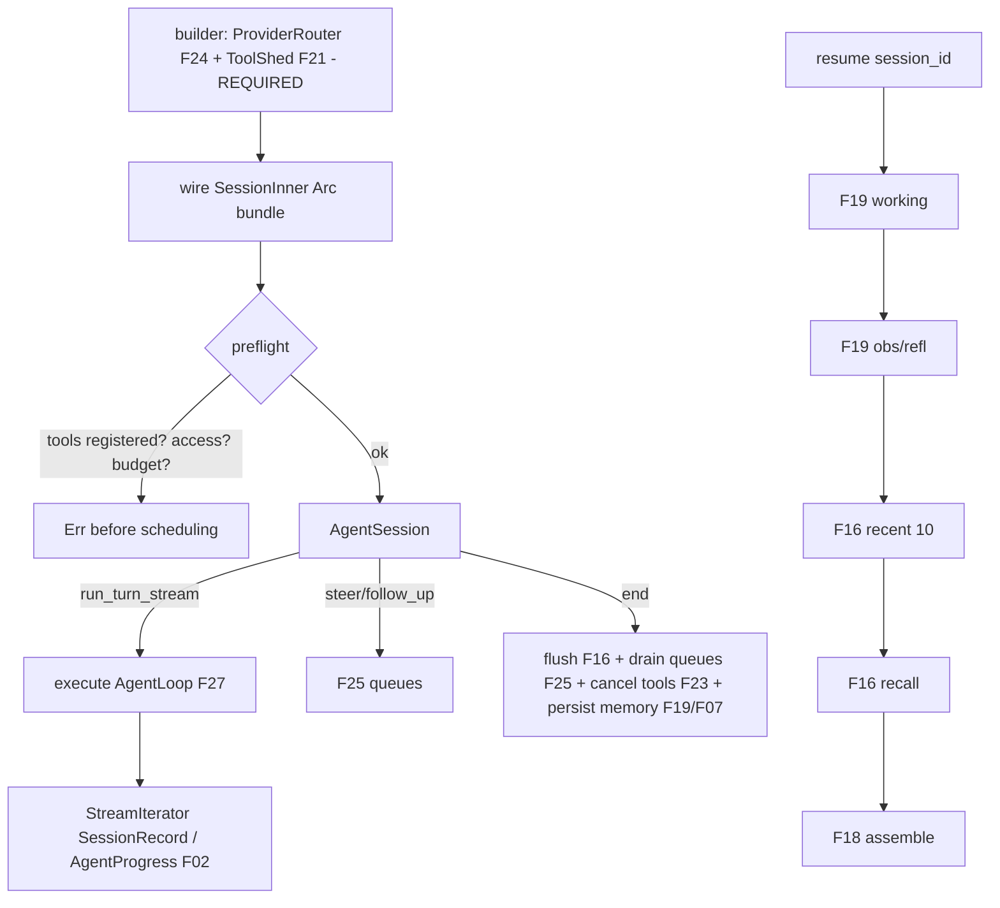

# Feature 31: Agent Session API + Resume Protocol

> **Review status (2026-06-14) — self-review against code (subagent unavailable):**
> 1. **The user explicitly REJECTED `tools(vec![...])`** (Decision 18 line 15/29 TODO: "tools are
>    supposed to be a ToolShed they supply, why did you come up with a tools(vec![])… it makes no
>    sense"). So the builder requires **a `ToolShed`** (F21, explicit fields) and registers its tools with
>    the F20/F23 `ToolCallManager`. `tools(Vec<String>)` and `session_store`/`vector_store` as `Arc<dyn
>    ModelProvider>` (Decision 18 line 49) are removed/replaced.
> 2. **The builder takes a `ProviderRouter` (F24), NOT `Arc<dyn ModelProvider>`** — Decision 18's
>    `Arc<dyn ModelProvider>` is impossible (F24 review #1: `ModelProvider` has associated types, not
>    object-safe). The builder accepts a `ProviderRouter` (single-provider or routed). This is the
>    central correction to Decision 18.
> 3. **Preflight BEFORE scheduling onto valtron** (the user's requirement): before
>    `execute(agent_loop)`, verify (a) every `ToolShed` tool is registered with the `ToolCallManager`
>    (F20 `names()` ⊇ shed tools), (b) `SessionAccessProvider::can_access_session` + `can_use_model` pass
>    (F29), (c) `token_budget` retrieved and applied to F03's ledger (F29 OD-29-4). Any failure →
>    `AgenticError` returned from `build()`/`run_turn` BEFORE a task is spawned. (OD-31-2.)
> 4. **`run_as_task` uses `execute(agent_loop)`** (Decision 18 line 143). The real loop is F27's
>    `AgentLoop: TaskIterator` → `StreamIterator<D = Result<SessionRecord, AgenticError>, P =
>    AgentProgress>` (F02, NOT Decision 18's `AgentEvent`). `run_turn_stream` returns that stream;
>    `run_turn` drains it to the final `SessionRecord::Summary` / collected assistant records.
> 5. **Resume is deterministic, exact Decision 01 order** (`01-session-architecture.md:58-97`):
>    (1) load WorkingMemory (F19 `latest_working` / F07), (2) load Observation+Reflection (F19/F07;
>    transitional: obs used if no reflection), (3) `MessageApi.recent(10)` (F16 — note Decision 01 fixes
>    **10**, F18 assembly says "last N" — reconcile: resume seeds with 10, F18 may include more within
>    budget), (4) semantic recall (F16 `semantic_search`), (5) assemble (F18 order: system → working →
>    reflection → recent → recalled), (6) queues start EMPTY (were drained+persisted on end), (7)
>    ToolCallManager fresh. F31 orchestrates; F18/F19/F07/F16 do the loading. (OD-31-4.)
> 6. **`end()` is the Decision 01 teardown**: flush Message API buffer (F16 `flush`, synchronous drain,
>    F16 review #5), drain PriorityQueue + FollowUpQueue → persist to Message API → clear (F25
>    `drain_*`), cancel in-progress tool calls + persist partial (F23), persist Working/Observation/
>    Reflection snapshots (F19/F07), flush vectors. Decision 01 §Session ends. `end()` drains
>    SYNCHRONOUSLY (no valtron join primitive, F16 review #5). (OD-31-5.)
> 7. **`SessionId` is F01's** (`SessionId(foundation_compact::Id)` per the RNG fold — the main agent moves
>    `foundation_rng`→`foundation_compact`; refer to scru128/ids as living in `foundation_compact`).
>    `AgentSession::builder().build()` mints a new `SessionId`; `resume(session_id, ..)` rehydrates.
> 8. **`AgentConfig` is Decision 18's** (line 120-132): thresholds (30k/40k), loop config, circuit
>    breaker, buffer capacity/flush interval, embedding cache. F31 wires it into F03/F19/F25/F28/F16/F15.

> Implements Decision 18 (session API, corrected per the user's TODOs) + Decision 01 (resume). The
> single high-level handle: a builder requiring a `ToolShed` + a `ProviderRouter`, preflight validation
> before any valtron scheduling, `run_turn`/`run_turn_stream`/`end`, and deterministic resume in
> Decision 01's exact order. This is the public face of the whole spec.

## WHY: Problem Statement

A caller should create, drive, stream, interrupt, follow-up, end, and resume a session with one handle
— without wiring Message API, Context, ToolCallManager, queues, router, memory, and detector by hand
(Decision 18). And resume must be deterministic (Decision 01): the same `SessionId` reconstructs the
same context every time. Decision 18's original sketch had two fatal mismatches the user called out:
`tools(vec![...])` (should be a `ToolShed`) and `Arc<dyn ModelProvider>` (impossible — should be a
`ProviderRouter`). This feature is the corrected, real builder + lifecycle + resume.

## WHAT: Solution

```rust
// backends/foundation_ai/src/agentic/session.rs
pub struct AgentSession { inner: Arc<SessionInner> }   // the Arc bundle (Decision 08)

pub struct AgentSessionBuilder {
    router: ProviderRouter,                    // F24 — REQUIRED (replaces Arc<dyn ModelProvider>)
    toolshed: ToolShed,                        // F21 — REQUIRED (replaces tools(vec![...]))
    access: Arc<dyn SessionAccessProvider>,    // F29 — default AllowAllAccess
    user: UserId,                              // default a local user
    model: Option<ModelId>,
    fallback_models: Vec<ModelId>,
    memory_model: Option<ModelId>,
    session_id: Option<SessionId>,
    doc_store: Option<Arc<dyn DocumentStore>>, // default in-memory (F04)
    vector_store: Option<Arc<dyn VectorStore>>,// default InMemoryVectorStore (F12)
    config: AgentConfig,                       // Decision 18 defaults
}

impl AgentSession {
    pub fn builder(router: ProviderRouter, toolshed: ToolShed) -> AgentSessionBuilder;
    /// Wire components, RUN PREFLIGHT, then return the session (NOT yet scheduled).
    pub fn build(builder: AgentSessionBuilder) -> Result<AgentSession, AgenticError>;
    /// Rehydrate by SessionId — deterministic Decision 01 order.
    pub fn resume(session_id: SessionId, router: ProviderRouter, toolshed: ToolShed, cfg: AgentConfig)
        -> Result<AgentSession, AgenticError>;

    pub fn run_turn(&self, prompt: impl Into<Messages>) -> Result<Vec<SessionRecord>, AgenticError>;
    pub fn run_turn_stream(&self, prompt: impl Into<Messages>)
        -> Result<impl StreamIterator<D = Result<SessionRecord, AgenticError>, P = AgentProgress>, AgenticError>;

    pub fn steer(&self, msg: Messages);        // F25 PriorityQueue
    pub fn follow_up(&self, msg: Messages);    // F25 FollowUpQueue
    pub fn end(&self) -> Result<(), AgenticError>;   // Decision 01 teardown (synchronous flush)
}
```

### Preflight (before scheduling onto valtron — the user's requirement, OD-31-2)

```rust
fn preflight(&self) -> Result<(), AgenticError> {
    // 1. Every ToolShed tool is registered with the ToolCallManager (F20/F23).
    for t in self.toolshed.all_tools() {                         // F21 flatten
        if !self.tools.names().contains(&t.name) { return Err(AgenticError::Session(
            format!("toolshed tool '{}' not registered", t.name))); }
    }
    // 2. Access passes (F29).
    if !self.access.can_access_session(&self.user, &self.session_id)? { return Err(...); }
    if !self.access.can_use_model(&self.user, &self.current_model)? { return Err(...); }
    // 3. Budget retrieved + applied to the ledger (F29 OD-29-4 / F03).
    let budget = self.access.token_budget(&self.user)?;
    if let Some(limit) = budget.limit { self.ledger.set_budget(limit.saturating_sub(budget.used)); }
    Ok(())
}
```

Only after `preflight` succeeds does `run_turn_stream` call `execute(AgentLoop::new(inner))` (F27).

### Resume protocol (Decision 01 exact order, OD-31-4)

```text
resume(session_id):
  1. WorkingMemory   = memory.latest_working()      (F19/F07; empty if none)
  2. Observation+Reflection = memory.latest_*()     (transitional: obs if no reflection)
  3. recent          = message_api.recent(10)       (F16; Decision 01 fixes 10)
  4. recalled        = message_api.semantic_search(query_from(working+recent))  (F16)
  5. context assembled by F18: system → working → reflection → recent(10) → recalled
  6. PriorityQueue / FollowUpQueue start EMPTY      (drained+persisted on prior end)
  7. ToolCallManager fresh                          (prior calls cancelled+persisted)
```

### `end()` (Decision 01 teardown, OD-31-5)

Flush Message API buffer synchronously (F16); drain both queues → persist → clear (F25); cancel
in-flight tool calls + persist partial (F23); persist Working/Observation/Reflection (F19/F07); flush
vectors. Nothing survives into a resume except the durable log + memory snapshots.

## Architecture



## Fundamentals Documentation (zero-to-expert) — REQUIRED

Author `fundamentals/` covering: the builder pattern for complex wiring (required vs optional, sensible
defaults); **preflight validation before resource acquisition** (fail fast before scheduling a task —
why validating tools/access/budget up front beats failing mid-turn); session lifecycle (create → run →
steer/follow-up → end) and the run_turn vs run_turn_stream split; **deterministic session resume**
(replayable context reconstruction in a fixed order, why determinism matters for trust/debugging); the
`Arc`-bundle shared-state pattern across valtron tasks; synchronous teardown when no join primitive
exists; why the ToolShed+Router shape (not `tools(vec)`/`dyn ModelProvider`) is the correct API. (Task
— see list.)

## HOW: Implementation Steps

1. `AgentSessionBuilder` requiring `ProviderRouter` (F24) + `ToolShed` (F21); optional stores/config.
2. `build`: wire `SessionInner` (Message API F16, Context F18, ToolCallManager F20/F23, queues F25,
   memory F19, detector F28, ledger F03, access F29, router F24, processors F26).
3. `preflight` (tools registered, access passes, budget→ledger) — fail before scheduling (OD-31-2).
4. `run_turn_stream` → `execute(AgentLoop)` (F27); `run_turn` drains to final records.
5. `steer`/`follow_up` → F25 queues.
6. `resume` — Decision 01 exact order (F19/F07/F16/F18).
7. `end` — synchronous teardown (F16/F25/F23/F19/F07).
8. `AgentConfig` defaults (Decision 18) wired through.
9. Tests: builder rejects missing ToolShed tool (preflight); access denial blocks build (no task
   scheduled); budget applied to ledger; run_turn (no-tools + with-tools, via F32 mock); run_turn_stream
   yields `SessionRecord`/`AgentProgress`; steer/follow-up routed; **resume reconstructs exact Decision
   01 order**; end persists + clears queues; resumed session has empty queues + fresh tools; wasm build.

## Open Decisions

- **OD-31-1 — builder requireds:** `builder(router, toolshed)` both required (rec, per user) vs optional
  with defaults. Rec: both required (the user mandated explicit ToolShed + a provider/router).
- **OD-31-2 — preflight scope (load-bearing):** tools-registered + access + budget before scheduling
  (rec, user requirement). Confirm the exact checks + that failure returns before `execute`.
- **OD-31-3 — run_turn return:** `Vec<SessionRecord>` (collected this turn) vs a single final record.
  Rec: `Vec<SessionRecord>` (conversation + any memory snapshots produced). Confirm.
- **OD-31-4 — recent count:** Decision 01 fixes `recent(10)`; F18 assembly says "last N within budget".
  Rec: resume seeds with 10; F18 may include more if budget allows. Reconcile + confirm.
- **OD-31-5 — end synchronicity:** synchronous flush/drain (rec — no valtron join primitive, F16
  review #5) vs a teardown task. Rec: synchronous.

## Target Files

- `backends/foundation_ai/src/agentic/session.rs` (new) — `AgentSession`, `AgentSessionBuilder`,
  `SessionInner`, `resume`, `end`
- coordinates F01 (`SessionId`/`Messages`), F03 (ledger budget), F16/F18/F19/F07 (resume + persist),
  F20/F21/F23 (tools), F24 (router), F25 (queues), F26 (processors), F27 (loop), F28 (detector), F29
  (access/budget), F30 (errors)

## Tests

```bash
cargo test -p foundation_ai -- agentic::session
cargo build -p foundation_ai --no-default-features --features agentic --target wasm32-unknown-unknown
```

## Verification

```bash
cargo build -p foundation_ai
cargo build -p foundation_ai --no-default-features --features agentic --target wasm32-unknown-unknown
cargo clippy -p foundation_ai -- -D warnings
cargo test  -p foundation_ai -- agentic::session
```

## Done When

- `AgentSession::builder(router, toolshed)` requires a `ProviderRouter` + `ToolShed` (no
  `tools(vec![...])`, no `Arc<dyn ModelProvider>`); preflight (tools registered, access, budget→ledger)
  runs and can fail BEFORE any valtron scheduling; `run_turn`/`run_turn_stream`/`steer`/`follow_up`/`end`
  work; `resume` reconstructs context in Decision 01's exact order with empty queues + fresh tools; `end`
  persists + clears synchronously; builds native + wasm.
- OD-31-1..5 resolved (OD-31-2 flagged); fundamentals authored.
