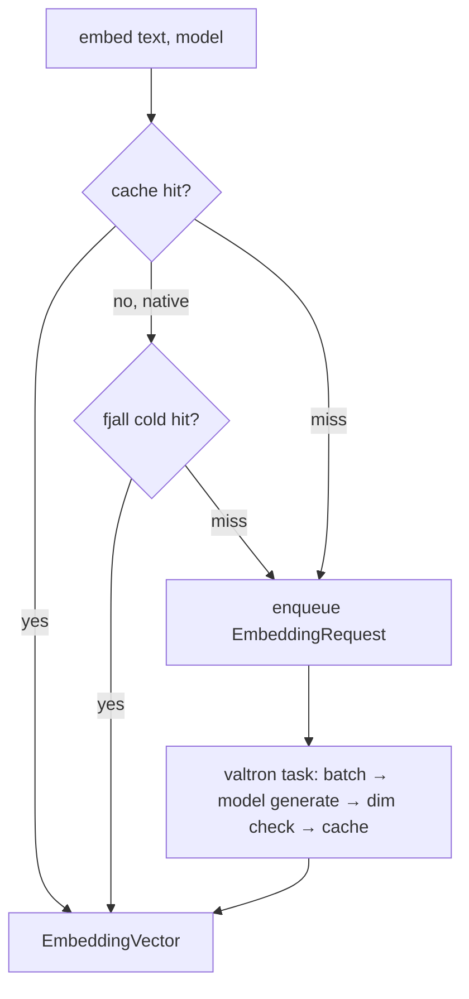

# Feature 31: EmbeddingProvider

> **Review status (2026-06-14) — significant rework:**
> 1. **Sync blocking `embed()` over a queue+channel VIOLATES valtron's "never block in `next_status`"
>    rule** (deadlocks the single-thread executor; stalls a worker). **OD-31-6 (load-bearing):** make
>    `embed` either (a) return a pumpable `StreamIterator`/`TaskIterator` the caller drives, or (b) a
>    direct **inline** `Model::generate` call (no queue), with `embed_batch` for caller-assembled
>    coalescing. Remove "queue + blocks on channel".
> 2. **No batchable embedding path exists.** There is no `generate_embeddings` trait method — embeddings
>    are a **marker-message hack** (`Messages::Assistant` w/ empty `ModelOutput::Embedding`, detected by
>    `is_embedding_request`), **single-result per call**. So "batch = one model call for many texts" has
>    zero infra — either add a real `Model::embed(&[&str])` trait method + true backend batching, or
>    scope F31 to the single-result marker path and drop the batch claim.
> 3. **fjall must live in `foundation_nativeapis`** (where it is), consumed via a trait — putting it in
>    `foundation_ai` repeats **F07's reversed "fatal" error**.
> 4. **Dimension type bridge:** `ModelOutput::Embedding.dimensions` is `usize`; registry/`EmbeddingVector`/
>    F28 use `u16` — specify a checked `usize→u16` (overflow error).
> 5. **Deps absent:** add `lru` + a hash crate + `fjall` to root `[workspace.dependencies]` (none exist
>    today; `foundation_compact` has no general hasher).
> 6. **F12 ProviderRouter is an undeclared dep and is UNWRITTEN** — add to `depends_on`; it's a hard
>    prerequisite.
> 7. **`foundation_ai::agentic` module doesn't exist** — its creation must be owned by the first
>    agentic feature (F01/F03), not assumed by each. **Cache collision** (64-bit hash → wrong vector:
>    store text + verify) and **model-version invalidation** (epoch in key) needed. See OD-31-6..10.

> Implements Decision 06. Wraps the model layer's embedding generation (`generate_embeddings` /
> `ModelOutput::Embedding { dimensions, values }`) with caching, dimension isolation, and a
> queue-backed valtron task. Feeds the VectorStore (F28-14) and semantic recall (F16).

## WHY: Problem Statement

Semantic recall (F16) and tool discovery (F10) embed text constantly; identical texts are embedded
repeatedly (wasteful — 10-100ms each). Different models produce different dimensions; mixing them
breaks similarity. The EmbeddingProvider: caches (LRU, bounded), isolates dimensions, and batches
generation off a queue so callers don't block on inference.

## WHAT: Solution

```rust
pub trait EmbeddingProvider: Send + Sync {
    /// Cache-or-generate an embedding for text under a model id.
    fn embed(&self, text: &str, model_id: &str) -> Result<EmbeddingVector, EmbeddingError>;
    fn embed_batch(&self, texts: &[String], model_id: &str) -> Result<Vec<EmbeddingVector>, EmbeddingError>;
    fn register_model(&self, model_id: &str, dimensions: u16);   // dimension registry
    fn cache_stats(&self) -> CacheStats;
    fn clear_cache(&self);
}

pub struct EmbeddingVector { pub dimensions: u16, pub data: Vec<f32>, pub model_id: String }
```

### LRU cache (bounded)

- Key = `(text_hash, model_id)`; value = `EmbeddingVector`. Default max **1000** entries (~3MB @ 768-d).
- LRU eviction; `&self` + interior `Mutex`/`RwLock` (Decision 08).
- **Whole-text caching** first (Decision 06); sentence-level (nlprule) deferred.

### Dimension registry (cross-model safety)

- `model_id → expected u16 dimension`. `embed` validates the generated vector matches; insert into a
  VectorStore (F28) only via the matching-dimension store. Mismatch → error (Decision 06).

### fjall backing (cfg-gated — native required, wasm optional)

- Native: an optional persistent fjall keyspace (cold tier) behind the hot LRU: memory → fjall →
  generate. Per the native-tooling rule, **target-gated** (`cfg(not(wasm32))`), required on native,
  absent on wasm (memory-only there). (Decision 06 TODO resolution.)

### Queue-backed valtron task

- `embed` checks cache; miss → enqueue an `EmbeddingRequest` to a `ConcurrentQueue`; a valtron task
  drains, **batches** (single model call for many texts), validates dimension, caches, returns via a
  channel. Progress via `TaskStatus::Pending`; cancellable on session end. (Decision 06/08.)
- This decouples request submission from inference latency.

### Generation source

- Routes to the model layer's embedding path (`generate_embeddings`, `ModelOutput::Embedding`) via the
  agentic provider/router (F12) — local model, or a remote embedding endpoint. The EmbeddingProvider
  doesn't implement inference; it caches + batches it.

## Architecture



## Fundamentals Documentation (zero-to-expert) — REQUIRED

Author `fundamentals/` covering: text embeddings & how models produce them; **LRU caching** (design,
eviction, bounded memory, hashing keys); **dimension isolation** & why cross-model mixing breaks
similarity; cold-tier caching with fjall (LSM); **batching** inference behind a queue (throughput vs
latency); valtron task + channel response pattern; cache hit-rate measurement & chunking strategies
(whole-text vs sentence/nlprule). (Task — see list.)

## HOW: Implementation Steps

1. `EmbeddingProvider` trait + `EmbeddingVector`/`CacheStats`/`EmbeddingError`.
2. Bounded LRU cache (`&self`, interior mutability); `(text_hash, model_id)` keys.
3. Dimension registry + validation.
4. Queue-backed valtron task: drain, batch, generate (via provider/router), dim-check, cache, respond.
5. fjall cold tier (native, target-gated); memory→fjall→generate lookup.
6. Tests: cache hit/miss/eviction; dimension mismatch error; batch correctness; concurrent embed;
   fjall persistence (native); wasm (memory-only) build.

## Open Decisions

- **OD-31-1 — generation routing:** via F12 ProviderRouter (embedding model may differ from chat
  model). Rec: route through F12; embedding model configurable.
    Then add specific API for embeddings or a EmbeddingProvider router so its a separate API layer

- **OD-31-2 — cache key hash:** fast non-crypto hash (xxhash) of text. Rec: xxhash.

- **OD-31-3 — fjall required-on-native:** required vs optional. Decision 06 says required on native.
  Rec: optional-but-default-on; a memory-only mode for tests.
        Sure, memory for tests, but we also test fjall implementation too

- **OD-31-4 — batch trigger:** size threshold + time window. Rec: both (e.g. 32 texts or 50ms).

- **OD-31-5 — sentence-level chunking:** deferred (nlprule). Confirm whole-text first.
      Why deffrered - sentence level is better and there are rust crate to help where needed and fallback can be whole text if in a platform where it cant be done.

## Target Files

- `backends/foundation_ai/src/agentic/embedding.rs` (new)
- `backends/foundation_ai/Cargo.toml` — fjall (native, target-gated), lru/xxhash

## Tests

```bash
cargo test -p foundation_ai -- agentic::embedding
cargo build -p foundation_ai --no-default-features --features agentic --target wasm32-unknown-unknown
```

## Verification

```bash
cargo build -p foundation_ai
cargo build -p foundation_ai --no-default-features --features agentic --target wasm32-unknown-unknown
cargo clippy -p foundation_ai -- -D warnings
cargo test  -p foundation_ai -- agentic::embedding
```

## Done When

- `EmbeddingProvider` caches (LRU + native fjall cold tier), isolates dimensions, batches via a
  valtron task; `&self` concurrent-safe; builds native + wasm (memory-only).
- Routes generation through the provider/router; whole-text caching.
- OD-31-1..5 resolved; fundamentals authored.
