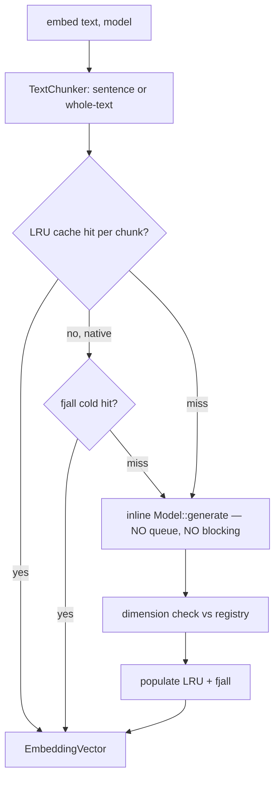

# Feature 31: EmbeddingProvider

> **Review status (2026-06-14) — significant rework:**
> 1. **Sync blocking `embed()` over a queue+channel VIOLATES valtron's "never block in `next_status`"
>    rule** (deadlocks the single-thread executor; stalls a worker). **OD-31-6 (load-bearing):** make
>    `embed` either (a) return a pumpable `StreamIterator`/`TaskIterator` the caller drives, or (b) a
>    direct **inline** `Model::generate` call (no queue), with `embed_batch` for caller-assembled
>    coalescing. Remove "queue + blocks on channel".
> 2. **No batchable embedding path exists.** There is no `generate_embeddings` trait method — embeddings
>    are a **marker-message hack** (`Messages::Assistant` w/ empty `ModelOutput::Embedding`, detected by
>    `is_embedding_request`), **single-result per call**. So "batch = one model call for many texts" has
>    zero infra — either add a real `Model::embed(&[&str])` trait method + true backend batching, or
>    scope F31 to the single-result marker path and drop the batch claim.
> 3. **fjall must live in `foundation_nativeapis`** (where it is), consumed via a trait — putting it in
>    `foundation_ai` repeats **F07's reversed "fatal" error**.
> 4. **Dimension type bridge:** `ModelOutput::Embedding.dimensions` is `usize`; registry/`EmbeddingVector`/
>    F28 use `u16` — specify a checked `usize→u16` (overflow error).
> 5. **Deps absent:** add `lru` + a hash crate + `fjall` to root `[workspace.dependencies]` (none exist
>    today; `foundation_compact` has no general hasher).
> 6. **F12 ProviderRouter is an undeclared dep and is UNWRITTEN** — add to `depends_on`; it's a hard
>    prerequisite.
> 7. **`foundation_ai::agentic` module doesn't exist** — its creation must be owned by the first
>    agentic feature (F01/F03), not assumed by each. **Cache collision** (64-bit hash → wrong vector:
>    store text + verify) and **model-version invalidation** (epoch in key) needed. See OD-31-6..10.

> Implements Decision 06. Wraps the model layer's embedding generation (`generate_embeddings` /
> `ModelOutput::Embedding { dimensions, values }`) with caching, dimension isolation, sentence-level
> chunking, and an **inline sync `embed()` that never blocks the valtron executor**. Feeds the
> VectorStore (F28-14) and semantic recall (F16).

## WHY: Problem Statement

Semantic recall (F16) and tool discovery (F10) embed text constantly; identical texts are embedded
repeatedly (wasteful — 10-100ms each). Different models produce different dimensions; mixing them
breaks similarity. The EmbeddingProvider: caches (LRU, bounded), isolates dimensions, and provides
sentence-level chunking for higher-quality embeddings.

## WHAT: Solution

### Execution model (OD-31-6 — load-bearing, resolved)

**The old design (queue + blocks on channel) is WRONG.** Blocking in `embed()` while waiting for a
channel response violates valtron's "never block in `next_status`" rule — it deadlocks a single-thread
executor and stalls a worker thread on multi-threaded targets.

**Corrected design — inline sync call, no queue:**

`embed()` is a **direct, inline** call to the model's embedding path. No queue, no channel, no
blocking wait. The call sequence is: check LRU cache → check fjall cold tier (native) → call
`Model::generate` synchronously (the embedding inference) → validate dimension → populate cache →
return. This is the same execution model as any other `Model::generate` call in the system.

**`embed_batch()` is caller-assembled coalescing:** the caller (e.g. the flush task in F08) collects
multiple texts and passes them as a batch. The provider iterates, checking cache per-text and calling
`Model::generate` for misses. There is **no automatic batching queue** — the current model layer has
no `Model::embed(&[&str])` batch method (embeddings use the marker-message `ModelOutput::Embedding`
path, single-result per call). If/when a true batch embedding trait is added to the model layer, the
provider will use it; until then, `embed_batch` is a loop over `embed` with cache short-circuiting.

```rust
pub trait EmbeddingProvider: Send + Sync {
    /// Cache-or-generate an embedding. INLINE — never blocks the executor.
    /// Sequence: LRU hit → fjall cold hit (native) → Model::generate → dim check → cache → return.
    fn embed(&self, text: &str, model_id: &str) -> Result<EmbeddingVector, EmbeddingError>;
    /// Caller-assembled batch: loop over embed() with cache short-circuit for each text.
    /// When a true Model::embed_batch exists, this will use it for cache-miss texts.
    fn embed_batch(&self, texts: &[String], model_id: &str) -> Result<Vec<EmbeddingVector>, EmbeddingError>;
    fn register_model(&self, model_id: &str, dimensions: u16);
    fn cache_stats(&self) -> CacheStats;
    fn clear_cache(&self);
}

pub struct EmbeddingVector { pub dimensions: u16, pub data: Vec<f32>, pub model_id: String }
```

### LRU cache (bounded)

- Key = `(text_hash, model_id, epoch)`; value = `EmbeddingVector`. `epoch` is a model-version counter
  so upgrading a model invalidates stale cached embeddings. Default max **1000** entries (~3MB @
  768-d).
- LRU eviction; `&self` + interior `Mutex`/`RwLock` (Decision 08).
- **Cache collision guard:** the cache stores the original text alongside the hash; on hit, verify the
  text matches (a 64-bit hash collision → wrong vector is a silent correctness bug). If mismatch,
  treat as a miss and regenerate.

### Sentence-level chunking (OD-31-5 — resolved, not deferred)

Text chunking is **implemented now**, not deferred. Two strategies via a `TextChunker` trait:

```rust
pub trait TextChunker: Send + Sync {
    fn chunk(&self, text: &str) -> Vec<String>;
}

pub struct WholeTextChunker;          // returns [text] as-is — the fallback
pub struct SentenceChunker;           // nlprule sentence splitting (native), simple fallback (wasm)
```

- **`SentenceChunker`** (default on native): uses nlprule for sentence splitting — produces one
  embedding per sentence, averaged or stored individually depending on the caller's needs (F08 stores
  per-record; F16 may average for a summary). Falls back to `WholeTextChunker` on platforms where
  nlprule doesn't build.
- **`WholeTextChunker`** (fallback): embeds the full text as one unit. Used on wasm or when nlprule
  data is absent.
- The `EmbeddingProvider` is constructed with a `TextChunker` instance. Chunking happens before the
  cache check — each chunk is cached independently, so repeated sentences across records get cache hits.

### Dimension registry (cross-model safety)

- `model_id → expected u16 dimension`. `embed` validates the generated vector matches; insert into a
  VectorStore (F28) only via the matching-dimension store. Mismatch → error (Decision 06).
- **Dimension type bridge:** `ModelOutput::Embedding.dimensions` is `usize`; the registry and F28 use
  `u16`. A checked `usize → u16` conversion with an `EmbeddingError::DimensionOverflow` on values
  >65535 (no real embedding model produces that many dimensions).

### fjall backing (cfg-gated — native required, wasm optional)

- Native: an optional persistent fjall keyspace (cold tier) behind the hot LRU: memory → fjall →
  generate. Per the native-tooling rule, **target-gated** (`cfg(not(target_family = "wasm"))`),
  default-on for native, absent on wasm (memory-only there). (Decision 06 TODO resolution.)
- fjall lives in `foundation_nativeapis` (NOT `foundation_ai` — review note #3), consumed via a
  `ColdCache` trait so the embedding provider doesn't depend on fjall directly.
- **Durability:** the `ColdCache` implementation receives `Arc<DurabilityWriteConfig>` (F22) from the
  session. Cache writes (embedding → fjall) respect the same flush policy as all other durable writers.
  With the default immediate mode, each cache-populate flushes + syncs immediately; with batching
  enabled, cache writes accumulate and flush on threshold/timeout. This is less critical than document
  writes (a lost cache entry just means a re-generate on next hit), but consistency comes from one
  config governing all durable I/O.
- Memory-only mode for tests (OD-31-3 resolved), but fjall implementation is also tested.

### Generation routing (OD-31-1 — resolved)

- Embeddings route through a **dedicated `EmbeddingRouter`** — a separate API layer from the chat
  `ProviderRouter` (F12), because the embedding model may differ from the chat model. The router
  implements `EmbeddingProvider` and delegates to the appropriate model backend based on `model_id`
  config.
- Routes to the model layer's embedding path (`generate_embeddings`, `ModelOutput::Embedding`) via the
  configured embedding model — local (llama.cpp) or remote (API endpoint). The `EmbeddingRouter`
  doesn't implement inference; it caches + routes it.

## Architecture



## Fundamentals Documentation (zero-to-expert) — REQUIRED

Author `fundamentals/` covering: text embeddings & how models produce them; **LRU caching** (design,
eviction, bounded memory, hashing keys, collision guards, model-version epochs); **dimension isolation**
& why cross-model mixing breaks similarity; cold-tier caching with fjall (LSM); **sentence-level
chunking** (nlprule sentence splitting, why sentence embeddings beat whole-text, averaging strategies);
why **queue+block is wrong** for valtron (never block `next_status`, inline calls instead); cache
hit-rate measurement. (Task — see list.)

## HOW: Implementation Steps

1. `EmbeddingProvider` trait + `EmbeddingVector`/`CacheStats`/`EmbeddingError`/`TextChunker` trait.
2. `SentenceChunker` (nlprule) + `WholeTextChunker` (fallback).
3. Bounded LRU cache (`&self`, interior mutability); `(text_hash, model_id, epoch)` keys + collision
   guard (store+verify text).
4. Dimension registry + `usize→u16` checked bridge + validation on every embed result.
5. `EmbeddingRouter` — dedicated embedding routing layer, separate from chat ProviderRouter.
6. Inline `embed()` — cache → fjall → `Model::generate` → dim check → cache → return. No queue.
7. `embed_batch()` — loop over `embed()` with per-text cache short-circuit.
8. `ColdCache` trait + fjall impl in `foundation_nativeapis` (native, target-gated); memory-only
   fallback for wasm + tests.
9. Tests: cache hit/miss/eviction/collision-guard; dimension mismatch error; epoch invalidation;
   sentence chunking correctness; batch = loop correctness; concurrent embed; fjall persistence
   (native); wasm (memory-only) build; nlprule fallback on wasm.

## Open Decisions

- **OD-31-1 — generation routing: RESOLVED (user, 2026-06-15).** Dedicated `EmbeddingRouter` — a
  separate API layer from the chat `ProviderRouter` (F12). Embedding models may differ from chat
  models; the router is configured per-session with the embedding `model_id`.

- **OD-31-2 — cache key hash:** fast non-crypto hash (xxhash) of text. Rec: xxhash. Plus a collision
  guard (store original text, verify on hit).

- **OD-31-3 — fjall required-on-native: RESOLVED (user, 2026-06-15).** Optional-but-default-on for
  native; memory-only mode for tests. fjall implementation is also tested (not just memory mode).

- **OD-31-4 — batch trigger:** N/A — the queue+batch design is removed (OD-31-6). `embed_batch` is
  caller-assembled (the caller decides when to batch, e.g. F08's flush task collects texts before
  calling `embed_batch`). No automatic trigger needed.

- **OD-31-5 — sentence-level chunking: RESOLVED (user, 2026-06-15).** NOT deferred — implemented now.
  `SentenceChunker` (nlprule, default on native) + `WholeTextChunker` (fallback on wasm or when
  nlprule data is absent). Sentence-level is better; fallback to whole-text where nlprule can't build.

- **OD-31-6 — embed() execution model: RESOLVED (load-bearing).** The queue+blocks-on-channel design
  VIOLATES valtron's "never block in `next_status`" rule (deadlocks single-thread executor, stalls
  workers). **Corrected:** `embed()` is an inline sync call — cache → fjall → `Model::generate` →
  dim check → cache → return. No queue, no channel, no blocking. `embed_batch` is a caller-assembled
  loop. See WHAT section for full design.

- **OD-31-7 — cache collision:** 64-bit hash collision → silent wrong vector. Mitigated by storing the
  original text alongside the hash and verifying on hit. Plus model-version `epoch` in the key to
  invalidate stale embeddings when a model is upgraded.

- **OD-31-8 — dimension type bridge:** `ModelOutput::Embedding.dimensions` is `usize`; registry + F28
  use `u16`. Checked `usize → u16` conversion; `EmbeddingError::DimensionOverflow` on >65535.

- **OD-31-9 — fjall location:** fjall lives in `foundation_nativeapis` (NOT `foundation_ai`), consumed
  via a `ColdCache` trait. Putting fjall in `foundation_ai` would repeat F07's reversed error.

## Target Files

- `backends/foundation_ai/src/agentic/embedding.rs` (new)
- `backends/foundation_ai/Cargo.toml` — fjall (native, target-gated), lru/xxhash

## Tests

```bash
cargo test -p foundation_ai -- agentic::embedding
cargo build -p foundation_ai --target wasm32-unknown-unknown
```

## Verification

```bash
cargo build -p foundation_ai
cargo build -p foundation_ai --target wasm32-unknown-unknown
cargo clippy -p foundation_ai -- -D warnings
cargo test  -p foundation_ai -- agentic::embedding
```

## Done When

- `EmbeddingProvider` caches (LRU + collision guard + epoch + native fjall cold tier), isolates
  dimensions, provides sentence-level chunking (nlprule + whole-text fallback); `embed()` is inline
  sync (no queue, no blocking); `&self` concurrent-safe; builds native + wasm (memory-only on wasm).
- `EmbeddingRouter` routes generation through a dedicated embedding API layer (separate from chat).
- Sentence chunking works (nlprule on native, fallback on wasm); dimension type bridge is checked.
- OD-31-1..9 resolved; fundamentals authored.
