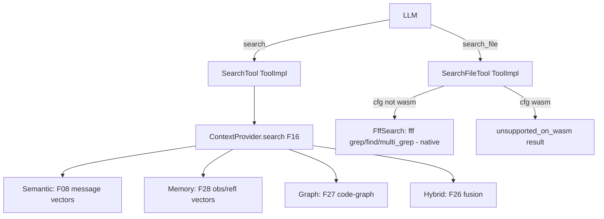

# Feature 32: Search Tools — `search()` vs `search_file()`

> **Review status (2026-06-14) — self-review against code (subagent unavailable):**
> 1. **The split is already half-built in F16.** `ContextProvider` (`16-context-provider-assembly/
>    feature.md:57-72`) already defines `search(query, SearchMode, k)` (Semantic/Memory/Graph/Hybrid)
>    and `search_file(query, FileSearchKind)` (fff, native; wasm unsupported). **F32 owns the *tool
>    surface* — the `SearchTool`/`SearchFileTool` `ToolImpl`s — that wrap F16's methods.** F32 does NOT
>    re-implement recall; it adapts the F16 Context API into two `ToolImpl`s the LLM calls. (OD-16-5
>    already assigns generation to F15; here the boundary is F16=capability, F32=tool wrapper.)
> 2. **fff is an EXTERNAL Rust workspace OUTSIDE this repo** — verified at
>    `/home/darkvoid/Boxxed/@formulas/src.rust/src.FileSystemAPIs/src.Search/fff` (crates `fff-core`,
>    `fff-grep`, `fff-query-parser`, `fff-mcp`, edition 2024, third-party authors). `fff-core/Cargo.toml`
>    pulls **`rayon`, `git2`, `heed`, `memmap2`, `notify`** (all native-only) — exactly Decision 14's
>    native-only list. So `search_file` MUST be **target-gated `cfg(not(target_family="wasm"))`**, NOT
>    feature-gated (memory `feedback_target_gate_native_tooling`). **How fff is consumed is an open
>    integration question (OD-32-1):** it is not a workspace member here and not on crates.io as a
>    library — options: (a) git/path dependency on the external workspace, (b) vendor `fff-core`/
>    `fff-grep`, (c) reimplement a minimal native grep. Flag for the user.
> 3. **Decision 14 conflated `search`'s fff-fallback; TODO #6 splits it.** Old Decision 14
>    (`SearchMode::Filesystem` → fff→vector fallback) is SUPERSEDED by the user's split (Decision 14
>    TODO #6, echoed in F16): `search` is knowledge-only (NO fff), `search_file` is filesystem-only (fff,
>    no vector fallback). F32 implements the *split*, not the old two-phase. The two tools never call
>    each other.
> 4. **`search` modes map to existing subsystems:** Semantic → F08 `semantic_search` (message vectors,
>    ns=session); Memory → F28 query over observation/reflection vectors (F07/F15 content); Graph →
>    F27 code-graph (`find_entity`/`callers`/`neighborhood`); Hybrid → F26 fusion. All reached via F16's
>    `search`. On wasm, Graph degrades to a prebuilt-graph query or is unavailable (F16 OD-16-3).
> 5. **Both are `ToolImpl`s (F09), sync `execute`** (F09 OD-09-1). They are wired by F10's
>    `with_defaults` as the `search` field of the `ToolShed` (`search_file` is an extra registered tool,
>    not a named `ToolShed` field — the real `ToolShed` has `search` but no `search_file` slot, so
>    `search_file` rides as a normal registered tool discoverable via `shed`). (OD-32-4.)
> 6. **wasm `search_file` returns a clean unsupported result, never a panic** (Decision 14 §Platform):
>    `ToolCallResult { content: Text("search_file is unavailable on wasm; use search() for knowledge
>    recall"), error_detail: Some("unsupported_on_wasm") }`. The LLM sees it and adapts.

> Implements Decision 14 TODO #6 (the search split). Owns the two **search tools** the LLM calls:
> `search` (knowledge — semantic/memory/graph/hybrid, wraps F16) and `search_file` (filesystem — fff,
> native-only, wasm-unsupported). Both are `ToolImpl`s (F09) wired into the `ToolShed` (F10).

## WHY: Problem Statement

The agent has two genuinely different "search" needs that were conflated: **knowledge recall** ("what
did I decide about auth?", "which entity defines `foo`?") and **filesystem search** ("grep
`auth_check(` across the repo"). Decision 14 TODO #6 (the user's explicit ruling) splits them so the
LLM picks the right one and so the filesystem path (fff, native-only) doesn't leak into wasm builds.
F16 added the *capabilities*; this feature exposes them as two distinct, well-described tools.

## WHAT: Solution

### `search` — knowledge tool (wraps F16, all platforms)

```rust
// backends/foundation_ai/src/agentic/tools/search.rs
pub struct SearchTool { context: ContextProvider }   // F16

#[derive(Serialize, Deserialize)]
pub struct SearchArgs { pub query: String, pub mode: SearchMode, pub k: usize }
// SearchMode { Semantic, Memory, Graph, Hybrid } — re-exported from F16

impl ToolImpl for SearchTool {
    fn definition(&self) -> ToolDefinition { /* name="search", description steers Semantic/Memory/Graph/Hybrid, NOT files */ }
    fn execute(&self, args: HashMap<String, ArgType>) -> Result<ToolCallResult, ToolError> {
        let a: SearchArgs = parse(args)?;
        let res = self.context.search(&a.query, a.mode, a.k);   // F16
        Ok(ToolCallResult { content: UserModelContent::Text(json(res)), error_detail: None })
    }
}
```

### `search_file` — filesystem tool (fff, native-only, target-gated)

```rust
pub struct SearchFileTool {
    #[cfg(not(target_family = "wasm"))]
    fff: FffSearch,    // F16's fff binding (grep/find/multi_grep) — native only
}

#[derive(Serialize, Deserialize)]
pub struct SearchFileArgs { pub query: String, pub kind: FileSearchKind, pub paths: Option<Vec<String>> }
pub enum FileSearchKind { Grep, Find, MultiGrep }   // maps to fff grep/find/multi_grep (Decision 14)

impl ToolImpl for SearchFileTool {
    fn definition(&self) -> ToolDefinition { /* name="search_file", description: real filesystem, native-only */ }

    #[cfg(not(target_family = "wasm"))]
    fn execute(&self, args: HashMap<String, ArgType>) -> Result<ToolCallResult, ToolError> {
        let a: SearchFileArgs = parse(args)?;
        let matches = match a.kind {
            FileSearchKind::Grep      => self.fff.grep(&a.query),
            FileSearchKind::Find      => self.fff.find(&a.query),
            FileSearchKind::MultiGrep => self.fff.multi_grep(&a.query, a.paths.unwrap_or_default().as_slice()),
        }.map_err(|e| ToolError::Execution { tool: "search_file".into(), reason: e.to_string() })?;
        Ok(ToolCallResult { content: UserModelContent::Text(json(matches)), error_detail: None })
    }

    #[cfg(target_family = "wasm")]
    fn execute(&self, _args: HashMap<String, ArgType>) -> Result<ToolCallResult, ToolError> {
        Ok(ToolCallResult {
            content: UserModelContent::Text(TextContent { content:
                "search_file is unavailable on wasm; use search() for knowledge recall".into(), signature: None }),
            error_detail: Some("unsupported_on_wasm".into()),
        })
    }
}
```

`FffSearch` (the `grep`/`find`/`multi_grep` wrapper, `FffMatch { path, line_number, content, score }`)
is defined in F16 / consumed here; the **fff dependency wiring is OD-32-1** (external workspace).

### Tool descriptions (steer the LLM to the right tool)

- `search`: "Search your knowledge — semantic recall over prior messages, distilled memory
  (observations/reflections), and the code-graph (which file defines an entity). NOT the live
  filesystem — use `search_file` for that."
- `search_file`: "Search the real filesystem with fff: grep file content, find by path pattern,
  multi-file grep. Native only. NOT for memory recall — use `search`."

## Architecture



## Fundamentals Documentation (zero-to-expert) — REQUIRED

Author `fundamentals/` covering: knowledge search vs filesystem search (why the conflation was wrong,
how tool descriptions steer the LLM); semantic/memory/graph/hybrid retrieval modes (what each queries);
**target-gating native-only tooling** (`cfg(not(target_family="wasm"))` vs feature gates, and why fff's
`heed`/`memmap2`/`git2`/`rayon`/`notify` force it); integrating an external (out-of-repo) Rust tool
(dependency strategies: git/path dep vs vendoring vs reimplementation); graceful wasm degradation (a
tool that returns "unsupported" instead of failing the build); fff's grep/find/frecency model. (Task —
see list.)

## HOW: Implementation Steps

1. `SearchTool: ToolImpl` wrapping F16 `ContextProvider::search` (Semantic/Memory/Graph/Hybrid).
2. `SearchFileTool: ToolImpl`, target-gated execute (native fff vs wasm unsupported result).
3. Resolve fff consumption (OD-32-1: git/path dep vs vendor vs minimal reimpl) — wire `FffSearch`.
4. `FileSearchKind` → fff `grep`/`find`/`multi_grep`; serialize `FffMatch` into `ToolCallResult`.
5. Tool descriptions that disambiguate the two tools (steer the LLM).
6. Register both in F10 `with_defaults` (`search` = ToolShed.search field; `search_file` = extra
   registered tool, shed-discoverable).
7. Tests: `search` each mode dispatches to the right F16 path; `search_file` grep/find/multi_grep
   (native, against a temp dir); wasm `search_file` returns unsupported (no panic, builds clean);
   both validate args; descriptions present. wasm build excludes fff entirely.

## Open Decisions

- **OD-32-1 — fff consumption (load-bearing):** fff is an external workspace, not a repo member / not a
  published lib. (a) git/path dependency on `fff-core`+`fff-grep`, (b) vendor those two crates, (c)
  reimplement a minimal native grep. Rec: (a) path/git dep on `fff-core`+`fff-grep` target-gated; fall
  back to (c) if their deps (libgit2 vendored, heed/LMDB) bloat the build. **Flag for the user.**
      I shared https://crates.io/crates/fff-search

- **OD-32-2 — search-result shape:** unify `search` and `search_file` into one `SearchResult` JSON, or
  distinct shapes. Rec: distinct (`KnowledgeHit{source,score,content,ref}` vs `FffMatch{path,line,..}`)
  — they're genuinely different.
        Yes different, important for agnet to know, in fact we should make `search` - `search_context`  - so its clear its searching context, memories, etc not files

- **OD-32-3 — graph on wasm:** `search(Graph)` queries a prebuilt graph if present else unavailable
  (F16 OD-16-3). Confirm parity with F16.
          Yes, prebuilt, so it loads and search the prebuild json or whatever file format makes sense.

- **OD-32-4 — search_file placement:** the real `ToolShed` has a `search` field but no `search_file`
  slot. Register `search_file` as a normal tool (shed-discoverable) rather than a named field. Rec:
  yes (don't add a struct field; keep `ToolShed` as F01 defines it).
        Of course add it, the idea is the fields are the mandatory ones supplied, the toolshed owns any discovery needed, absolutely add it.

- **OD-32-5 — fff root:** the search root (workspace dir) is session/config-supplied. Rec: an
  `AgentConfig::workspace_root: Option<PathBuf>`; `search_file` disabled if unset on native.
        `search_file` - implementation based, nothing stops wasm from using in memory or vfs based search that works in its environment.

## Target Files

- `backends/foundation_ai/src/agentic/tools/search.rs` (new) — `SearchTool`, `SearchFileTool`
- `backends/foundation_ai/Cargo.toml` — fff dep (target-gated, per OD-32-1)
- coordinates F16 (`ContextProvider::search`/`search_file`, `FffSearch`), F09 (`ToolImpl`), F10
  (`with_defaults` wiring), F26/F27/F28/F08 (the search backends behind F16)

## Tests

```bash
cargo test -p foundation_ai -- agentic::tools::search
cargo build -p foundation_ai --target wasm32-unknown-unknown
```

## Verification

```bash
cargo build -p foundation_ai
cargo build -p foundation_ai --target wasm32-unknown-unknown
cargo clippy -p foundation_ai -- -D warnings
cargo test  -p foundation_ai -- agentic::tools::search
```

## Done When

- `search` (knowledge: semantic/memory/graph/hybrid via F16) and `search_file` (filesystem: fff,
  native-only) are two distinct `ToolImpl`s with disambiguating descriptions; `search_file` is
  target-gated and returns a clean unsupported result on wasm (no panic, no fff in the wasm build);
  both registered via F10; the two tools never call each other (the split, not the old two-phase).
- OD-32-1..5 resolved (OD-32-1 flagged for the user); fundamentals authored.
