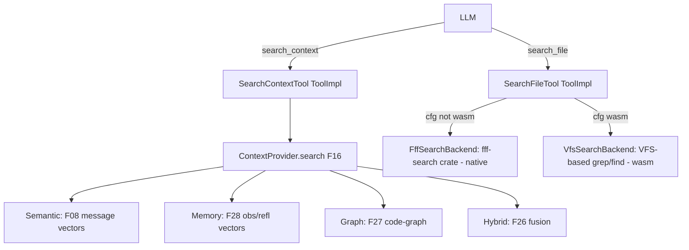

# Feature 32: Search Tools — `search_context()` vs `search_file()`

> **Review status (2026-06-14) — self-review against code, UPDATED 2026-06-15 per user rulings:**
> 1. **The split is already half-built in F16.** `ContextProvider` already defines
>    `search(query, SearchMode, k)` (Semantic/Memory/Graph/Hybrid) and `search_file(query,
>    FileSearchKind)` (fff, native; VFS on wasm). **F32 owns the *tool surface* — the
>    `SearchContextTool`/`SearchFileTool` `ToolImpl`s — that wrap F16's methods.** F32 does NOT
>    re-implement recall; it adapts the F16 Context API into two `ToolImpl`s the LLM calls.
> 2. **fff is published on crates.io as `fff-search`** (user-provided, OD-32-1 resolved). Consume via
>    the published crate — no vendoring or reimplementation needed. Native deps (`rayon`, `git2`,
>    `heed`, `memmap2`, `notify`) mean the fff-backed path is target-gated
>    `cfg(not(target_family="wasm"))`.
> 3. **RENAMED: `search` → `search_context`** (user, OD-32-2) — makes it clear the tool searches
>    context/memories/knowledge, not files. The LLM sees `search_context` and understands it's for
>    knowledge recall.
> 4. **Both tools are `ToolShed` fields** (user, OD-32-4) — `search_context` in the existing `search`
>    slot, `search_file` added as a new mandatory field. Both are always-present default tools.
> 5. **wasm `search_file` uses VFS-based search** (user, OD-32-5) — NOT unsupported. Nothing stops wasm
>    from using in-memory or VFS-based file search within its environment. Only the fff-backed native
>    path is target-gated; wasm gets a VFS search implementation.

> Implements Decision 14 TODO #6 (the search split). Owns the two **search tools** the LLM calls:
> `search_context` (knowledge — semantic/memory/graph/hybrid, wraps F16) and `search_file` (filesystem
> — fff on native, VFS on wasm). Both are `ToolImpl`s (F09) wired into the `ToolShed` (F10) as
> mandatory fields.

## WHY: Problem Statement

The agent has two genuinely different "search" needs that were conflated: **knowledge recall** ("what
did I decide about auth?", "which entity defines `foo`?") and **filesystem search** ("grep
`auth_check(` across the repo"). Decision 14 TODO #6 (the user's explicit ruling) splits them so the
LLM picks the right one. F16 added the *capabilities*; this feature exposes them as two distinct,
well-described tools. The name `search_context` (not `search`) makes the knowledge-recall purpose
unambiguous to the LLM.

## WHAT: Solution

### `search_context` — knowledge tool (wraps F16, all platforms)

FFF source code here: /home/darkvoid/Boxxed/@formulas/src.rust/src.FileSystemAPIs/src.Search/fff

```rust
// backends/foundation_ai/src/agentic/tools/search.rs
pub struct SearchContextTool { context: ContextProvider }   // F16

#[derive(Serialize, Deserialize)]
pub struct SearchContextArgs { pub query: String, pub mode: SearchMode, pub k: usize }
// SearchMode { Semantic, Memory, Graph, Hybrid } — re-exported from F16

/// Result shape — distinct from search_file (important for agent to distinguish knowledge vs file hits).
#[derive(Serialize, Deserialize)]
pub struct KnowledgeHit { pub source: String, pub score: f32, pub content: String, pub record_ref: Option<String> }

impl ToolImpl for SearchContextTool {
    fn definition(&self) -> ToolDefinition { /* name="search_context", description below */ }
    fn execute(&self, args: HashMap<String, ArgType>) -> Result<ToolCallResult, ToolError> {
        let a: SearchContextArgs = parse(args)?;
        let res = self.context.search(&a.query, a.mode, a.k);   // F16
        Ok(ToolCallResult { content: UserModelContent::Text(json(res)), error_detail: None })
    }
}
```

### `search_file` — filesystem tool (fff on native, VFS on wasm)

Both platforms get a working `search_file` — the implementation differs by target:

- **Native (`cfg(not(target_family = "wasm"))`):** uses `fff-search` crate (published on crates.io,
  OD-32-1 resolved) for grep/find/multi_grep over the real filesystem.
- **Wasm (`cfg(target_family = "wasm")`):** uses a **VFS-based search** implementation over the
  platform's VFS (`VfsFileSystem` from `foundation_nativeapis`). Grep = iterate VFS files, match
  content; Find = iterate VFS directory entries, match path pattern. Limited to files loaded into the
  VFS (no unbounded filesystem), but functional — the agent can search workspace files that have been
  loaded.

```rust
pub struct SearchFileTool {
    #[cfg(not(target_family = "wasm"))]
    backend: FffSearchBackend,         // fff-search crate — real filesystem
    #[cfg(target_family = "wasm")]
    backend: VfsSearchBackend,         // VFS-based search — in-memory / loaded files
}

#[derive(Serialize, Deserialize)]
pub struct SearchFileArgs { pub query: String, pub kind: FileSearchKind, pub paths: Option<Vec<String>> }
pub enum FileSearchKind { Grep, Find, MultiGrep }

/// Result shape — distinct from search_context (path+line vs source+score).
#[derive(Serialize, Deserialize)]
pub struct FffMatch { pub path: String, pub line_number: u32, pub content: String, pub score: f32 }

impl ToolImpl for SearchFileTool {
    fn definition(&self) -> ToolDefinition { /* name="search_file", description below */ }

    fn execute(&self, args: HashMap<String, ArgType>) -> Result<ToolCallResult, ToolError> {
        let a: SearchFileArgs = parse(args)?;
        let matches = self.backend.search(&a.query, a.kind, a.paths.as_deref())?;
        Ok(ToolCallResult { content: UserModelContent::Text(json(matches)), error_detail: None })
    }
}
```

`FffSearchBackend` wraps the `fff-search` crate; `VfsSearchBackend` implements the same `FileSearch`
trait over the VFS. Both return `Vec<FffMatch>`.

### Tool descriptions (steer the LLM to the right tool)

- `search_context`: "Search your knowledge — semantic recall over prior messages, distilled memory
  (observations/reflections), and the code-graph (which file defines an entity). NOT the live
  filesystem — use `search_file` for that."
- `search_file`: "Search files: grep file content, find by path pattern, multi-file grep. NOT for
  memory recall — use `search_context`."

## Architecture



## Fundamentals Documentation (zero-to-expert) — REQUIRED

Author `fundamentals/` covering: knowledge search vs filesystem search (why the conflation was wrong,
how tool descriptions steer the LLM); semantic/memory/graph/hybrid retrieval modes (what each queries);
**target-gating native-only tooling** (`cfg(not(target_family="wasm"))` vs feature gates, and why fff's
`heed`/`memmap2`/`git2`/`rayon`/`notify` force it); integrating an external (out-of-repo) Rust tool
(dependency strategies: git/path dep vs vendoring vs reimplementation); graceful wasm degradation (a
tool that returns "unsupported" instead of failing the build); fff's grep/find/frecency model. (Task —
see list.)

## HOW: Implementation Steps

1. `SearchContextTool: ToolImpl` wrapping F16 `ContextProvider::search` (Semantic/Memory/Graph/Hybrid).
2. `SearchFileTool: ToolImpl` with `FffSearchBackend` (native) + `VfsSearchBackend` (wasm).
3. `FileSearch` trait abstracting the backend; `FffSearchBackend` wraps `fff-search` crate (crates.io).
4. `VfsSearchBackend` implements grep/find over VFS files (wasm — iterates loaded VFS entries).
5. `FileSearchKind` → backend `search()`; distinct `FffMatch` result shape.
6. `KnowledgeHit` result shape for `search_context` (distinct from `FffMatch`).
7. Tool descriptions that disambiguate the two tools (steer the LLM).
8. Register both in F10 `with_defaults` — `search_context` = `ToolShed.search` field (renamed),
   `search_file` = new `ToolShed.search_file` field (added per user ruling).
9. Tests: `search_context` each mode dispatches to the right F16 path; `search_file` grep/find/
   multi_grep (native, against a temp dir); wasm `search_file` VFS search works against loaded files;
   both validate args; descriptions present; distinct result shapes verified.

## Open Decisions

- **OD-32-1 — fff consumption: RESOLVED (user, 2026-06-15).** fff is published on crates.io as
  **`fff-search`** (https://crates.io/crates/fff-search). Consume via the published crate — no
  vendoring, no reimplementation. Target-gated (`cfg(not(target_family = "wasm"))`) because fff's
  native deps (rayon, git2, heed, memmap2, notify) don't build for wasm.

- **OD-32-2 — search-result shape: RESOLVED (user, 2026-06-15).** Distinct shapes — important for
  the agent to distinguish knowledge hits from file hits. `KnowledgeHit { source, score, content,
  record_ref }` for `search_context`, `FffMatch { path, line_number, content, score }` for
  `search_file`. **ALSO: rename `search` → `search_context`** so it's clear the tool searches
  context/memories/knowledge, not files.

- **OD-32-3 — graph on wasm: RESOLVED (user, 2026-06-15).** `search_context(Graph)` loads and queries
  a prebuilt graph (JSON or whatever format makes sense, F27). If no prebuilt graph is present, the
  Graph mode returns an empty result (not an error).

- **OD-32-4 — search_file placement: RESOLVED (user, 2026-06-15).** **Add `search_file` as a
  `ToolShed` field** — it is a mandatory default tool, same as `search` (now `search_context`). The
  `ToolShed` fields are the mandatory always-present tools; the shed also handles discovery for any
  additional registered tools.

- **OD-32-5 — search_file on wasm: RESOLVED (user, 2026-06-15).** `search_file` is NOT unsupported on
  wasm — nothing stops wasm from using in-memory or VFS-based search within its environment. The
  implementation is target-dependent: **native uses `fff-search`** (real filesystem), **wasm uses
  `VfsSearchBackend`** (VFS-based grep/find over loaded files). The search root is
  session/config-supplied (`AgentConfig::workspace_root`); on wasm it points to the VFS root.

## Target Files

- `backends/foundation_ai/src/agentic/tools/search.rs` (new) — `SearchTool`, `SearchFileTool`
- `backends/foundation_ai/Cargo.toml` — fff dep (target-gated, per OD-32-1)
- coordinates F16 (`ContextProvider::search`/`search_file`, `FffSearch`), F09 (`ToolImpl`), F10
  (`with_defaults` wiring), F26/F27/F28/F08 (the search backends behind F16)

## Tests

```bash
cargo test -p foundation_ai -- agentic::tools::search
cargo build -p foundation_ai --target wasm32-unknown-unknown
```

## Verification

```bash
cargo build -p foundation_ai
cargo build -p foundation_ai --target wasm32-unknown-unknown
cargo clippy -p foundation_ai -- -D warnings
cargo test  -p foundation_ai -- agentic::tools::search
```

## Done When

- `search_context` (knowledge: semantic/memory/graph/hybrid via F16) and `search_file` (filesystem:
  fff on native, VFS on wasm) are two distinct `ToolImpl`s with disambiguating descriptions and
  distinct result shapes (`KnowledgeHit` vs `FffMatch`); both are `ToolShed` fields (mandatory
  default tools); both work on all platforms (fff native, VFS wasm); the two tools never call each
  other (the split, not the old two-phase).
- OD-32-1..5 resolved; fundamentals authored.
