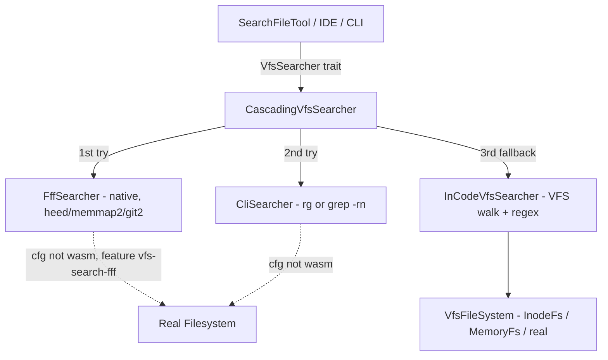

# Feature 33: VFS fff search cascade

> **Motivation (user, 2026-06-20).** The `search_file` tool in `foundation_ai` currently uses the
> `VfsSearcher` cascade (rg/grep CLI → in-code VFS walk) but does NOT use fff — the high-performance
> search engine at `/home/darkvoid/Boxxed/@formulas/src.rust/src.FileSystemAPIs/src.Search/fff`. The user
> wants fff integrated into foundation_nativeapis as the *primary* search backend when available, with the
> existing rg/grep CLI and in-code searchers as fallbacks.
>
> Additionally, custom file-reading logic in `search.rs` (line 151+) should be eliminated — all file
> search should go through the `VfsSearcher` trait so that any consumer (tools, IDE adapters, CLI)
> benefits from the best available backend.

## WHY: Problem Statement

1. **fff is not wired in.** The fff search engine is a high-performance Rust-native tool with frecency,
   git-aware filtering, and heed/memmap2-backed indexing. It's already referenced in F32's spec as the
   intended native search backend, but the actual integration was never implemented — `search.rs` uses
   a generic `dyn FileSearch` trait with only a `VfsSearchBackend` implementation.

2. **Ad-hoc file reading.** `foundation_ai/src/agentic/tools/search.rs` has manual file-reading code
   rather than delegating to `VfsSearcher`. This means:
   - Consumers don't benefit from search backend improvements
   - Each tool re-invents directory walking and grep matching
   - No cascade (if rg is available, it's not used; if fff is available, it's not used)

3. **No VFS-aware fff.** fff searches the real filesystem. It should also be able to search data held in
   our in-memory VFS (`InodeFs`, `MemoryFs`) for wasm and testing scenarios. The `VfsSearcher` trait
   enables this — fff becomes one backend in the cascade alongside VFS-native search.

## WHAT: Solution

### 1. `FffSearcher` — new backend in foundation_nativeapis (native-only)

A `VfsSearcher` impl that wraps fff (path dependency from the formulas monorepo). Native-only
(`cfg(not(target_family = "wasm"))`) because fff depends on `heed`, `memmap2`, `git2`, `rayon`, `notify`.

```rust
// foundation_nativeapis/src/shared/vfs/search.rs (extend existing file)

#[cfg(all(not(target_family = "wasm"), feature = "vfs-search-fff"))]
pub struct FffSearcher {
    // fff search engine handle
}

#[cfg(all(not(target_family = "wasm"), feature = "vfs-search-fff"))]
impl VfsSearcher for FffSearcher {
    fn is_available(&self) -> bool { true }
    fn search(&self, query: &str, kind: VfsSearchKind, roots: &[String]) -> VfsResult<Vec<VfsSearchMatch>> {
        // Delegate to fff API
    }
}
```

### 2. Updated cascade order

The `native_vfs_searcher()` factory becomes:

```
fff (if vfs-search-fff feature enabled) → rg/grep CLI → in-code VFS walk
```

```rust
pub fn native_vfs_searcher<F: VfsFileSystem + 'static>(fs: Arc<F>) -> Box<dyn VfsSearcher> {
    let mut backends: Vec<Box<dyn VfsSearcher>> = Vec::new();

    #[cfg(feature = "vfs-search-fff")]
    if let Some(fff) = FffSearcher::detect() {
        backends.push(Box::new(fff));
    }

    if let Some(cli) = CliSearcher::detect() {
        backends.push(Box::new(cli));
    }

    backends.push(Box::new(InCodeVfsSearcher::new(fs)));

    Box::new(CascadingVfsSearcher::new(backends))
}
```

### 3. foundation_ai search tools delegate to VfsSearcher only

Remove any ad-hoc file-reading from `foundation_ai/src/agentic/tools/search.rs`. The `SearchFileTool`
already uses `dyn FileSearch` / `VfsSearchBackend` — ensure it goes through the updated cascade factory
so fff is used when available.

### 4. VFS-aware search for in-memory filesystems

For VFS filesystems (`InodeFs`, `MemoryFs`), the in-code searcher already works. fff is filesystem-only
(it needs real disk paths), so the cascade naturally falls through to the in-code searcher for VFS-backed
stores. No special handling needed — the cascade handles this.

## Architecture



## HOW: Implementation Steps

1. Add fff as a path dependency in `foundation_nativeapis/Cargo.toml` behind `vfs-search-fff` feature.
   Path: `../../@formulas/src.rust/src.FileSystemAPIs/src.Search/fff` (relative to workspace root).
2. Implement `FffSearcher` wrapping fff's search API — map fff results to `VfsSearchMatch`.
3. Add `FffSearcher::detect()` — checks if fff's index exists or can be initialized.
4. Update `native_vfs_searcher()` to include `FffSearcher` in cascade order: fff → CLI → in-code.
5. Audit `foundation_ai/src/agentic/tools/search.rs` for ad-hoc file reading — replace with delegation
   to `VfsSearcher` via `SearchFileTool::from_searcher()`.
6. Ensure `SearchFileTool` constructor uses the updated cascade factory.
7. Feature-gate: `vfs-search-fff = ["dep:fff"]` so fff is opt-in (its native deps are heavy).
8. Tests: fff search integration (temp dir with files, verify matches); cascade fallback (fff unavailable
   → CLI → in-code); VFS-only search still works without fff.
9. Verify no regressions in existing search tests (`cargo test -p foundation_nativeapis --features vfs-search`
   and `cargo test -p foundation_ai`).
10. Author `fundamentals/` covering: cascading search backends, fff integration, why in-code is the
    universal fallback.

## Open Decisions

- **OD-33-1 — fff dependency mode:** path dep (from formulas monorepo) vs vendoring fff source into
  foundation_nativeapis. Rec: path dep — fff is actively maintained in the formulas repo, and the
  workspace already references formulas paths. If fff publishes to crates.io, switch to version dep.
- **OD-33-2 — fff index lifecycle:** does `FffSearcher::detect()` auto-initialize the fff index, or
  require explicit setup? Rec: auto-initialize on first search with the provided roots.
- **OD-33-3 — wasm fallback:** on wasm, the cascade is just in-code VFS. Confirm this is sufficient
  or if a wasm-compatible subset of fff should be explored. Rec: in-code only for now; fff's deps are
  fundamentally native.

## Target Files

- `backends/foundation_nativeapis/Cargo.toml` — fff dep, `vfs-search-fff` feature
- `backends/foundation_nativeapis/src/shared/vfs/search.rs` — `FffSearcher`, updated cascade
- `backends/foundation_ai/src/agentic/tools/search.rs` — remove ad-hoc file reading, use cascade
- `backends/foundation_nativeapis/tests/` — fff search integration tests

## Tests

```bash
cargo test -p foundation_nativeapis --features vfs-search,vfs-search-fff
cargo test -p foundation_ai
```

## Verification

```bash
cargo clippy -p foundation_nativeapis --all-targets --features vfs-search,vfs-search-fff
cargo clippy -p foundation_ai --all-targets
```

## Done When

- `FffSearcher` implements `VfsSearcher` and is wired into the cascade as the first backend.
- `native_vfs_searcher()` cascade: fff → rg/grep → in-code VFS.
- No ad-hoc file-reading in `foundation_ai/src/agentic/tools/search.rs` — all search goes through
  `VfsSearcher`.
- fff is feature-gated (`vfs-search-fff`) so builds without it still work.
- Existing search tests pass; new fff-specific tests exist.
