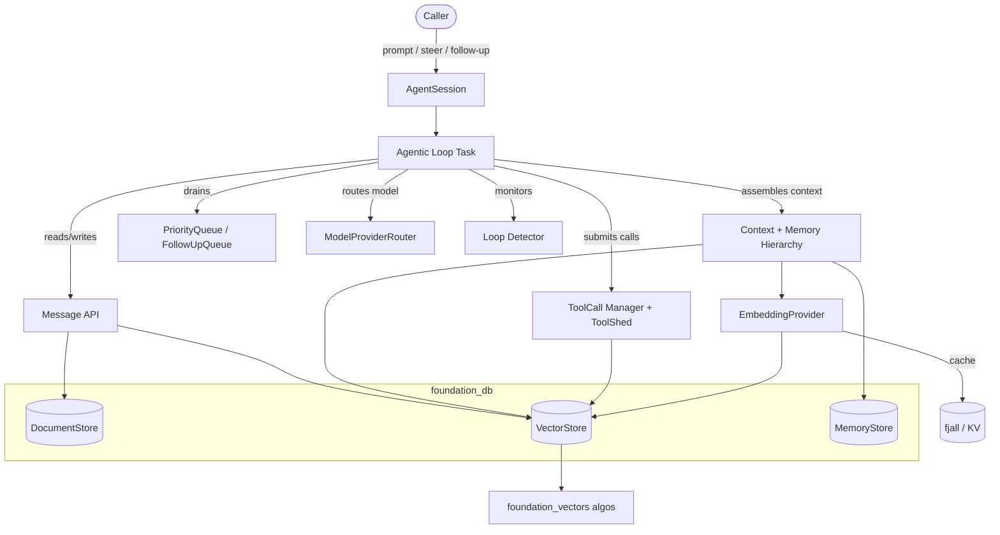
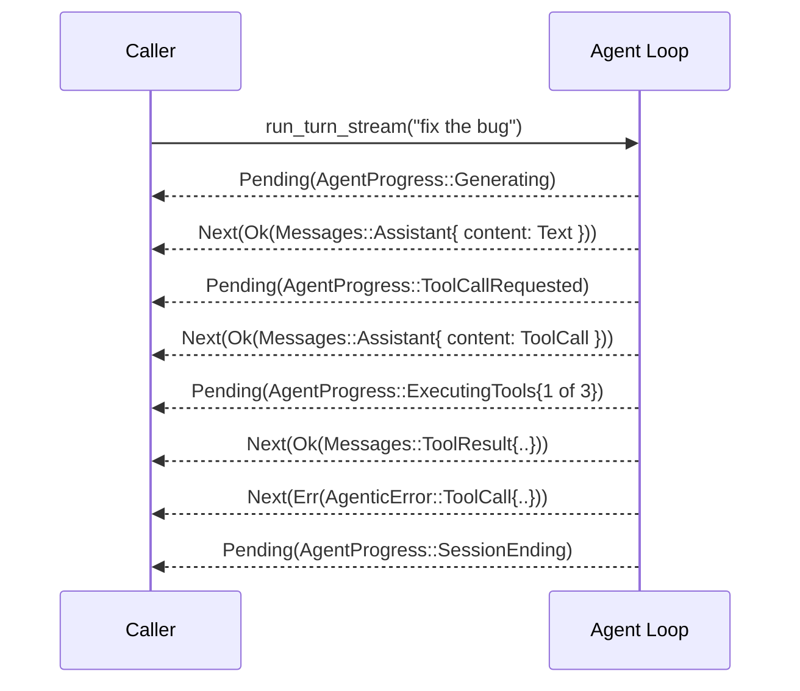
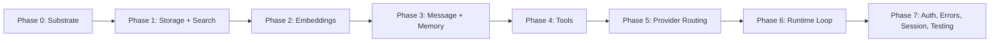

# Requirements: Agentic API for foundation_ai

## Overview

This specification builds an **agentic API** on top of `foundation_ai` and Valtron. It turns
single-shot LLM generation into long-running, resumable agent **sessions** that:

1. Execute requests against an LLM (via a provider or a provider **router**).
2. Pull relevant prior context from a layered **memory hierarchy** and from **vector / file
   search**.
3. Identify tool calls, execute them (serial / parallel / batched via a dependency DAG), and
   feed persisted results back into the loop.
4. Repeat until the LLM emits no further tool calls or output.
5. Accept **steering** (interrupt now) and **follow-up** (defer) input mid-flight.
6. Continuously distil interactions into Working / Observation / Reflection memory, with
   loop-detection and compaction-by-distillation (never by deleting the audit trail).

Everything is a Valtron `TaskIterator` and streams its results using the **same contract the
model layer already uses** — `Stream<Messages, _>` carries the rich `Messages`, while
`Stream::Pending` carries thin status signals.

The **design rationale** for every component lives in `decisions/` (18 ADRs). The **why/what/how
implementation detail** lives in `features/NN-*/feature.md`. This file is the high-level map.

> Source material: `plan.md` (brainstorm), `decisions/01-18` (resolved ADRs), and the
> explorations referenced therein (Pi, Hermes, Mastra, Chroma, graphify, fff, nlprule).

## Language Stack

- **Rust** (native + `wasm32` + Cloudflare Workers). All components must be WASM-aware:
  native-only tooling (fff, heed, memmap2, rayon, fjall) is **target-gated**, never
  feature-gated, with graceful fallbacks on `wasm32`.
- Skills: `rust-clean-code`, `rust-valtron-iterator`, `rust-valtron-usage`.

## Crates Touched

| Crate | Role in this spec |
|-------|-------------------|
| `foundation_ai` | New `agentic` module (sessions, loop, tools, memory, queues), `Messages`/`ModelOutput` type changes, `ProviderRouter`, token budgeting |
| `foundation_db` | New `DocumentStore`, `VectorStore`, `MemoryStore` traits + all backends |
| `foundation_vectors` | **New crate** — vector algorithms (flat/IVF/HNSW), BM25, hybrid fusion, code-graph |
| `foundation_core` | Consumes existing `valtron` (`TaskStatus::Depends`, `Stream`, executors); possible `synca` pub/sub helper |
| `foundation_rng` | scru128 IDs (already present) — wrapped as `Scru128`/`SessionId` |

## Known Issues, Prerequisites & Code Realities

These were verified against the current source and must be handled explicitly (each is assigned
to a feature):

1. **`Broadcaster<T>` needs `&mut self`** for `subscribe()`/`broadcast()`
   (`foundation_core/src/synca/mpp.rs`). Pub/sub over `Arc` requires a `&self` mechanism —
   resolved in **F08** (Message API) via a `ConcurrentQueue`-of-receivers pattern or a
   `&self`-safe broadcaster helper.
2. **`Stream<D,P>` has no error variant** (verified). Errors propagate as `Stream::Next(Err(..))`
   by making the agent loop's `D = Result<Messages, AgenticError>` — **F01 / F17**.
3. **`Messages::User.role` is `String`** today (`types/mod.rs:895`). The `MessageRole` enum is a
   deliberate breaking change this spec introduces — **F01**.
4. **`ToolShed.others` exists** (`types/mod.rs:1076`) but is to be **removed** in this spec —
   **F01 / F10**. (Decision 15's "no `others`" assertion is the intended end state.)
5. **`GenerationError` lacks `ContextOverflow` / `RateLimit`** variants. Either add them or detect
   via the existing `Messages::is_context_overflow()` + `RateLimiterStore` — **F17**.
6. **`AuthProvider` already exists** in `foundation_ai` for *provider credentials*. The agentic
   access-control trait must use a **different name** (`SessionAccessProvider`) — **F16**.
7. **`DocumentStore`, `VectorStore`, `MemoryStore`, `foundation_vectors` do not yet exist** — they
   are prerequisites built in Phase 1 before the agentic layer consumes them — **F03–F06**.
8. **`TaskStatus::Depends(Arc<dyn EventReadiness>)` and `Wait` exist** (verified) and are used to
   avoid `Pending`/`Delayed` spin loops — **F13**.

## High-Level Architecture

### The Session Bundle

A session is a `SessionId` (scru128, time-ordered, machine-unique) plus an `Arc`-shared bundle of
components, each backed by a Valtron task and wired with `&self` interior mutability.



### The Stream Contract (the spine)

The model layer already streams `StreamIterator<D = Messages, P = ModelState>`. The agentic loop
**mirrors** this:



- **`Stream::Next(Ok(Messages))`** carries the *real* message (the source of truth — `Messages`
  already models user/assistant/tool-result/working-memory/observation/reflection).
- **`Stream::Next(Err(AgenticError))`** carries errors (no new Stream variant needed).
- **`Stream::Pending(AgentProgress)`** carries *thin status signals* only — lifecycle and
  progress. A `Pending` signal tells the consumer **what `Next` to expect** (e.g.
  `ToolCallRequested` ⇒ next `Next` is an `Assistant{ content: ToolCall }`).

### Build Phases



## Feature Index

> Ordering is dependency-driven. Each feature maps to the decisions it implements and the
> answered TODOs it resolves. Detailed architecture lives in each `feature.md`.

| # | Feature | Phase | Implements (Decisions) | Resolves (TODOs) |
|---|---------|-------|------------------------|------------------|
| 01 | Message Model & Stream Contract | 0 | D02, D04, D11 | #9, CRIT-04/05/06 |
| 02 | Token Accounting & Budget | 0 | D02, D03, D16 | #5 |
| 03 | DocumentStore + Backends | 1 | D13, D10 | #1(idx), #2, #3 |
| 04 | foundation_vectors Crate | 1 | D07 | #6(graph), #7 |
| 05 | VectorStore + Backends | 1 | D07, D03 | #8 |
| 06 | MemoryStore | 1 | D03, D01 | #1(memory) |
| 07 | EmbeddingProvider | 2 | D06 | #11 |
| 08 | Message API | 3 | D02, D10 | #3, #4 |
| 09 | Context & Memory Hierarchy | 3 | D03 | #5 |
| 10 | Tool Registration & ToolShed | 4 | D15, D14, D04 | #6, #14(shed) |
| 11 | ToolCall Execution (DAG) | 4 | D04, D16 | — |
| 12 | ModelProviderRouter | 5 | (new) | #14(router) |
| 13 | Steering Queues & Depends | 6 | D05, D08 | #10, CRIT-07 |
| 14 | Agentic Loop & Processors | 6 | D11, D08 | #9 |
| 15 | Loop Detection | 6 | D09 | — |
| 16 | Access Control & Budget | 7 | D12 | #12, #13 |
| 17 | Error Handling | 7 | D16 | CRIT-03 |
| 18 | Agent Session API | 7 | D18, D01 | #14(builder) |
| 19 | Testing Strategy | 7 | D17 | — |

### Feature 01 — Message Model & Stream Contract
- [ ] `MessageRole` enum (`User|Agent|System|Tool|Custom`), replace `Messages::User.role: String`
- [ ] Add agentic `Messages` variants: `WorkingMemory`, `Observation`, `Reflection` + entry types
- [ ] `ModelOutput::ToolCall` gains `depends_on: Vec<String>` + `execution_hint: ExecutionHint`
- [ ] Remove `ToolShed.others`; update `build_toolshed` + all providers
- [ ] `Scru128` / `SessionId` wrapper over `foundation_rng`
- [ ] Define agent stream contract `D = Result<Messages, AgenticError>`, `P = AgentProgress`
- [ ] `AgentProgress` enum (thin status signals + the "expect-next" protocol)

### Feature 02 — Token Accounting & Budget
- [ ] Session token accumulator built on `UsageReport` from each `Messages::Assistant`
- [ ] Configurable max-token budget; halt generation + correct error until reset/updated
- [ ] Expose counters consumed by memory triggers (F09) and budget surfacing (F16)

### Feature 03 — DocumentStore + Backends
- [ ] `DocumentStore` trait (append/scan/scan_all/delete/count) in `foundation_db`
- [ ] `scan_from(key, from_id, limit)` temporal range scan exploiting scru128 ordering
- [ ] Promote `scru128/title/summary/type` to real columns + `content` blob (search-friendly)
- [ ] fjall sidecar offset index beside NDJSON/file stores for fast seek (native)
- [ ] Backends: SQL (SQLite/Turso/D1), Memory, VFS, CF KV

### Feature 04 — foundation_vectors Crate
- [ ] New crate; distance metrics (cosine/L2/dot)
- [ ] Flat scan; IVF; HNSW (cross-platform, WASM-safe)
- [ ] BM25 + hybrid fusion (RRF, optional rerank, alpha weighting)
- [ ] Code-graph generation (learn from graphify, reimplement EwePlatform/Rust-native)

### Feature 05 — VectorStore + Backends
- [ ] `VectorStore` trait with `query(vector, top_k, namespace)` session scoping
- [ ] Backends: in-memory, Turso/libSQL, SQLite(sqlite-vec), fjall(IVF), CF D1, CF KV
- [ ] External backends behind the trait: Pinecone, Chroma, TurboPuffer (native)
- [ ] Dimension config + validation; WASM-friendly path

### Feature 06 — MemoryStore
- [ ] `MemoryStore` trait for fast latest/last memory retrieval per `SessionId`
- [ ] Impl over fjall (native disk) and `KeyValueStore` implementers
- [ ] Stores newest Working/Observation/Reflection snapshots for quick resume hydration

### Feature 07 — EmbeddingProvider
- [ ] LRU cache (bounded); dimension registry; queue-backed Valtron task; batch embed
- [ ] fjall cache backing: **required** on native, optional/cfg-gated on wasm/CF
- [ ] Whole-text caching first; sentence-level (nlprule) deferred

### Feature 08 — Message API
- [ ] `Arc<MessageInner>` store on `DocumentStore`; write-buffer + flush Valtron task
- [ ] `&self` pub/sub (resolve Broadcaster `&mut self`); event stream for listeners
- [ ] Vector indexing via EmbeddingProvider + VectorStore; `recent`/`all`/`scan_from`/`semantic_search`
- [ ] JSON + Arrow serialization (columns + content blob; drop FlatBuffers fallback)

### Feature 09 — Context & Memory Hierarchy
- [ ] Working / Observation / Reflection memory; generation triggers from Token Accounting (F02)
- [ ] Context assembly order; resolve transitional observation-injection question (INCON-03)
- [ ] Semantic recall via VectorStore + fast hydration via MemoryStore

### Feature 10 — Tool Registration & ToolShed
- [ ] `ToolImpl` trait; ToolCallManager registry; `ToolShed::default()` helper wiring defaults
- [ ] Explicit `ToolShed` requirement (no `others`); `shed` meta-tool over VectorStore
- [ ] Split `search(...)` (semantic/memory/graph) vs `search_file(...)` (fff)
- [ ] fff integration (native) + wasm fallback; preflight (tools registered, auth, budget)

### Feature 11 — ToolCall Execution (DAG)
- [ ] Workflow staging (parallel/sequential/batch) from `depends_on`/`execution_hint`
- [ ] Persist-before-deliver; interruption via PriorityQueue/cancel signal
- [ ] Retry config per tool; tool errors surface back to the LLM

### Feature 12 — ModelProviderRouter
- [ ] `ProviderRouter` implementing the provider trait, routing model→provider
- [ ] Routing via provider-declared supported models / rules (no model-by-model wiring)
- [ ] Single-provider OR router; same-model multi-provider fallback (design-aware, future impl)

### Feature 13 — Steering Queues & Depends
- [ ] `PriorityQueue` / `FollowUpQueue` as `Arc<ConcurrentQueue<Messages>>`
- [ ] `CancelCode` (`#[repr(u32)]`, valid syntax); sequenced agent+LLM composition
- [ ] Use `TaskStatus::Depends` for queue/tool waits (no `Pending`/`Delayed` spin)

### Feature 14 — Agentic Loop & Processors
- [ ] Inner/outer loop (steering vs follow-up boundaries)
- [ ] Input/output processor interface fully specified (return type, skip, dedup)
- [ ] Consume F01 stream contract; wire memory triggers, loop detection, circuit breaker

### Feature 15 — Loop Detection
- [ ] Exact / fuzzy (SimHash) / tool-call / semantic detection
- [ ] Redirect from memory; escalation (model/temperature); resolve task-vs-processor model

### Feature 16 — Access Control & Budget
- [ ] `SessionAccessProvider` (renamed to avoid `AuthProvider` collision) + `AllowAllAccess`
- [ ] Session ownership / shared_with rationale; bridge to `foundation_auth`
- [ ] Retrieve user token budget; surface limits to the model

### Feature 17 — Error Handling
- [ ] `AgenticError` taxonomy; propagation via `Next(Err)`
- [ ] Retry ownership in model/tool tasks; circuit breaker / fallback models
- [ ] Resolve `GenerationError::ContextOverflow`/`RateLimit` gap

### Feature 18 — Agent Session API
- [ ] Builder requiring `ToolShed` + `ProviderRouter`; default-config helpers
- [ ] Lifecycle: `run_turn` / `run_turn_stream` / `end`; deterministic resume protocol
- [ ] Preflight checks before scheduling onto Valtron

### Feature 19 — Testing Strategy
- [ ] `MockModelProvider` driven by `ModelInteraction` (not regex)
- [ ] Mock tools; test tiers (unit/integration/e2e/deterministic); pool annotations; wasm

## Success Criteria (Spec-wide)

- A caller can create, drive, stream, interrupt, follow-up, end, and **resume** a session with a
  single `AgentSession` handle.
- The full agentic loop runs end-to-end against a local model (llama.cpp/Candle) with mock tools.
- All storage/search traits (`DocumentStore`, `VectorStore`, `MemoryStore`) have working native +
  WASM-capable backends.
- The audit trail is never destroyed; context reduction is by distillation only.
- Everything compiles for native and `wasm32`; native-only tooling is target-gated.
- `cargo clippy -- -D warnings` clean; tests green per feature.

## Module References

- Decisions: `decisions/01-18`
- Valtron: `backends/foundation_core/src/valtron` (+ skills `rust-valtron-*`)
- foundation_ai types: `backends/foundation_ai/src/types/mod.rs`
- Explorations: Pi, Hermes, Mastra, Chroma, graphify, fff, nlprule (paths in `plan.md`)

## Verification Commands

```bash
cargo build -p foundation_ai -p foundation_db -p foundation_vectors
cargo build -p foundation_ai --target wasm32-unknown-unknown
cargo clippy -p foundation_ai -p foundation_db -p foundation_vectors -- -D warnings
cargo fmt -- --check
cargo test -p foundation_vectors
cargo test -p foundation_db
cargo test -p foundation_ai
```

---

*Created: 2026-06-14*
*Last Updated: 2026-06-14*
*Status: In Progress — feature breakdown pending user approval*
