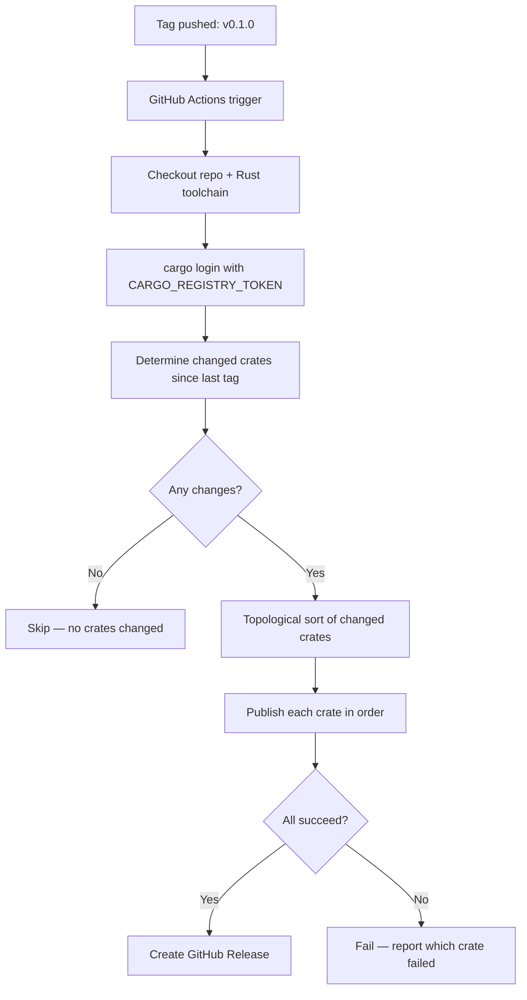

# Feature 07: CI/CD Publishing Pipeline

## WHY: Problem Statement

Manual `cargo publish` for 38 crates is error-prone and doesn't scale. An automated CI/CD pipeline ensures:
- Crates are published in correct dependency order (topological sort)
- Only changed crates are published (no redundant publishes)
- Publishing is triggered on tagged releases with proper versioning
- Failures are reported with clear error messages

## WHAT: Pipeline Design

### Trigger

- GitHub tag matching pattern: `v*` (e.g., `v0.1.0`, `v0.2.3`)
- Manual dispatch (for emergency publishes)

### Workflow Steps



### HOW: Implementation Tasks

1. **Create `.github/workflows/publish-crates.yml`**
   - Trigger on tag push `v*`
   - Set up Rust toolchain (same version as workspace `rust-version`)
   - `cargo login` using `${{ secrets.CARGO_REGISTRY_TOKEN }}`
   - Determine changed crates by comparing `git diff` between current tag and previous tag
   - Topological sort of changed crates using workspace dependency graph
   - For each crate in order:
     - `cargo publish -p <crate> --allow-dirty` (allow uncommitted README changes if needed)
     - On failure: fail the workflow with clear error message
   - On success: create GitHub Release from the tag

2. **Configure `CARGO_REGISTRY_TOKEN` secret**
   - User must create a crates.io API token with `publish` scope
   - Add as GitHub secret: `Settings → Secrets and variables → Actions → CARGO_REGISTRY_TOKEN`

3. **Add `publish` field to Cargo.toml** (optional safety)
   - `publish = ["crates-io"]` to explicitly allow publishing to crates.io
   - Prevents accidental publishes to other registries

4. **Test the pipeline**
   - Create a test tag on a branch
   - Verify workflow runs and publishes a single test crate
   - Verify GitHub Release is created

5. **Add manual dispatch support**
   - `workflow_dispatch` input for specifying which crates to publish
   - Useful for re-publishing after a failed attempt

6. **Add notification**
   - Post to Slack/Discord/email on publish success/failure

### Workflow File Structure

```yaml
name: Publish Crates to crates.io

on:
  push:
    tags:
      - 'v*'
  workflow_dispatch:
    inputs:
      crates:
        description: 'Comma-separated list of crates to publish (optional)'
        required: false

permissions:
  contents: write

jobs:
  publish:
    runs-on: ubuntu-latest
    steps:
      - uses: actions/checkout@v4
      - uses: dtolnay/rust-toolchain@stable
      - name: Login to crates.io
        run: cargo login ${{ secrets.CARGO_REGISTRY_TOKEN }}
      - name: Determine changed crates
        run: |
          # Script to detect changed crates and topological sort
          # Output: ordered list of crate names to publish
      - name: Publish crates
        run: |
          # For each crate in order:
          #   cargo publish -p <crate>
      - name: Create GitHub Release
        if: success()
        run: gh release create ${{ github.ref_name }} --generate-notes
```

### Success Criteria

- Workflow triggers on tag push
- Changed crates detected automatically
- Crates published in correct dependency order
- GitHub Release created on success
- Clear error reporting on failure
- Manual dispatch works for ad-hoc publishes
