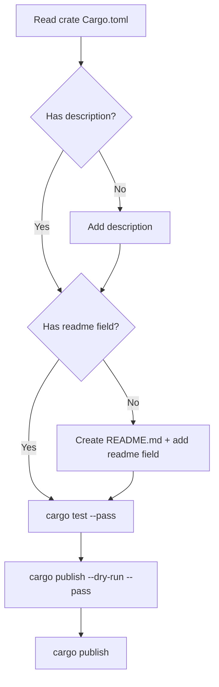
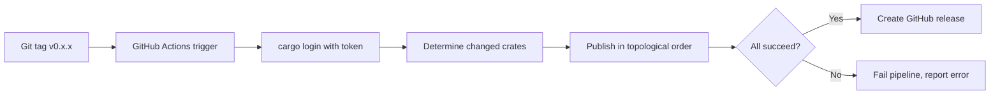

# crates.io Publishing — Specification

## Overview

This specification covers the end-to-end process of publishing all 38 workspace crates from the `ewe_platform` monorepo to crates.io. It includes name validation, metadata completion, dependency-order publishing, and CI/CD pipeline setup.

## Known Issues/Limitations

- None currently — all 38 crate names confirmed available on crates.io (2026-06-16)

## Feature Index

| Feature | Description | Status |
|---------|-------------|--------|
| [00 — Crate Names & Publish Plan](features/00-crate-names-and-publish-plan/feature.md) | Validate all crate names on crates.io, confirm no conflicts, document publishing tiers and per-crate checklists | ✅ Completed |
| [01 — Metadata Completion](features/01-metadata-completion/feature.md) | Add missing descriptions, README files, and `readme` fields to all crates | ⏳ Pending |
| [02 — Tier 1 Leaf Crates Publishing](features/02-tier1-leaf-publishing/feature.md) | Publish 8 leaf crates with no internal dependencies (errstacks, nostd, macros, conditional, testing, rng, llama_bindings, llama_cpp) | ⏳ Pending |
| [03 — Tier 2 Core Substrate Publishing](features/03-tier2-core-substrate-publishing/feature.md) | Publish 3 core substrate crates (compact, config, logging) | ⏳ Pending |
| [04 — Tier 3 Infrastructure Publishing](features/04-tier3-infra-publishing/feature.md) | Publish 6 infrastructure crates (core, http, netio, signals, ui_traits, theme) | ⏳ Pending |
| [05 — Tier 4 Domain Crates Publishing](features/05-tier4-domain-publishing/feature.md) | Publish 10 domain crates (auth, db, jsonschema, codegen, codegentools, packager, runtimes, shell, toolings, testbed) | ⏳ Pending |
| [06 — Tier 5 Higher-Order Crates Publishing](features/06-tier5-higher-order-publishing/feature.md) | Publish 11 higher-order crates (ai, arrow, browser, cedar, deployment, html, nativeapis, openapi, ui_components, wasm, wasm_ui) | ⏳ Pending |
| [07 — CI/CD Publishing Pipeline](features/07-ci-cd-publishing-pipeline/feature.md) | Set up GitHub Actions workflow for automated `cargo publish` on tagged releases | ⏳ Pending |

## Requirements Conversation Summary

- User requested: validate crate name conflicts on crates.io, revise naming if needed, then write deployment features for each crate
- All 38 names confirmed available — user confirmed keep all names as-is
- All 38 crates to be published (including infrastructure_llama_*)
- 4 crates missing descriptions: foundation_auth, foundation_cedar, foundation_logging, foundation_netio → descriptions added in feature 00
- User wants to deploy once name conflicts are resolved — proceeding to metadata and publish setup

## High-Level Architecture

### Publishing Tiers (Topological Order)

```mermaid
graph TD
    subgraph Tier1[Tier 1 — Leaf Crates]
        T1A[foundation_errstacks]
        T1B[foundation_nostd]
        T1C[foundation_macros]
        T1D[foundation_conditional]
        T1E[foundation_testing]
        T1F[foundation_rng]
        T1G[infrastructure_llama_bindings]
        T1H[infrastructure_llama_cpp]
    end

    subgraph Tier2[Tier 2 — Core Substrate]
        T2A[foundation_compact]
        T2B[foundation_config]
        T2C[foundation_logging]
    end

    subgraph Tier3[Tier 3 — Infrastructure]
        T3A[foundation_core]
        T3B[foundation_http]
        T3C[foundation_netio]
        T3D[foundation_signals]
        T3E[foundation_ui_traits]
        T3F[foundation_theme]
    end

    subgraph Tier4[Tier 4 — Domain Crates]
        T4A[foundation_auth]
        T4B[foundation_db]
        T4C[foundation_jsonschema]
        T4D[foundation_codegen]
        T4E[foundation_codegentools]
        T4F[foundation_packager]
        T4G[foundation_runtimes]
        T4H[foundation_shell]
        T4I[foundation_toolings]
        T4J[foundation_testbed]
    end

    subgraph Tier5[Tier 5 — Higher-Order]
        T5A[foundation_ai]
        T5B[foundation_arrow]
        T5C[foundation_browser]
        T5D[foundation_cedar]
        T5E[foundation_deployment]
        T5F[foundation_html]
        T5G[foundation_nativeapis]
        T5H[foundation_openapi]
        T5I[foundation_ui_components]
        T5J[foundation_wasm]
        T5K[foundation_wasm_ui]
    end

    Tier1 --> Tier2
    Tier2 --> Tier3
    Tier3 --> Tier4
    Tier4 --> Tier5
```

### Per-Crate Publish Flow

### CI/CD Pipeline

## Success Criteria

1. All 38 crates successfully published to crates.io
2. Each crate passes `cargo publish --dry-run` before publishing
3. CI/CD pipeline publishes automatically on tagged releases
4. No name conflicts — all names confirmed available

## Language Stack

- **Rust** — all crates in this workspace
