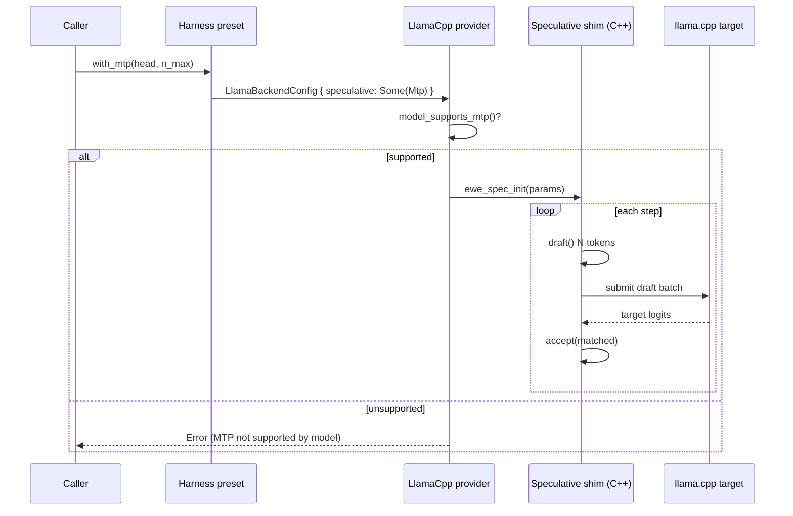

# llama.cpp Multi-Token Prediction (MTP) — Opt-in Speculative Decoding

## Problem

Modern local models (GLM 5.2, Qwen 3.6, Gemma 4, DeepSeek, …) ship a
**Multi-Token Prediction (MTP)** head that llama.cpp can use as a speculative
decoding *draft* to generate several tokens per target step, materially
speeding up token generation. Our `llama.cpp` provider does not expose this at
all today: `LlamaBackendConfig` has no speculative/MTP knob, and the decode
loop in `backends/foundation_ai/src/backends/llamacpp.rs` runs plain
single-token decoding.

Two hard constraints shape the design:

1. **Not every model supports MTP.** Enabling it globally, or bolting it into
   the decode path unconditionally, would break the majority of GGUF models
   that ship no MTP head. MTP must be **opt-in** and **capability-gated**.
2. **MTP is a llama.cpp `common/` (C++) API.** The speculative engine lives in
   `common/speculative.h` (`common_speculative_init/_begin/_process/_draft/
   _accept`), which is a stateful C++ API — not the bindgen-friendly C surface
   in `include/llama.h`. It requires a compiled `extern "C"` shim, exactly like
   the Jinja chat-template shim already added (see Background).

## Goals

- **G1 — Opt-in config.** Add an optional `SpeculativeConfig` (MTP variant) to
  the llama.cpp provider config, defaulting to `None` (today's plain decoding).
  Zero behavior change unless a caller explicitly enables it.
- **G2 — Capability gating.** A model/preset that does not support MTP must not
  silently no-op nor crash: enabling MTP where it is unsupported returns a
  clear error at configuration/preflight time.
- **G3 — Speculative decode engine.** Wire a C++ shim over
  `common/speculative.h` and integrate a draft → verify → accept loop into the
  llama.cpp generation path, engaged only when `SpeculativeConfig` is present
  and the model supports it.
- **G4 — Harness surface.** Declare MTP support on the harness presets and add
  a `with_mtp(...)` opt-in for the supporting presets: GLM 5.2, Qwen 3.6,
  Gemma 4. Non-supporting presets do not expose the knob (or reject it).
- **G5 — Graceful fallback.** If the speculative engine cannot initialize at
  runtime (e.g. the MTP head GGUF is missing), fall back to standard decoding
  with a single clear `tracing::warn!`, never a panic.

## Progress

- **Phase 1 — config surface, threading, capability gate, harness (DONE):**
  `SpeculativeConfig`/`SpeculativeKind` + `LlamaBackendConfig.speculative`
  (default `None`) with builder `.speculative()` / `.mtp()`; capability probe
  `LlamaModel::supports_mtp()` (via `llama_model_n_layer_nextn`); capability
  gate in `LlamaBackends::load_model` (errors when MTP requested on a model with
  no head — G2); config threaded through `HuggingFaceGGUFProvider` (previously
  the whole `llama_config` was dropped); harness `with_mtp()` helper +
  `SUPPORTS_MTP` on presets (GLM 5.2 / Qwen 3.6 / Gemma 4 = true, Ornith =
  false); honest `warn!`-and-fall-back at decode when engine is not yet wired
  (G5 fallback). Tests: `tests/harness/mtp_tests.rs` (offline, 5) +
  `tests/harness/integrations/mtp_gate.rs` (gate error + control, 2).
- **Phase 2 — speculative decode engine (DONE, in-process FFI, verified):**
  Decision (user): implement in-process via a C++ shim, not server-backed.
  VERIFIED end-to-end on Gemma 4 E2B + `mtp-gemma-4-E2B-it.gguf`: `Model::generate`
  ran the shim and reported `n_prompt_tokens=93 n_generated=2 n_drafted=8
  n_accepted=4 acceptance_rate=0.5`, output "Hello!". Tests:
  `tests/harness/integrations/mtp_generate.rs` (live e2e) + `mtp_gate.rs` (2) +
  `mtp_tests.rs` (5 offline) — all pass. Committed in `9259281da` (wiring),
  `LlamaMtp` safe wrapper in `infrastructure/llama-cpp/src/speculative.rs`.
  Findings while building:
  * The Gemma/Qwen MTP head is a **separate draft GGUF** (arch
    `Gemma4Assistant`), loaded alongside the target and sharing the target KV
    cache (draft context created with `ctx_type=LLAMA_CONTEXT_TYPE_MTP`,
    `ctx_other=ctx_tgt`). So the **main model has `n_layer_nextn == 0`** — the
    Phase-1 gate (which checks the main model) wrongly rejects it and must be
    updated to accept a model when a valid MTP head is supplied.
  * Downloaded the head `mtp-gemma-4-E2B-it.gguf` (~98 MB, Q8_0) into
    `artefacts/models/`.
  * **Validated MTP works on our b9850 build** via `support/bin/llama-server`
    `--model-draft … --spec-type draft-mtp`: `draft acceptance = 0.417
    (5/12), mean len 2.67`.
  * Integration model: reference is `examples/speculative-simple` +
    `tools/server` (MTP path). Single-sequence loop: `common_speculative_init`
    → `common_speculative_begin(prompt)` → per step: set draft params →
    `common_speculative_draft` → build target batch `[id_last, draft…]` →
    `llama_set_embeddings(ctx_tgt, common_speculative_need_embd(spec))` →
    `llama_decode(ctx_tgt)` → `common_speculative_process(spec, batch)` →
    `common_sampler_sample_and_accept_n` → `common_speculative_accept` →
    commit + `llama_memory_seq_rm` extras. Checkpoints skipped (single fresh
    seq); if the context requires checkpoints, fall back to standard decode.
  * Shim: `infrastructure/llama-bindings/wrapper_mtp.{h,cpp}` exposing
    `ewe_mtp_init` / `ewe_mtp_generate` / `ewe_mtp_free` (mirrors the
    `wrapper_chat` build wiring: `cc` compile + `ewe_mtp_.*` bindgen allowlist).
- **Config-threading gap (FIXED):** `HuggingFaceGGUFProvider` now carries the
  full `LlamaBackendConfig` into `LlamaBackends::load_model`, which applies
  `to_model_params()` (GPU layers) and `to_context_params()` (context length,
  batch, threads). Previously the whole config was dropped and defaults used.
  `to_context_params()` also no longer force-enables embeddings (that would
  break text generation, which shares the context). Verified: Gemma 4 E2B still
  generates after the change.
- **Phase 2 follow-ups (ALL DONE, verified):** the shim was refactored from a
  one-shot `ewe_mtp_generate` to a **step-driven** engine — `ewe_mtp_init`
  (build reusable engine: contexts + speculator), `ewe_mtp_begin` (reset KV +
  sampler, decode prompt), `ewe_mtp_step` (one draft→verify→accept step, returns
  the committed piece), `ewe_mtp_stats`. `LlamaMtp` exposes `begin`/`step`/
  `stats` plus a `generate` convenience. This unlocked all three follow-ups:
  * **Streaming MTP (was: not supported):** `Model::stream` now drives the
    engine one `step()` per poll (`mtp_stream_next` + `MtpStreamState`), yielding
    committed pieces. Verified: `tests/harness/integrations/mtp_generate.rs::
    test_mtp_stream_gemma4_e2b` → `MTP stream collected: "Hello!"`.
  * **Engine caching (was: reload per call):** the engine is cached in
    `LlamaModelsInner.mtp: Arc<Mutex<Option<LlamaMtp>>>`, lazily built on first
    MTP `generate()` and reused — no per-call draft reload. (Streams own their
    own engine for exclusive access over the stream's lifetime.)
  * **No wasted ctx (was: standard ctx built then discarded):** the MTP dispatch
    moved into `Model::generate` BEFORE the standard `ctx`/`sampler` are built;
    they are created only on the standard/fallback path. `generate_text` is now
    the standard-only decode.
  * Note: the capability gate still validates a separate `mtp_model` lazily (a
    bad head surfaces at generate time → G5 fallback) — intentional, not a bug.

## Non-Goals

- Non-MTP speculative types (`draft-simple`, `draft-eagle3`, `draft-dflash`,
  n-gram). The config enum is shaped to allow them later, but only MTP is
  implemented here.
- Speculative decoding for cloud providers (Anthropic/OpenAI) — not applicable.
- Automatic download of MTP head GGUFs — the caller supplies the path (a
  follow-up may teach `HuggingFaceGGUFProvider` to fetch `mtp-` siblings, as
  llama.cpp's `--mtp` does).

## Implementation Location

- Provider config + decode loop: `backends/foundation_ai/src/backends/llamacpp.rs`
- Speculative C++ shim: `infrastructure/llama-bindings/wrapper_spec.{h,cpp}`
  (+ `wrapper.h` include, bindgen allowlist + `cc` compile in `build.rs`)
- Safe wrapper: `infrastructure/llama-cpp/src/` (new `speculative` module)
- Harness presets: `backends/foundation_ai/src/harness/{providers,agents}.rs`
- Docs: `backends/foundation_ai/docs/03-model-providers.md` (+ harness how-to)

## Language Stack

| Language | Purpose | Skill Location |
|----------|---------|----------------|
| Rust | Provider config, safe wrapper, harness, decode loop | `.agents/skills/rust-clean-code/skill.md` |
| C++ | `extern "C"` shim over llama.cpp `common/speculative.h` | (matches existing `wrapper_chat.cpp` shim) |

### Mandatory Pre-Implementation Steps

1. Read `.agents/skills/rust-clean-code/skill.md` before writing Rust.
2. Mirror the existing chat-template shim (`wrapper_chat.{h,cpp}`) for the C++
   FFI boundary — same build wiring (`cc` compile, bindgen allowlist, link
   order ahead of `libllama-common`).

---

## Approach

### 1. Config surface (opt-in, `None` by default)

```rust
// backends/foundation_ai/src/backends/llamacpp.rs
pub struct LlamaBackendConfig {
    // ... existing fields ...
    /// Multi-token prediction / speculative decoding. `None` = standard decode.
    pub speculative: Option<SpeculativeConfig>,
}

pub struct SpeculativeConfig {
    pub kind: SpeculativeKind,      // currently only Mtp
    /// Path to the MTP head GGUF, if it is a separate sibling file.
    pub mtp_model: Option<PathBuf>,
    /// Max draft tokens per target step (llama.cpp `n_max`).
    pub n_max: u32,
}

pub enum SpeculativeKind { Mtp }
```

Builder: `LlamaBackendConfigBuilder::speculative(cfg)` / `.mtp(path, n_max)`.

### 2. Capability gating

A `model_supports_mtp(&LlamaModel) -> bool` probe (via model metadata / the
new `LLAMA_CONTEXT_TYPE_MTP` capability). At model creation / preflight:

- `speculative: Some(_)` + supported → engage the speculative path.
- `speculative: Some(_)` + unsupported → **error** (`GenerationError` /
  provider error), not a silent no-op (G2).
- `speculative: None` → standard decode (unchanged).

### 3. Speculative C++ shim (`wrapper_spec.{h,cpp}`)

Mirror the chat shim: an opaque `ewe_speculative*` handle over
`common_speculative_*`, plus `common_params_speculative` construction. Exposed
`extern "C"`, allowlisted through bindgen (`ewe_spec_.*`), compiled by `cc` and
linked ahead of `libllama-common`.

### 4. Decode loop integration

In the llama.cpp generate/stream path, when a speculative handle is present:
`begin(prompt)` → per step: `draft()`, submit the drafted batch, verify against
the target logits, `accept(n)` the matched prefix, continue. Falls back to
plain decode on init failure (G5).

### 5. Harness surface

- `providers.rs`: a `supports_mtp()` associated const/fn on each preset —
  `true` for `Glm52`, `Qwen36`, `Gemma4*`; `false` otherwise.
- `agents.rs` / `RouterMix`: a `with_mtp(...)` opt-in that sets the
  `SpeculativeConfig` on the underlying GGUF config for supporting presets.

### 6. Data flow



### Technical Decisions and Trade-offs

| Decision | Rationale | Alternatives rejected |
|----------|-----------|-----------------------|
| Opt-in `Option<SpeculativeConfig>`, default `None` | Zero risk to the 99% of models without MTP heads | Always-on / autodetect — breaks non-MTP models, surprises callers |
| Error (not no-op) when MTP unsupported | Honest, debuggable; avoids a "config knob that silently does nothing" | Silent fallback — hides misconfiguration |
| C++ `extern "C"` shim over `common/speculative.h` | The capable API is C++; matches the proven chat-template shim pattern | Binding `llama.h` only — no speculative API there |
| Caller supplies MTP head path | Keeps this spec focused; download is a separable concern | Auto-fetch `mtp-` sibling — larger surface, defer |

---

## Background (already landed on `ai-gemma-readiness`)

This spec builds directly on work completed while making Gemma 4 generate
locally. Recorded here so the MTP work has full context.

### B1 — foundation_ai harness module (`src/harness/`)

One-call, sensible-default agent setup over the provider stack:

- `providers.rs` — GGUF presets (`Glm52`, `Qwen36`, `Ornith10`, `Gemma4E2b/
  E4b/26b`) with quantization methods, plus `CloudPresets` (Claude
  Opus/Sonnet, OpenAI chat + Responses) and cloud model-id constants.
- `router.rs` — `RouterMix` composes heterogeneous providers into a
  `ProviderRouter` using **explicit routing rules with distinct provider
  identities**. This is required because provider `serves()` is inconsistent:
  `HuggingFaceGGUFProvider::serves()` is always `false` (no catalog) and
  `AnthropicMessagesProvider::serves()` is always `true` (claims every id), so
  the router's auto-probe cannot safely mix them. `RouterPreset` carries the
  router + primary/memory/fallback model ids and bridges into an
  `AgentSessionBuilder` via `into_agent_builder`.
- `agents.rs` — combo presets, each with `*_router()` → `RouterPreset` and
  `*_session(session_id)` → `AgentSessionBuilder`: `glm52_gemma`,
  `qwen36_gemma`, `gemma` (26B main + E2B memory), `claude`, `openai_chat`,
  `openai_responses`, `candle_llama` (candle-gated; Candle currently
  implements only the Llama architecture).

Tests: `tests/harness/` (offline `router_tests` + `session_bridge_tests`) plus
`tests/harness/integrations/gemma_pull.rs` (feature-gated by
`integration_tests`, no `#[ignore]`, pulls Gemma 4 E2B and generates).

### B2 — llama.cpp bump b9006 → b9850

Submodule `tools/llama.cpp` updated to b9850 (master tip). Build fixes:

- `infrastructure/llama-bindings/build.rs`: `LLAMA_BUILD_APP=OFF` (new unified
  `llama` binary under `app/`, gated only by `LLAMA_BUILD_APP`, links tools
  impl libs we exclude via `TOOLS=OFF`).
- `backends/foundation_ai/build.rs` (the separate `llama-server` build via
  `LLAMA_SERVER_BUILD=1`): `LLAMA_BUILD_TOOLS=ON` (server moved under `tools/`),
  `APP/UI/HTML=OFF`, and `BUILD_SHARED_LIBS=OFF` (b9850 defaults shared ON,
  which produced a 16 KB stub linked to build-tree `.so`s via absolute rpath;
  static restores a self-contained ~17 MB binary).
- Gotcha: cmake-rs reuses a per-feature-hash `CMakeCache`; after changing
  flags, `cargo clean -p infrastructure_llama_bindings` forces a fresh
  configure.

### B3 — Jinja (minja) chat-template shim

The legacy C API `llama_chat_apply_template` only handles hardcoded templates
and returns `-1` for the Jinja templates modern models ship (Gemma 4, etc.) —
true even on b9850. Fix: an `extern "C"` C++ shim over minja's
`common_chat_templates_init/_apply` (`common/chat.h`):

- `infrastructure/llama-bindings/wrapper_chat.{h,cpp}` — shim; `wrapper.h`
  includes it; `build.rs` compiles via `cc` and allowlists `ewe_chat_.*`.
- `infrastructure/llama-cpp`: `LlamaModel::apply_jinja_chat_template(...)` +
  `LlamaChatMessage::role_ptr/content_ptr`; `JinjaChatTemplateError`.
- `backends/foundation_ai/src/backends/llamacpp.rs`: no override → Jinja path,
  fall back to legacy on failure; explicit override → legacy.
- Hardened earlier: legacy `-1` now returns
  `ApplyChatTemplateError::TemplateNotApplicable(i32)` instead of panicking.

**This is the direct precedent for the MTP shim** (§3): same C++ FFI pattern,
same build wiring.

---

# Success Criteria

## Functionality
- `LlamaBackendConfig.speculative` defaults to `None`; existing behavior
  unchanged when unset.
- Enabling MTP on a supporting model engages speculative decoding and produces
  identical *content* to standard decoding (drafts are verified against the
  target, so output is not degraded).
- Enabling MTP on a non-supporting model returns a clear error (G2).
- Missing/broken MTP head → single `warn!` + standard-decode fallback (G5).
- Harness presets `Glm52`, `Qwen36`, `Gemma4*` expose `with_mtp(...)` and
  report `supports_mtp() == true`; others report `false`.

## Code Quality
- Zero new warnings (`cargo check` clean per the fast-check workflow).
- Rust tests in `tests/`; WHY/WHAT/HOW docs on new public items.
- C++ shim mirrors `wrapper_chat.cpp` structure and exception-safety.

## Documentation
- `backends/foundation_ai/docs` harness how-to covers presets, `RouterMix`,
  the agent bridge, and the MTP opt-in.
- `LEARNINGS.md` captures the speculative-decode integration decisions.
- `VERIFICATION.md` with all checks passing.

## Verification (integration)
- Extend `tests/harness/integrations/` with an MTP pull test for one supporting
  model (feature-gated `integration_tests`), asserting engaged speculative
  decode and unchanged output vs. standard decode.

## Module References
- `backends/foundation_ai/docs/03-model-providers.md`
- Background specs: `specifications/completed/36-agentic-api`

---

_Created: 2026-07-01_
_Last Updated: 2026-07-01_
