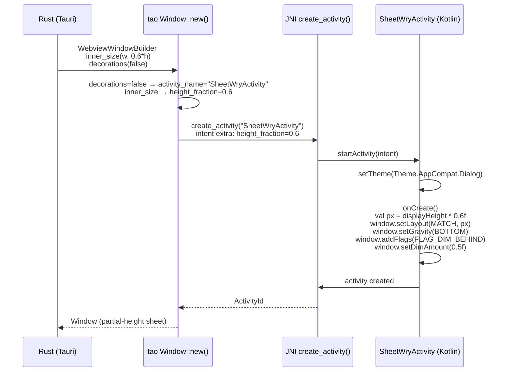

# F44 — Android Window Layout Properties (tao fork)

## Problem

On Android, **every Tauri window is forced full-screen**. The tao Android backend
discards all `WindowAttributes` and hardcodes `Activity.setContentView(webview)`.
This makes it impossible to create partial-height overlay windows (for bottom
sheets, dialogs, or side panels) that leave the underlying window visible.

`foundation_platform` needs to create a second Tauri window styled as a partial-height
bottom sheet overlay so the main dashboard remains visible behind. Without layout
control in tao, every modal becomes a full-screen Activity swap — not a sheet.

## Solution

Add an `AndroidWindowLayout` struct to tao's `platform/android.rs` with builder
methods on `WindowBuilderExtAndroid`. The layout config flows through
`PlatformSpecificWindowBuilderAttributes` → `Window::new()` → `create_activity()`
JNI call → Intent extras → `WryActivity.onCreate()` → `Window.setAttributes()`.



### What currently exists (tao Android)

| Component | File | Lines | Status |
|---|---|---|---|
| `WindowAttributes` | `tao/src/window.rs` | 135–292 | 25 fields, ALL discarded on Android |
| `PlatformSpecificWindowBuilderAttributes` | `tao/src/platform_impl/android/mod.rs` | 589–593 | 3 fields: `activity_id` (dead), `activity_name`, `created_by_activity_name` |
| `Window::new()` | `tao/src/platform_impl/android/mod.rs` | 601–634 | `_window_attrs` discarded with `// FIXME` comment |
| `set_inner_size()` | `tao/src/platform_impl/android/mod.rs` | 688 | `warn!("Cannot set window size on Android")` — empty body |
| `set_resizable()` | `tao/src/platform_impl/android/mod.rs` | 726 | `warn!("Window::set_resizable is ignored on Android")` |
| `set_decorations()` | `tao/src/platform_impl/android/mod.rs` | 792 | Empty body |
| `set_visible()` | `tao/src/platform_impl/android/mod.rs` | 705 | Empty body |
| `set_always_on_top()` | `tao/src/platform_impl/android/mod.rs` | 796 | Empty body |
| `set_background_color()` | `tao/src/platform_impl/android/mod.rs` | 835 | Empty body |
| `inner_position()` | `tao/src/platform_impl/android/mod.rs` | 672 | Returns `Err(NotSupported)` |
| `create_activity()` | `tao/src/platform_impl/android/ndk_glue.rs` | 173–207 | `startActivity(cls)` — no layout params |

### What currently exists (tauri runtime)

```rust
// tauri-runtime-wry/src/lib.rs:848-851 — explicitly skips size on Android
#[cfg(not(any(target_os = "ios", target_os = "android")))]
{
    window = window.inner_size(config.width, config.height);
}
```

## ARCHITECTURE RESEARCH

### Activity Model Constraints

Android Activities are full-screen by design. Partial-height "windows" are
achieved via one of:

1. **Dialog-themed Activity** — `<activity android:theme="@style/Theme.Dialog">`
   creates a floating window with the activity lifecycle. Supports `Window.setLayout()`,
   `setGravity()`, and dimming. This is the approach proposed here.

2. **Fragment-based overlay** — `BottomSheetDialogFragment` or `DialogFragment`
   within the same Activity. Requires detaching/reattaching the WebView, which
   breaks the Rust `CreateWebView` lifecycle (see F45 for why this path was rejected).

3. **`FLAG_NOT_TOUCH_MODAL`** — A window flag that passes touches outside the
   window bounds. Combined with partial height + bottom gravity, this creates
   a sheet-like overlay.

### Why Tauri/tao Does It the Current Way

1. **Android's single-Activity model.** Historically, one Activity = one
   full-screen app window. Multi-window on Android means multiple Activities
   in the task stack, not overlapping windows.

2. **No use case before now.** Tauri mobile apps have been single-window.
   foundation_platform's modal architecture is the first use case requiring
   partial-height overlay windows.

3. **Backward compatibility.** Changing the Activity theme or layout behavior
   could break existing apps that rely on full-screen behavior. All changes
   must be opt-in via builder methods.

   **RESOLVED:** The dedicated-class approach is preferred. See §R2a below.

### Why a dedicated Kotlin class beats builder methods

Pushing `AndroidWindowLayout` through JNI as 8 separate Intent extras couples the
Rust API to Android SDK knowledge (gravity constants, WindowManager.LayoutParams
flags). A dedicated Kotlin class (`SheetWryActivity`, `DialogWryActivity`) is
cleaner because:

1. **`activity_name` already routes to the right class.** `PlatformSpecificWindowBuilderAttributes.activity_name`
   controls which Java Activity class is launched. No new JNI surface needed.

2. **The Kotlin class owns its theme and layout.** The class's `onCreate` calls
   `setTheme(R.style.Theme_AppCompat_Dialog)`, configures `Window.setLayout()`,
   and sets gravity — all in Kotlin where Android SDK access is natural.

3. **Rust only sends one Intent extra — `height_fraction: float`.** The class
   reads it in `onCreate` and computes the pixel height. No flags, gravity
   constants, or dim amounts cross the JNI boundary.

4. **Easier to test.** `SheetWryActivity` can be unit-tested in isolation
   without the Rust JNI layer.

### Security & Stability

| Concern | Mitigation |
|---|---|
| **Touch passthrough** | `FLAG_NOT_TOUCH_MODAL` must be opt-in. Default consumes touches within bounds. |
| **Back navigation** | Dialog-themed Activity must handle back press — dismiss if partial-height, navigate if full-screen. WryActivity's `OnBackPressedCallback` is already wired. |
| **Activity lifecycle** | `isChangingConfigurations()` guard in `onActivityDestroy` prevents state loss on rotation. Partial-height windows must test rotation behavior. |
| **Task stack** | Dialog-themed activities appear in recents if not properly configured. Use `android:excludeFromRecents` when appropriate. |
| **Dim amount** | `FLAG_DIM_BEHIND` + `setDimAmount()` on API 14+. Must verify on emulator. |

## Requirements

### R1. `AndroidWindowLayout` struct (simplified)
- `height_fraction: Option<f32>` — 0.0–1.0 fraction of screen height.
  This is the ONLY field that crosses JNI (as an Intent extra).
  All other layout properties (gravity, flags, dim, theme) are handled
  by the dedicated Kotlin class (`SheetWryActivity`, R2a).
- `width_fraction: Option<f32>` — reserved for future side-panel use.
  Does NOT cross JNI until a `SidePanelWryActivity` Kotlin class exists.
- `activity_class: Option<String>` — overrides the default activity name.
  `None` = standard `WryActivity` (full-screen). `Some("SheetWryActivity")`
  = partial-height bottom sheet (R2a). Future: `"DialogWryActivity"` etc.
- All fields have `Default` impl
- File: `tao/src/platform/android.rs` (new type, re-exported)

### R2. Builder methods on `WindowBuilderExtAndroid`
- `with_android_layout(AndroidWindowLayout) -> Self` — sets full layout config
  (used for one-off custom layouts via generic `WryActivity` + Intent extras)
- `with_android_sheet_height(f32) -> Self` — convenience for bottom sheet percentage
  (maps to `activity_name = "SheetWryActivity"` + `height_fraction` Intent extra)
- File: `tao/src/platform/android.rs` (added to `WindowBuilderExtAndroid` trait)

### R2a. Dedicated `SheetWryActivity` class (Kotlin, wry fork)
- Extends `WryActivity`. Overrides `onCreate`:
  ```kotlin
  override fun onCreate(savedInstanceState: Bundle?) {
      setTheme(R.style.Theme_AppCompat_Dialog_Sheet)
      super.onCreate(savedInstanceState)
      // Read height_fraction from Intent, compute pixel height
      val heightFrac = intent.getFloatExtra("height_fraction", 1.0f)
      if (heightFrac < 1.0f) {
          val pxHeight = (resources.displayMetrics.heightPixels * heightFrac).toInt()
          window.setLayout(MATCH_PARENT, pxHeight)
          window.setGravity(Gravity.BOTTOM)
          window.addFlags(FLAG_DIM_BEHIND)
          window.setDimAmount(0.5f)
      }
  }
  ```
- Declared in AndroidManifest with `android:theme="@style/Theme.AppCompat.Dialog"`
- `activity_name = "SheetWryActivity"` is the ONLY thing Rust needs to select
  this class (already supported via `PlatformSpecificWindowBuilderAttributes.activity_name`)
- File: `wry/src/android/kotlin/SheetWryActivity.kt` (new)

### R3. `WindowAttributes` → `activity_name` + `Intent` extras
- `decorations: false` → `activity_name = "SheetWryActivity"`
- `inner_size` → `height_fraction` Intent extra
- `transparent: true` → `activity_name = "SheetWryActivity"` + transparent theme
- No `AndroidWindowLayout` stored in `Window` struct — the Kotlin class owns layout
- File: `tao/src/platform_impl/android/mod.rs`

### R4. Minimal JNI bridge — only `height_fraction` Intent extra
- `create_activity()` already passes `activity_name` (no change needed)
- Add one Intent extra: `intent.putExtra("height_fraction", heightFraction)`
- Kotlin class applies all layout — Rust does not send gravity/flags/dim
- Default (no extra) = full-screen — backward compatible
- File: `tao/src/platform_impl/android/ndk_glue.rs`

### R5. tauri-runtime-wry — propagate size + sheet config to tao
- Remove `#[cfg(not(target_os = "android"))]` from `inner_size` call
- Allow `WebviewWindowBuilder.inner_size(w, h)` to flow through to tao on Android
- Map `decorations: false` → `with_activity_name("SheetWryActivity")` on
  `WindowBuilderExtAndroid`. This routes the window to the dedicated sheet class.
- File: `tauri-runtime-wry/src/lib.rs`

### R6. No breakage of existing behavior
- Without explicit `with_android_layout()` call → full-screen (current behavior)
- All existing Tauri Android apps continue to work unchanged
- Must pass `cargo check` and existing tests

## Implementation Sequence

1. **wry (Kotlin)**: Create `SheetWryActivity.kt` — extends `WryActivity`, applies
   `Theme.Dialog`, reads `height_fraction` Intent extra, configures `Window.setLayout/setGravity/dim`
2. **wry (Kotlin)**: Declare `SheetWryActivity` in `AndroidManifest.xml` with dialog theme
3. **tao**: Add `AndroidWindowLayout` type + builder methods on `WindowBuilderExtAndroid`
4. **tao**: Modify `Window::new()` to map `WindowAttributes.decorations` → `activity_name="SheetWryActivity"`
5. **tao (Kotlin)**: Add `height_fraction` Intent extra in `create_activity()` JNI call
6. **tauri-runtime-wry**: Ungate `inner_size` on Android, map `decorations: false` →
   `with_activity_name("SheetWryActivity")`
7. **Test**: `WebviewWindowBuilder.decorations(false).inner_size(w, fraction*h)` →
   verify partial-height sheet on emulator

## Verification

```bash
# tao
cargo check -p tao --target x86_64-linux-android

# tauri-runtime-wry
cargo check -p tauri-runtime-wry --target x86_64-linux-android --features wry

# platform_android — build APK with sheet window
cd examples/platform_android/src-tauri
cargo tauri android build --target x86_64 --debug
# Manual: verify bottom sheet window is partial-height on emulator
```

## Files

| File | Action | Description |
|---|---|---|
| `wry/src/android/kotlin/SheetWryActivity.kt` | **NEW** | Dedicated sheet class: `Theme.Dialog` + `Window.setLayout/Gravity` + dim |
| `wry/src/android/kotlin/WryActivity.kt` | No change | Remains full-screen default |
| `tao/src/platform/android.rs` | **MODIFY** | Add simplified `AndroidWindowLayout` (height_fraction + activity_class), builder methods |
| `tao/src/platform_impl/android/mod.rs` | **MODIFY** | Map `WindowAttributes` → `activity_name` + `height_fraction`, store in `PlatformSpecificWindowBuilderAttributes` |
| `tao/src/platform_impl/android/ndk_glue.rs` | **MODIFY** | Add `height_fraction` Intent extra to `create_activity()` JNI call |
| `tauri-runtime-wry/src/lib.rs` | **MODIFY** | Remove `#[cfg(not(target_os = "android"))]` from inner_size, map `decorations` → sheet activity |
