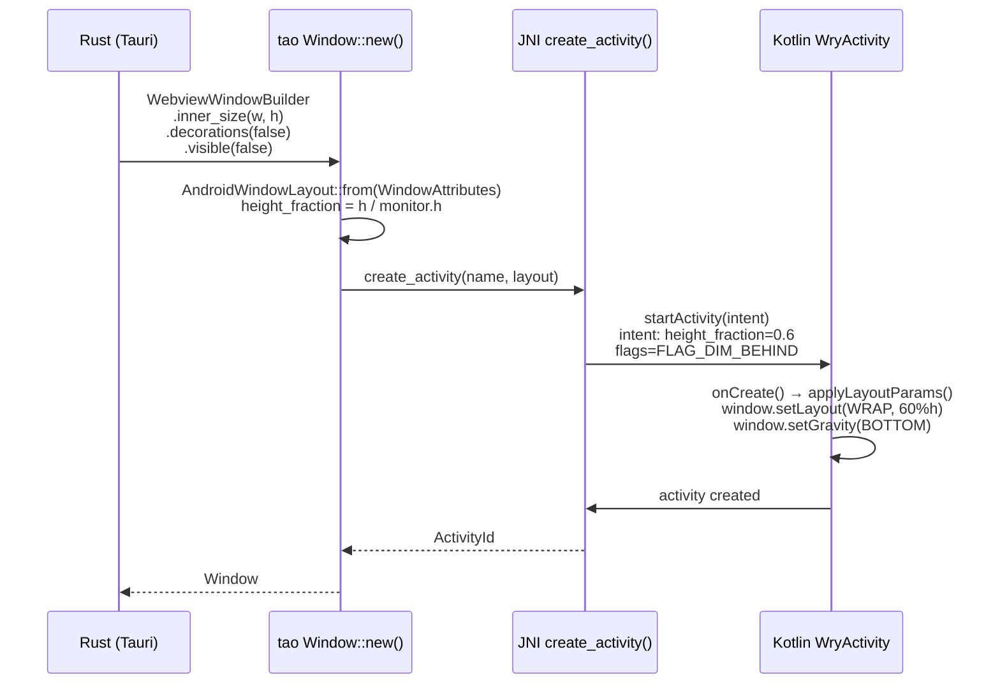

# F44 — Android Window Layout Properties (tao fork)

## Problem

On Android, **every Tauri window is forced full-screen**. The tao Android backend
discards all `WindowAttributes` and hardcodes `Activity.setContentView(webview)`.
This makes it impossible to create partial-height overlay windows (for bottom
sheets, dialogs, or side panels) that leave the underlying window visible.

`foundation_platform` needs to create a second Tauri window styled as a partial-height
bottom sheet overlay so the main dashboard remains visible behind. Without layout
control in tao, every modal becomes a full-screen Activity swap — not a sheet.

## Solution

Add an `AndroidWindowLayout` struct to tao's `platform/android.rs` with builder
methods on `WindowBuilderExtAndroid`. The layout config flows through
`PlatformSpecificWindowBuilderAttributes` → `Window::new()` → `create_activity()`
JNI call → Intent extras → `WryActivity.onCreate()` → `Window.setAttributes()`.



### What currently exists (tao Android)

| Component | File | Lines | Status |
|---|---|---|---|
| `WindowAttributes` | `tao/src/window.rs` | 135–292 | 25 fields, ALL discarded on Android |
| `PlatformSpecificWindowBuilderAttributes` | `tao/src/platform_impl/android/mod.rs` | 589–593 | 3 fields: `activity_id` (dead), `activity_name`, `created_by_activity_name` |
| `Window::new()` | `tao/src/platform_impl/android/mod.rs` | 601–634 | `_window_attrs` discarded with `// FIXME` comment |
| `set_inner_size()` | `tao/src/platform_impl/android/mod.rs` | 688 | `warn!("Cannot set window size on Android")` — empty body |
| `set_resizable()` | `tao/src/platform_impl/android/mod.rs` | 726 | `warn!("Window::set_resizable is ignored on Android")` |
| `set_decorations()` | `tao/src/platform_impl/android/mod.rs` | 792 | Empty body |
| `set_visible()` | `tao/src/platform_impl/android/mod.rs` | 705 | Empty body |
| `set_always_on_top()` | `tao/src/platform_impl/android/mod.rs` | 796 | Empty body |
| `set_background_color()` | `tao/src/platform_impl/android/mod.rs` | 835 | Empty body |
| `inner_position()` | `tao/src/platform_impl/android/mod.rs` | 672 | Returns `Err(NotSupported)` |
| `create_activity()` | `tao/src/platform_impl/android/ndk_glue.rs` | 173–207 | `startActivity(cls)` — no layout params |

### What currently exists (tauri runtime)

```rust
// tauri-runtime-wry/src/lib.rs:848-851 — explicitly skips size on Android
#[cfg(not(any(target_os = "ios", target_os = "android")))]
{
    window = window.inner_size(config.width, config.height);
}
```

## ARCHITECTURE RESEARCH

### Activity Model Constraints

Android Activities are full-screen by design. Partial-height "windows" are
achieved via one of:

1. **Dialog-themed Activity** — `<activity android:theme="@style/Theme.Dialog">`
   creates a floating window with the activity lifecycle. Supports `Window.setLayout()`,
   `setGravity()`, and dimming. This is the approach proposed here.

2. **Fragment-based overlay** — `BottomSheetDialogFragment` or `DialogFragment`
   within the same Activity. Requires detaching/reattaching the WebView, which
   breaks the Rust `CreateWebView` lifecycle (see F45 for why this path was rejected).

3. **`FLAG_NOT_TOUCH_MODAL`** — A window flag that passes touches outside the
   window bounds. Combined with partial height + bottom gravity, this creates
   a sheet-like overlay.

### Why Tauri/tao Does It the Current Way

1. **Android's single-Activity model.** Historically, one Activity = one
   full-screen app window. Multi-window on Android means multiple Activities
   in the task stack, not overlapping windows.

2. **No use case before now.** Tauri mobile apps have been single-window.
   foundation_platform's modal architecture is the first use case requiring
   partial-height overlay windows.

3. **Backward compatibility.** Changing the Activity theme or layout behavior
   could break existing apps that rely on full-screen behavior. All changes
   must be opt-in via builder methods.

### Security & Stability

| Concern | Mitigation |
|---|---|
| **Touch passthrough** | `FLAG_NOT_TOUCH_MODAL` must be opt-in. Default consumes touches within bounds. |
| **Back navigation** | Dialog-themed Activity must handle back press — dismiss if partial-height, navigate if full-screen. WryActivity's `OnBackPressedCallback` is already wired. |
| **Activity lifecycle** | `isChangingConfigurations()` guard in `onActivityDestroy` prevents state loss on rotation. Partial-height windows must test rotation behavior. |
| **Task stack** | Dialog-themed activities appear in recents if not properly configured. Use `android:excludeFromRecents` when appropriate. |
| **Dim amount** | `FLAG_DIM_BEHIND` + `setDimAmount()` on API 14+. Must verify on emulator. |

## Requirements

### R1. `AndroidWindowLayout` struct
- `height_fraction: Option<f32>` — 0.0–1.0 fraction of screen height
- `width_fraction: Option<f32>` — 0.0–1.0 fraction of screen width
- `gravity: AndroidWindowGravity` — Bottom (default), Top, Center, FullScreen
- `flags: u32` — Android `WindowManager.LayoutParams` flags bitmask
- `dim_amount: Option<f32>` — 0.0–1.0 background dim
- `dialog_theme: bool` — use `Theme.AppCompat.Dialog` instead of full Activity
- All fields have `Default` impl
- File: `tao/src/platform/android.rs` (new type, re-exported)

### R2. Builder methods on `WindowBuilderExtAndroid`
- `with_android_layout(AndroidWindowLayout) -> Self` — sets full layout config
- `with_android_dialog_theme(bool) -> Self` — convenience for dialog theme
- `with_android_sheet_height(f32) -> Self` — convenience for bottom sheet percentage
- File: `tao/src/platform/android.rs` (added to `WindowBuilderExtAndroid` trait)

### R3. `WindowAttributes` propagation in `Window::new()`
- Map `inner_size` + `monitor.size()` → `height_fraction`
- Map `decorations: false` → `dialog_theme: true`
- Map `transparent: true` → appropriate flags
- Store `AndroidWindowLayout` in `Window` struct
- File: `tao/src/platform_impl/android/mod.rs`

### R4. JNI bridge — layout params in `create_activity()`
- Serialize `AndroidWindowLayout` as Intent extras (or JSON string) to Kotlin
- Kotlin reads extras in `WryActivity.onCreate()`, applies via `window.setAttributes()`
- Default behavior (no extras) = full-screen (backward compatible)
- File: `tao/src/platform_impl/android/ndk_glue.rs` + `wry/src/android/kotlin/WryActivity.kt`

### R5. tauri-runtime-wry — stop skipping size on Android
- Remove `#[cfg(not(target_os = "android"))]` from `inner_size` call
- Allow `WebviewWindowBuilder.inner_size(w, h)` to flow through to tao on Android
- File: `tauri-runtime-wry/src/lib.rs`

### R6. No breakage of existing behavior
- Without explicit `with_android_layout()` call → full-screen (current behavior)
- All existing Tauri Android apps continue to work unchanged
- Must pass `cargo check` and existing tests

## Implementation Sequence

1. **tao**: Add `AndroidWindowLayout` type + builder methods
2. **tao**: Modify `Window::new()` to extract layout from `WindowAttributes`
3. **tao**: Modify `create_activity()` to pass layout via JNI
4. **wry (Kotlin)**: Update `WryActivity.kt` to apply layout params
5. **tauri-runtime-wry**: Ungate `inner_size` on Android
6. **Test**: PlatformBuild with partial-height window, verify in emulator

## Verification

```bash
# tao
cargo check -p tao --target x86_64-linux-android
# Verify new types compile
grep -r "AndroidWindowLayout" infrastructure/tao/src/

# tauri-runtime-wry
cargo check -p tauri-runtime-wry --target x86_64-linux-android --features wry

# platform_android — build APK with custom window
cd examples/platform_android/src-tauri
cargo tauri android build --target x86_64 --debug
# Manual: verify bottom sheet window is partial-height on emulator
```

## Files

| File | Action | Description |
|---|---|---|
| `tao/src/platform/android.rs` | **MODIFY** | Add `AndroidWindowLayout`, `AndroidWindowGravity`, builder methods |
| `tao/src/platform_impl/android/mod.rs` | **MODIFY** | Store layout in `Window` struct, propagate in `Window::new()`, add `PlatformSpecificWindowBuilderAttributes.layout` |
| `tao/src/platform_impl/android/ndk_glue.rs` | **MODIFY** | Pass layout params through `create_activity()` JNI call |
| `wry/src/android/kotlin/WryActivity.kt` | **MODIFY** | Read layout extras, apply `Window.setLayout/setGravity/addFlags` |
| `tauri-runtime-wry/src/lib.rs` | **MODIFY** | Remove `#[cfg(not(target_os = "android"))]` from inner_size call |
