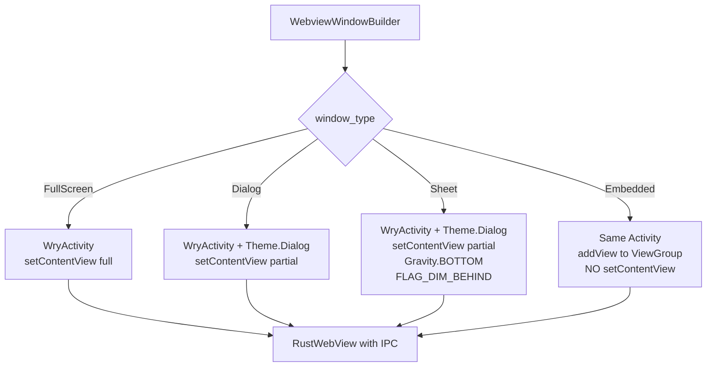

# F45 — Custom Window Types for Tauri WebView Creation (wry fork)

## Problem

wry's `CreateWebView` handler in `main_pipe.rs` hardcodes two calls:
1. `activity.setWebView(webview)` — registers the `RustWebView` with the Activity
2. `activity.setContentView(webview)` — makes the WebView the Activity's entire content view

This means **every Tauri WebView on Android replaces the Activity's entire content**.
There is no way to:
- Create a WebView in a Dialog-themed Activity (margin, dimming, gravity)
- Skip `setContentView` to allow the caller to place the WebView manually
- Create a WebView as a child of a `ViewGroup` within an existing layout

For `foundation_platform`, we need to create a WebView in a Dialog-themed Activity
that is partial-height and positioned at the bottom — a bottom sheet appearance
achieved through the Activity's window properties, not through AndroidX fragments.

## Solution

Add a `window_type` field to `CreateWebViewAttributes` that controls how the
Activity hosts the WebView. The existing `transparent` and `background_color`
fields are leveraged for visual styling. The key change: decouple window
type selection from the hardcoded `setContentView` pattern.



### What currently exists (wry Android)

The full `CreateWebView` flow in `main_pipe.rs:151-344` (handle_message, CreateWebView arm):

```
1. Find RustWebView class               (line 185-188)
2. new RustWebView(ctx, scripts, id)    (line 190-199) — JNI constructor
3. Configure WebSettings                (line 200-236) — autoplay, UA, JS
4. activity.setWebView(webview)         (line 238-244) — registers with WryActivity
5. Load URL or HTML                     (line 246-254)
6. Devtools if configured               (line 256-262)
7. Background color / transparent       (line 263-267)
8. Create RustWebViewClient             (line 268-282)
9. Create RustWebChromeClient           (line 283-299)
10. Add IPC Javascript Interface        (line 301-314) — window.ipc
11. activity.setContentView(webview)   (line 317-322) — ← THIS is what we need to control
12. on_webview_created callback         (line 324-333)
13. Store GlobalRef in ACTIVITY_PROXY   (line 335-343)
```

### `CreateWebViewAttributes` struct (main_pipe.rs:631-647)

```rust
pub(crate) struct CreateWebViewAttributes {
    pub id: String,
    pub url: Option<String>,
    pub html: Option<String>,
    pub devtools: bool,                         // debug-only
    pub transparent: bool,                      // ← already supported
    pub background_color: Option<RGBA>,         // ← already supported
    pub headers: Option<http::HeaderMap>,
    pub autoplay: bool,
    pub on_webview_created: Option<Arc<dyn Fn(super::Context) -> JniResult<()> + Send + Sync + 'static>>,
    pub user_agent: Option<String>,
    pub initialization_scripts: Vec<InitializationScript>,
    pub javascript_disabled: bool,
}
```

Key observations:
- `transparent` already exists — sets `(0,0,0,0)` background at line 265
- `background_color` already exists — calls `setBackgroundColor()` at line 267
- `on_webview_created` already exists — fires after `setContentView` at line 325
- **No `window_type` field** — the struct has no concept of dialog vs fullscreen

## ARCHITECTURE RESEARCH

### WryActivity.kt — what it does today

File: `wry/src/android/kotlin/WryActivity.kt`
- `setWebView(webView)` — stores `mWebView`, wires `OnBackPressedCallback`, calls `onWebViewCreate()`
- `onWebViewCreate(webView)` — open (overridable) hook, called BEFORE `setContentView`
- `startActivity(cls)` — creates a new `WryActivity` via Intent
- `onCreate()` — reads `ACTIVITY_ID_KEY` from saved state or intent extras

### How Activity theme is controlled

The Android theme is declared in `AndroidManifest.xml`:
```xml
<activity android:name=".MainActivity"
          android:theme="@style/Theme.AppCompat" />
```

To create a Dialog-themed Activity, we'd need:
```xml
<activity android:name=".MainActivity"
          android:theme="@style/Theme.AppCompat.Dialog" />
```

**But** there's a subtlety: `WryActivity` is compiled from a **static Kotlin template**
(`wry/src/android/kotlin/WryActivity.kt`) with `{{package}}` and `{{class-extension}}`
placeholders. The theme is set in the consuming app's `AndroidManifest.xml`, not in wry.

This means wry can't directly set the theme — it must be a runtime decision via Intent
extras that the consuming app's Manifest supports.

### Two approaches for dialog theme

**Approach A: Theme attribute on Intent** (recommended)
- Pass `android:theme` resource ID as an Intent extra
- In `WryActivity.onCreate()`, call `setTheme(themeResId)` BEFORE `super.onCreate()`
- This is the standard Android pattern for theming activities at runtime
- The manifest must declare each activity with a base theme that supports the
  dialog variant

**Approach B: Manifest-declared dialog activities**
- Register `WryActivityDialog` and `WryActivitySheet` in the manifest
- Use `activity_name` builder option to select which Activity class to launch
- More explicit but requires manifest changes in every consuming app

### Why Wry Does It the Current Way

1. `activity.setContentView(webview)` is the simplest path — one WebView, one
   Activity, full screen. Every Tauri mobile app until now has been a single full-screen
   WebView.

2. Wry's JNI layer runs on the Android main looper via `MainPipe` (Unix pipe +
   `FdEvent`). All operations are serialized through this pipe. Adding conditional
   layout paths complicates the message handling.

3. The `on_webview_created` callback already provides a post-setContentView hook.
   This exists for plugins to configure the WebView after it's visible. It fires
   too late for pre-content-view layout decisions.

### Security & Stability

| Concern | Mitigation |
|---|---|
| **IPC bridge still wired** | Steps 1-10 in CreateWebView run identically regardless of window type. IPC is wired before layout. |
| **Back navigation** | WryActivity's `OnBackPressedCallback` is wired in `setWebView()`. Dialog windows get the same back handling. |
| **Theme resource IDs** | Must validate that `setTheme(id)` succeeds. Invalid IDs crash at `super.onCreate()`. |
| **Multi-window state** | `ACTIVITY_PROXY` is keyed by `ActivityId`. Each dialog Activity gets its own entry. 1:1 WebView-to-Activity preserved. |
| **Configuration changes** | `isChangingConfigurations()` guard in `onActivityDestroy` preserves Rust state across rotation. Dialog windows must test. |

## Requirements

### R1. `AndroidWebViewWindowType` enum (simplified — see F44 R2a)
```rust
pub enum AndroidWebViewWindowType {
    /// Default — standard WryActivity (full-screen)
    FullScreen,
    /// Dialog-themed — uses DialogWryActivity (future Kotlin class)
    Dialog,
    /// Bottom sheet — uses SheetWryActivity (F44 R2a)
    BottomSheet,
}
```
The enum maps to `activity_name` values on the tao side (F44 R3):
`FullScreen` → `"WryActivity"`, `Dialog` → `"DialogWryActivity"`,
`BottomSheet` → `"SheetWryActivity"`.

The enum carries NO layout parameters. Theme, gravity, dim, flags, and
partial-height sizing are owned by the dedicated Kotlin class (F44 R2a).
Rust sends at most one Intent extra: `height_fraction` (F44 R1).

- File: `wry/src/android/mod.rs` (new type)

### R2. `CreateWebViewAttributes` — add `window_type` field
- `pub window_type: AndroidWebViewWindowType` — defaults to `FullScreen`
- Maps to `activity_name` in tao's `PlatformSpecificWindowBuilderAttributes`
  (routes the window to the correct Kotlin Activity class, F44 R3)
- `height_fraction` Intent extra added only for `BottomSheet` and `Dialog` types
- File: `wry/src/android/main_pipe.rs`

### R3. Conditional `setContentView` in `CreateWebView` handler (minimal change)
- `FullScreen` → `activity.setContentView(webview)` (unchanged)
- `Dialog` / `BottomSheet` → `activity.setContentView(webview)` (unchanged —
  the Activity class itself handles theme + layout via F44 R2a.
  The wry handler does NOT apply theme/dim/gravity via JNI.)
- File: `wry/src/android/main_pipe.rs`

### R4. `WebViewBuilderExtAndroid` — add builder method
```rust
fn with_android_window_type(self, window_type: AndroidWebViewWindowType) -> Self;
```
- Stores window type in `PlatformSpecificWebViewAttributes`
- Propagates through `InnerWebView::new()` → `CreateWebViewAttributes`
- Maps to `platform_specific.activity_name` on the tao side (F44 R3)
- File: `wry/src/lib.rs`

### R5. `SheetWryActivity.kt` — dedicated class (see F44 R2a for full spec)
- Extends `WryActivity`. Overrides `onCreate`: sets dialog theme, reads
  `height_fraction` Intent extra, configures `Window.setLayout/setGravity/dim`
- `WryActivity.kt` itself needs NO changes for theme/layout handling
- File: `wry/src/android/kotlin/SheetWryActivity.kt` (new)

## Implementation Sequence

1. **wry (Kotlin):** Create `SheetWryActivity.kt` (F44 R2a) — extends `WryActivity`
2. **wry (Rust):** Add `AndroidWebViewWindowType` enum (R1)
3. **wry (Rust):** Add `window_type` field to `CreateWebViewAttributes` and
   `PlatformSpecificWebViewAttributes` (R2)
4. **wry (Rust):** Add `with_android_window_type()` to `WebViewBuilderExtAndroid` (R4)
5. **tao (Rust):** Map `window_type` → `activity_name` for window routing (F44 R3)
6. **Test:** `window_type = BottomSheet` → verify `SheetWryActivity` is launched
   with partial height on emulator

## Verification

```bash
# wry
cargo check -p wry --target x86_64-linux-android

# platform_android — build APK with dialog window type
cd examples/platform_android/src-tauri
cargo tauri android build --target x86_64 --debug
# Manual: verify bottom sheet appears as partial-height overlay
```

## Files

| File | Action | Description |
|---|---|---|
| `wry/src/android/mod.rs` | **MODIFY** | Add `AndroidWebViewWindowType`, add to `PlatformSpecificWebViewAttributes` |
| `wry/src/android/main_pipe.rs` | **MODIFY** | Add `window_type` to `CreateWebViewAttributes` |
| `wry/src/lib.rs` | **MODIFY** | Add `with_android_window_type()` to `WebViewBuilderExtAndroid` |
| `wry/src/android/kotlin/SheetWryActivity.kt` | **NEW** | Dedicated sheet class (F44 R2a) |
