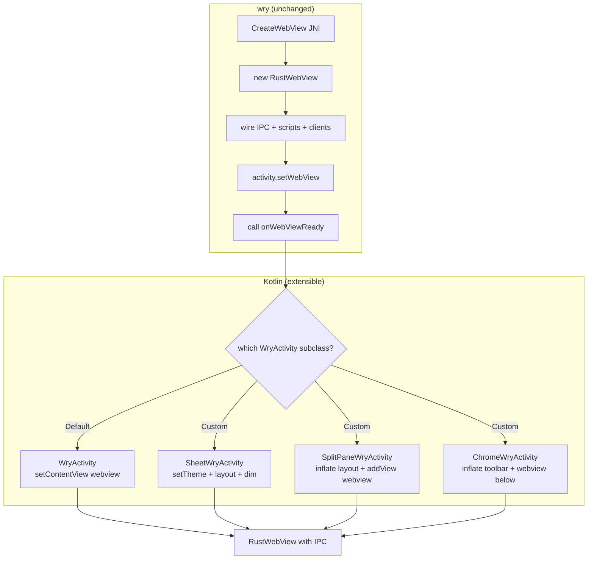

# F45 — Extensible Custom Activity Hosting for Tauri WebViews (wry fork)

## Problem

wry's `CreateWebView` handler in `main_pipe.rs` hardcodes two calls:
1. `activity.setWebView(webview)` — registers the `RustWebView` with the Activity
2. `activity.setContentView(webview)` — makes the WebView the Activity's entire content view

This means **every Tauri WebView on Android replaces the Activity's entire content**
with a plain `WryActivity`. There is no way to use a **custom Activity subclass**
that wraps the Tauri WebView with native Android UI — buttons, toolbars, split-pane
layouts, or platform-specific dialogs.

For `foundation_platform`, this blocks multiple use cases:
- **Bottom sheet** — `SheetWryActivity` (F44 R2a) with partial height + dim
- **Dialog** — `DialogWryActivity` with centered floating window
- **Split pane** — `SplitPaneWryActivity` with WebView + native RecyclerView side by side
- **Custom chrome** — `ChromeWryActivity` with native toolbar buttons that signal back
  to the WebView via Tauri IPC

The bottleneck is not layout — `activity_name` in tao's
`PlatformSpecificWindowBuilderAttributes` already routes to the right class.
The bottleneck is that **wry provides no hook for the custom class to access the
WebView it hosts**.

## Solution

Make `WryActivity` **extensible by contract** rather than by configuration.
Any Kotlin class extending `WryActivity` can host a Tauri WebView. The wry
side needs one change: a **well-defined hook** that custom Activity classes
override to receive the `RustWebView` after it's created and wired (IPC,
scripts, clients all in place) but before it's attached to the content view.

The consuming app:
1. Writes a Kotlin class extending `WryActivity` (or `SheetWryActivity`, etc.)
2. Declares it in `AndroidManifest.xml`
3. Passes the class name via `WebviewWindowBuilder.activity_name("MyClass")`
4. Overrides `onWebViewReady(webView)` to access the fully-wired Tauri WebView
5. Calls `setContentView(webView)` or `setContentView(customLayoutWithWebView)`



The wry handler calls `onWebViewReady(webView)` — a new **open method** on
`WryActivity` — instead of calling `setContentView(webView)` directly.
The default implementation does `setContentView(webView)` for backward
compatibility. Custom subclasses override it and do their own layout.

### What currently exists (wry Android)

The full `CreateWebView` flow in `main_pipe.rs:151-344` (handle_message, CreateWebView arm):

```
1. Find RustWebView class               (line 185-188)
2. new RustWebView(ctx, scripts, id)    (line 190-199) — JNI constructor
3. Configure WebSettings                (line 200-236) — autoplay, UA, JS
4. activity.setWebView(webview)         (line 238-244) — registers with WryActivity
5. Load URL or HTML                     (line 246-254)
6. Devtools if configured               (line 256-262)
7. Background color / transparent       (line 263-267)
8. Create RustWebViewClient             (line 268-282)
9. Create RustWebChromeClient           (line 283-299)
10. Add IPC Javascript Interface        (line 301-314) — window.ipc
11. activity.setContentView(webview)   (line 317-322) — ← THIS is what we need to control
12. on_webview_created callback         (line 324-333)
13. Store GlobalRef in ACTIVITY_PROXY   (line 335-343)
```

### `CreateWebViewAttributes` struct (main_pipe.rs:631-647)

```rust
pub(crate) struct CreateWebViewAttributes {
    pub id: String,
    pub url: Option<String>,
    pub html: Option<String>,
    pub devtools: bool,                         // debug-only
    pub transparent: bool,                      // ← already supported
    pub background_color: Option<RGBA>,         // ← already supported
    pub headers: Option<http::HeaderMap>,
    pub autoplay: bool,
    pub on_webview_created: Option<Arc<dyn Fn(super::Context) -> JniResult<()> + Send + Sync + 'static>>,
    pub user_agent: Option<String>,
    pub initialization_scripts: Vec<InitializationScript>,
    pub javascript_disabled: bool,
}
```

Key observations:
- `transparent` already exists — sets `(0,0,0,0)` background at line 265
- `background_color` already exists — calls `setBackgroundColor()` at line 267
- `on_webview_created` already exists — fires after `setContentView` at line 325
- **No `window_type` field** — the struct has no concept of dialog vs fullscreen

## ARCHITECTURE RESEARCH

### The `onWebViewReady` contract

Today, the Rust `CreateWebView` handler calls `activity.setContentView(webview)`
directly (line 317). This blocks customization.

The fix: replace that direct call with a call to a new **open method** on
`WryActivity` that subclasses override:

```kotlin
// WryActivity.kt — new open method (line ~116)
open fun onWebViewReady(webView: RustWebView) {
    // Default: set as full content view (backward compatible)
    setContentView(webView)
}
```

The Rust JNI handler changes from:
```rust
activity.setContentView(webview)?
```
to:
```rust
activity.onWebViewReady(webview)?
```

Custom subclasses override `onWebViewReady`:
```kotlin
// SheetWryActivity.kt
override fun onWebViewReady(webView: RustWebView) {
    setTheme(R.style.Theme_AppCompat_Dialog_Sheet)
    val heightFrac = intent.getFloatExtra("height_fraction", 1.0f)
    val px = (resources.displayMetrics.heightPixels * heightFrac).toInt()
    window.setLayout(MATCH_PARENT, px)
    window.setGravity(Gravity.BOTTOM)
    window.addFlags(FLAG_DIM_BEHIND)
    window.setDimAmount(0.5f)
    setContentView(webView)
}

// ChromeWryActivity.kt — WebView + native toolbar
override fun onWebViewReady(webView: RustWebView) {
    val root = LinearLayout(this)
    val toolbar = Toolbar(this)
    // ... configure toolbar buttons that call webView.evaluateJavascript() ...
    root.addView(toolbar)
    root.addView(webView, LayoutParams(MATCH_PARENT, 0, 1f))
    setContentView(root)
}
```

### Why `onWebViewReady` (not `onWebViewCreate`)

`WryActivity` already has `onWebViewCreate(webView)` which fires during
`setWebView()` — BEFORE IPC, init scripts, and WebViewClient are wired.
`onWebViewReady` fires **after** everything is wired, replacing the
hardcoded `setContentView` call. This is the right hook for custom
layout because the WebView is fully functional at this point.

### What `activity_name` already gives us

Tao's `PlatformSpecificWindowBuilderAttributes.activity_name` already routes
to the correct Kotlin class. `WryActivity.startActivity(cls)` takes a
`Class<*>` and launches it. No changes needed in the activity routing layer.
The gap is only the hook for the custom class to receive the WebView.

### How wry Kotlin templates work

`WryActivity.kt` uses `{{package}}`, `{{class-extension}}`, and `{{library}}`
placeholders filled at build time. The `onWebViewReady` method is added to
this template. Custom subclasses (like `SheetWryActivity.kt`) can be:
1. Part of the wry fork (library-provided, like `SheetWryActivity`)
2. Written by the consuming app in its own source tree (app-specific)
3. Part of a Tauri plugin's Android library (reusable, like
   `foundation_platform_native`'s `ModalHelper`)

### Why Wry Does It the Current Way

1. `activity.setContentView(webview)` is the simplest path — one WebView, one
   Activity, full screen. Every Tauri mobile app until now has been a single full-screen
   WebView.

2. Wry's JNI layer runs on the Android main looper via `MainPipe` (Unix pipe +
   `FdEvent`). All operations are serialized through this pipe. Adding conditional
   layout paths complicates the message handling.

3. The `on_webview_created` callback already provides a post-setContentView hook.
   This exists for plugins to configure the WebView after it's visible. It fires
   too late for pre-content-view layout decisions.

### Security & Stability

| Concern | Mitigation |
|---|---|
| **IPC bridge still wired** | Steps 1-10 in CreateWebView run identically regardless of window type. IPC is wired before layout. |
| **Back navigation** | WryActivity's `OnBackPressedCallback` is wired in `setWebView()`. Dialog windows get the same back handling. |
| **Theme resource IDs** | Must validate that `setTheme(id)` succeeds. Invalid IDs crash at `super.onCreate()`. |
| **Multi-window state** | `ACTIVITY_PROXY` is keyed by `ActivityId`. Each dialog Activity gets its own entry. 1:1 WebView-to-Activity preserved. |
| **Configuration changes** | `isChangingConfigurations()` guard in `onActivityDestroy` preserves Rust state across rotation. Dialog windows must test. |

## Requirements

### R1. `onWebViewReady(webView)` — new open method on `WryActivity`
- Added to `WryActivity.kt` template. Default implementation:
  ```kotlin
  open fun onWebViewReady(webView: RustWebView) {
      setContentView(webView)  // backward compatible
  }
  ```
- Called by Rust's `CreateWebView` handler via JNI, replacing the hardcoded
  `activity.setContentView(webview)?` call at `main_pipe.rs:317`
- `onWebViewReady` fires AFTER IPC, init scripts, WebViewClient, and
  WebChromeClient are all wired. The WebView is fully functional.
- Custom subclasses override this method to apply their own layout,
  theme, window attributes, or composite views.
- File: `wry/src/android/kotlin/WryActivity.kt` (modified template)

### R2. Rust JNI handler — call `onWebViewReady` instead of `setContentView`
- Replace `activity.setContentView(webview)?` at `main_pipe.rs:317` with
  `activity.onWebViewReady(webview)?` — a JNI call to the open method
- The `activity_name` already routes to the correct subclass via tao's
  `PlatformSpecificWindowBuilderAttributes.activity_name` (no change)
- Intent extras (e.g., `height_fraction`) are passed through the existing
  `create_activity()` JNI call; custom subclasses read them in `onCreate`
  or `onWebViewReady`
- File: `wry/src/android/main_pipe.rs`

### R3. `SheetWryActivity.kt` — example consumer (F44 R2a)
- Extends `WryActivity`. Overrides `onWebViewReady`:
  - Sets dialog theme via `setTheme()`
  - Reads `height_fraction` Intent extra
  - Configures `Window.setLayout/setGravity/addFlags/setDimAmount`
  - Calls `setContentView(webView)`
- Lives in wry fork as a library-provided class. The consuming app declares
  it in `AndroidManifest.xml` with `<activity android:name=".SheetWryActivity" .../>`.
- Rationale: `BottomSheetDialog` is just one consumer of the extensibility
  provided by R1+R2. Any app can write its own subclass without changing wry.
- File: `wry/src/android/kotlin/SheetWryActivity.kt` (new)

### R4. `WebViewBuilderExtAndroid` — add `on_webview_ready` callback (Rust side)
```rust
fn on_android_webview_ready<F>(self, f: F) -> Self
where F: Fn(JNIEnv, JObject, JObject) + Send + Sync + 'static;
```
- Allows Rust code to execute JNI operations inside `onWebViewReady`
  (between theme/layout setup and `setContentView`). Useful for
  runtime configuration that can't be done in Kotlin alone.
- Stored in `PlatformSpecificWebViewAttributes`. Existing `on_webview_created`
  (line 324-333) fires AFTER `setContentView` — too late for pre-layout work.
- File: `wry/src/lib.rs`

### R5. Android manifest — consumer declares activity classes
- The consuming app's `AndroidManifest.xml` declares each custom subclass:
  ```xml
  <activity android:name=".SheetWryActivity"
            android:theme="@style/Theme.AppCompat.Dialog" />
  <activity android:name=".ChromeWryActivity"
            android:theme="@style/Theme.AppCompat" />
  ```
- `activity_name` in Rust selects which class to launch (already supported)
- wry provides the template; the app provides the class and manifest entry.
  No manifest changes needed in wry itself.
- Guide: `docs/adding_native_capabilities/custom-activity.md` (foundation_platform_native)

## Implementation Sequence

1. **wry (Kotlin):** Add `onWebViewReady(webView)` open method to `WryActivity.kt` template
2. **wry (Rust):** Replace `activity.setContentView(webview)?` in `main_pipe.rs:317`
   with JNI call to `activity.onWebViewReady(webview)`
3. **wry (Kotlin):** Create `SheetWryActivity.kt` as example consumer — overrides
   `onWebViewReady`, configures dialog theme + partial height + dim
4. **wry (Rust):** Add `on_android_webview_ready()` callback to
   `WebViewBuilderExtAndroid` for Rust-side JNI in the ready hook
5. **Test:** `activity_name = "SheetWryActivity"` → verify partial-height window on emulator
6. **Test:** Create a custom `ChromeWryActivity` with native toolbar buttons → verify
   WebView + IPC still work alongside native UI

## Verification

```bash
# wry
cargo check -p wry --target x86_64-linux-android

# platform_android — build APK with SheetWryActivity
cd examples/platform_android/src-tauri
cargo tauri android build --target x86_64 --debug
# Manual on emulator:
# 1. Verify bottom sheet appears as partial-height overlay
# 2. Verify IPC works in the sheet WebView
# 3. Verify custom ChromeWryActivity (toolbar + WebView) works end-to-end
```

## Files

| File | Action | Description |
|---|---|---|
| `wry/src/android/kotlin/WryActivity.kt` | **MODIFY** | Add `onWebViewReady(webView)` open method, remove direct `setContentView` responsibility from default path |
| `wry/src/android/main_pipe.rs` | **MODIFY** | Replace `activity.setContentView(webview)` with `activity.onWebViewReady(webview)` JNI call |
| `wry/src/lib.rs` | **MODIFY** | Add `on_android_webview_ready()` to `WebViewBuilderExtAndroid` |
| `wry/src/android/kotlin/SheetWryActivity.kt` | **NEW** | Example consumer: dialog theme, partial height, bottom gravity, dim (F44 R2a) |
| `wry/src/android/kotlin/WryActivity.kt` | **MODIFY** | Template — `onWebViewReady` default impl calls `setContentView` |
