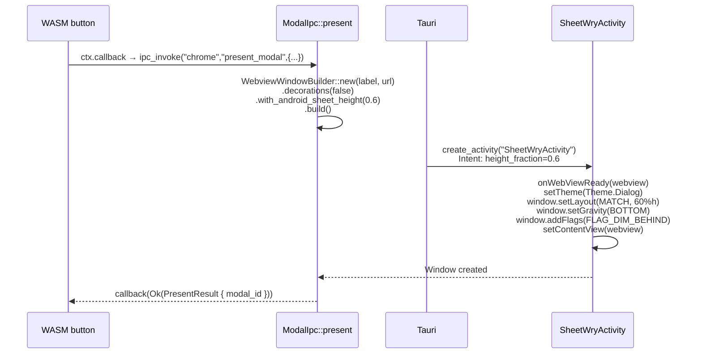

# F46 — SheetWryActivity → MultiWryActivity (staged modal WebView)

## Problem

Today, `ModalIpc::present()` calls Kotlin's `presentModal` via `PluginHandle`,
which creates a plain `android.webkit.WebView` inside a `BottomSheetDialog`.
That WebView has no `__TAURI_INTERNALS__`, no init scripts, no IPC bridge,
and no VFS asset loading. It's a dumb browser widget.

We want the modal WebView to be a **Tauri WebView** — fully wired with IPC,
init scripts, custom protocol handling, and VFS loading. The user wants
this to eventually work as a BottomSheet overlay within the same Activity.

## Solution (two stages)

### Stage 1: SheetWryActivity — second window, proven first

Leverage the already-built F44/F45 infrastructure to create a **second Tauri
window** styled as a partial-height bottom sheet. `WebviewWindowBuilder`
+ `decorations(false)` + `with_android_sheet_height(0.6)` → `SheetWryActivity`
on Android, which uses `CustomWryActivity.onWebViewReady()` to apply
`Window.setLayout(limited height)`, `setGravity(BOTTOM)`, `FLAG_DIM_BEHIND`,
and `setDimAmount(0.5)`.

**This IS a separate Activity/window** — not a same-Activity BottomSheet.
But it proves the full chain works: WASM button → IPC → Rust → Tauri window
→ SheetWryActivity → partial-height overlay with full Tauri IPC.



**What we get with Stage 1:**
- Modal WebView has full Tauri IPC (`__TAURI_INTERNALS__`)
- Modal WebView has init scripts + VFS loading
- Dashboard stays visible behind the sheet (dimmed)
- WASM buttons on dashboard still work (different window, same Rust process)
- Dismiss works via `WindowManager.destroy()`
- Desktop: `decorations(false)` + `inner_size` creates a frameless centered window

**What we DON'T get with Stage 1:**
- It's a second Activity/window, not a true Android BottomSheet
- The modal window has its own Activity in the task stack
- No `BottomSheetDialog` swipe-to-dismiss gesture

### Stage 2: MultiWryActivity — same Activity, true BottomSheet

Replace the plain `WebView` in `BottomSheetDialog` with a Tauri WebView
created by `MultiWryActivity`. The Rust side creates a child WebView via
wry's `CreateWebView` on the existing `ActivityId`, which lands in
`MultiWryActivity.onWebViewReady()` → `decorView.addView()`. Kotlin's
`ModalHelper` finds it, detaches it, embeds it in `BottomSheetDialog`,
and reattaches on dismiss.

**This requires:**
1. `MultiWryActivity.kt` — extends `WryActivity`, stores `Map<String, RustWebView>`
2. wry Rust API — `CreateWebView` on existing `ActivityId` (no `tao::Window::new()`)
3. `ACTIVITY_PROXY` — `BTreeMap<String, GlobalRef>` instead of `Option<GlobalRef>`
4. `WindowManager.create_child(label, url)` — Rust API for creating child WebViews
5. `ModalHelper.kt` — `findWebViewInstance(id)` → detach → BottomSheet → reattach

**Stage 2 is blocked on wry/tao upstream changes** (R3-R8 in F45).
We do NOT implement Stage 2 until Stage 1 is proven working.

## Stage 1 Implementation

### What already exists (committed)

| Component | File | Status |
|---|---|---|
| `AndroidWindowLayout` | `infrastructure/tao/src/platform/android.rs` | ✓ Committed |
| `PlatformSpecificWindowBuilderAttributes.android_layout` | `infrastructure/tao/src/platform_impl/android/mod.rs` | ✓ Committed |
| `create_activity(_, height_fraction)` | `infrastructure/tao/src/platform_impl/android/ndk_glue.rs` | ✓ Committed |
| `WryActivity.onWebViewReady()` | `infrastructure/wry/src/android/kotlin/WryActivity.kt` | ✓ Committed |
| `CustomWryActivity` | `infrastructure/wry/src/android/kotlin/CustomWryActivity.kt` | ✓ Committed |
| `SheetWryActivity` | `infrastructure/wry/src/android/kotlin/SheetWryActivity.kt` | ✓ Committed |
| `main_pipe.rs` calls `onWebViewReady` not `setContentView` | `infrastructure/wry/src/android/main_pipe.rs` | ✓ Committed |
| `WindowOps::create_sheet()` trait method | `backends/foundation_platform/src/window.rs` | ✓ Committed |
| `TauriWindowOps::create_sheet()` | `backends/foundation_platform/src/window.rs` | ✓ Committed |
| `ModalIpc::present()` uses `WebviewWindowBuilder` directly | `backends/foundation_platform_native/src/native/modal.rs` | Need check |
| APK builds with forked tao/wry patches | `examples/platform_android/src-tauri/Cargo.toml` | ✓ Verified |

### What needs completing

#### R1. Verify `ModalIpc::present()` creates a `WebviewWindowBuilder` correctly

The current `modal.rs` at head already calls `WebviewWindowBuilder::new().decorations(false).with_android_sheet_height(fraction).build()`. Verify:

1. The `WebviewWindowBuilder` path compiles on the Android target
2. The window label is unique (`modal_0`, `modal_1`, ...)
3. The height_fraction maps correctly: `bottom_sheet` → 0.6, `dialog` → 0.8

#### R2. Verify `WindowManager.destroy()` works for sheet windows

```rust
// In ModalIpc::dismiss():
session.window_manager().destroy(&mut pool, &label);
```

Must close the sheet window and clean up the WebView pool entry.

#### R3. Verify `WindowManager.ensure()` for sheet windows

The existing `ensure()` calls `ops.create()` which creates a full-screen
window. We need `create_sheet()` to be called for modal labels. Options:
- Add a `WindowManager::ensure_sheet()` method that calls `ops.create_sheet()`
- Or detect the label prefix (`modal_*`) in `ensure()` and route appropriately

**Decision:** Add `WindowManager::ensure_sheet()` — cleaner than prefix detection.

#### R4. APK build with E2E proof

Add E2E proof script to the generated HTML:
```js
invokeIpc('chrome', 'present_modal', {url:'http://ewe.localhost/app/', style:'bottom_sheet', title:'F46 Test'})
```

Verify on emulator:
- Sheet appears as partial-height overlay (bottom 60% of screen)
- Dashboard behind is dimmed
- WASM is active in the sheet WebView (console logs appear)
- Dismissing via the E2E proof or back press works
- Dashboard was NOT destroyed (resume, not recreate)

#### R5. AndroidManifest declares SheetWryActivity

```xml
<activity android:name=".SheetWryActivity"
          android:theme="@android:style/Theme.DeviceDefault.Dialog" />
```

The build.rs in wry copies all `.kt` files including `SheetWryActivity.kt`.
The consuming app's manifest must declare `<activity>` for it. Without the
manifest entry, `startActivity(SheetWryActivity.class)` will crash with
`ActivityNotFoundException`.

Fix: add the manifest entry either in the wry build.rs (auto-generated)
or in the consuming app's `AndroidManifest.xml`.

#### R6. Desktop fallback

On desktop, `decorations(false).inner_size(360, 600)` creates a frameless
centered window. No Android-specific code in the Rust path — the `#[cfg]`
is only in the `WindowBuilderExtAndroid` call.

### Stage 1 Verification

```bash
# 1. Build APK
cd examples/platform_android/src-tauri
cargo tauri android build --target x86_64 --debug

# 2. Install + launch
adb install -r gen/android/app/build/outputs/apk/universal/debug/app-universal-debug.apk
adb shell am start -n com.ewe.platform/.MainActivity

# 3. Verify dashboard loads
adb logcat | grep "WASM active"

# 4. Trigger E2E proof (injected into HTML)
# Should see: Tauri/Plugin: pluginId: ewe-platform-native, command: presentModal
# SheetWryActivity should appear as partial-height overlay

# 5. Take screenshot
adb exec-out screencap -p > /tmp/f46-stage1-sheet.png
```

### Stage 1 Files

| File | Action | Description |
|---|---|---|
| `backends/foundation_platform_native/src/native/modal.rs` | **VERIFY/UPDATE** | `ModalIpc::present()` uses `WebviewWindowBuilder` directly |
| `backends/foundation_platform/src/window.rs` | **MODIFY** | Add `ensure_sheet()` to `WindowManager` |
| `backends/foundation_platform/src/stack.rs` | **VERIFY** | `pop_with` added — verify it works |
| `examples/platform_android/src-tauri/.../AndroidManifest.xml` | **MODIFY** | Declare `SheetWryActivity` |
| `examples/platform_android/app/src/lib.rs` | **VERIFY** | Buttons wired, present sends correct args |
| `backends/foundation_wasm_ui/src/build_tools/mod.rs` | **VERIFY** | HTML template clean (no stale E2E) |

## Stage 2 (future — do NOT implement now)

Blocked on: MultiWryActivity + ACTIVITY_PROXY refactor in wry.

Stage 2 replaces the separate `SheetWryActivity` window with a same-Activity
WebView embedded in a Kotlin `BottomSheetDialog`. The full spec is in F45
R6-R8. Do NOT implement Stage 2 until Stage 1 is proven working on the
emulator with screenshots.
