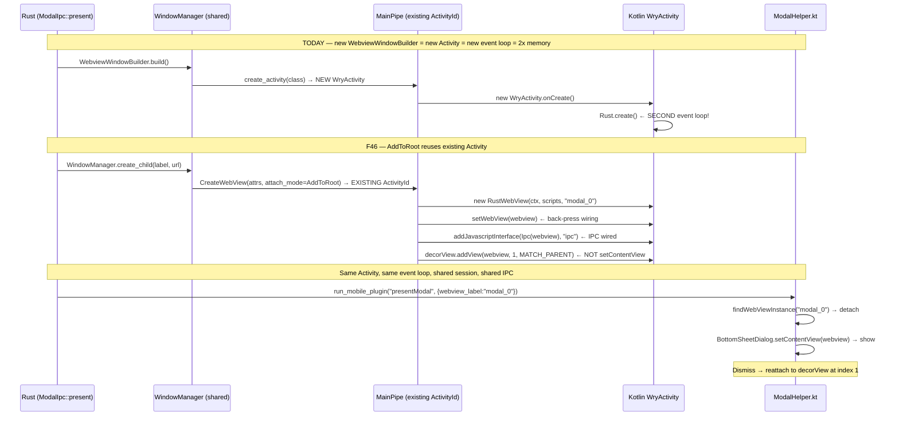

# F46 — Standalone WebView Creation Without Activity Attachment (wry fork)

## Problem

Today, wry's `CreateWebView` handler always calls `activity.setContentView(webview)`
(`main_pipe.rs:317-322`), making the WebView the Activity's entire content. There
is no way to create a Tauri WebView that is NOT immediately attached to an Activity
via `setContentView`.

This means:
- **No multiple WebViews per Activity** — each Activity hosts exactly one
- **No reparenting** — can't detach a WebView from one parent and move it elsewhere
- **No layout composition** — can't place a WebView alongside other Views in a
  custom layout
- **No lazy attachment** — must have an Activity ready at creation time

For `foundation_platform`, we want Kotlin (`ModalHelper.kt`) to:
1. Call `findWebViewInstance(activity.window.decorView)` to find Tauri WebViews
2. Detach the WebView from the decor view
3. Embed it in a `BottomSheetDialog`
4. Re-attach to the decor view when dismissed

This requires the WebView to exist as a regular `android.view.View` in the
Activity's view hierarchy — not as the content view via `setContentView`.



## Solution

Add an `attach_mode` field to `CreateWebViewAttributes` with two variants:
1. **`ContentView`** — current behavior, `activity.setContentView(webview)` (default)
2. **`AddToRoot`** — skip `tao::Window::new()` and `create_activity()` entirely.
   Instead, send `CreateWebView` to the **existing** Activity's `MainPipe`, then
   call `decorView.addView(webview)` as a sibling of the main WebView.

`AddToRoot` does NOT create a new `WryActivity`, NOT a new event loop, NOT a new
Rust process. The WebView is a sibling widget in the existing Activity hierarchy —
sharing the same `AppHandle`, `PlatformSession`, IPC handlers, and managed state.

The `WryActivity.setWebView()` call still fires for back-press wiring. Only the
final attachment step changes from `setContentView` to `addView`.

### What currently exists (relevant wry internals)

**WryActivity.kt** — the Activity class:
```kotlin
abstract class WryActivity : AppCompatActivity() {
    private lateinit var mWebView: RustWebView

    fun setWebView(webView: RustWebView) {
        mWebView = webView
        // Wires OnBackPressedCallback for goBack() handling
        onWebViewCreate(webView)  // open override hook
    }

    open fun onWebViewCreate(webView: WebView) { }
}
```

**main_pipe.rs** — the CreateWebView JNI handler (lines 238-322):
```rust
// Step 4: Register with Activity
activity.setWebView(webview)?

// Steps 5-10: Load URL, devtools, background, clients, IPC...

// Step 11: Attach to Activity (THE HARDCODED BIT)
activity.setContentView(webview)?      // line 317-322
```

**ACTIVITY_PROXY** — stores one WebView per Activity:
```rust
// main_pipe.rs:55
BTreeMap<ActivityId, ActivityProxy>

struct ActivityProxy {
    activity: GlobalRef,
    webview: Option<GlobalRef>,  // ← only ONE per Activity
    // ...
}
```

### The `ACTIVITY_PROXY` constraint

`ActivityProxy` stores a single `webview: Option<GlobalRef>`. This means the data
model assumes 1:1 Activity-to-WebView. For `AddToRoot` mode, this is fine — we're
adding one WebView as a child of the decor view within the existing Activity.

For `NoAttach` mode, we'd need to either:
- Skip storing in `ACTIVITY_PROXY` (WebView is caller-managed)
- Or store in a separate registry (e.g., `STANDALONE_WEBVIEWS: BTreeMap<String, GlobalRef>`)

The `NoAttach` mode is the highest risk — the WebView still has IPC and init scripts
wired, but it has no Activity lifecycle management. If the Activity is destroyed
while a detached WebView exists, JNI calls to it will crash.

## ARCHITECTURE RESEARCH

### Process Model: One Activity, One Event Loop, Multiple WebViews

The core insight of `AddToRoot` mode: **no second `WryActivity` is created.** The modal
WebView is a child widget in the SAME Activity that hosts the main WebView.

```
┌─────────────────────────────────────────────────────────┐
│ Android Process: com.ewe.platform                       │
│ ┌─────────────────────────────────────────────────────┐ │
│ │ WryActivity (single instance)                       │ │
│ │ ┌───────────────────────────────────────────────┐   │ │
│ │ │ Rust Process (single event loop)              │   │ │
│ │ │ ┌─────────┐  ┌──────────┐  ┌──────────────┐  │   │ │
│ │ │ │ AppHandle│  │ Platform │  │ EweNative     │  │   │ │
│ │ │ │         │  │ Session  │  │ Handles       │  │   │ │
│ │ │ └─────────┘  └──────────┘  └──────────────┘  │   │ │
│ │ └───────────────────────────────────────────────┘   │ │
│ │                                                      │ │
│ │ decorView (FrameLayout)                               │ │
│ │  ├── RustWebView(id="main")  ← setContentView        │ │
│ │  │     __TAURI_INTERNALS__ ✓                          │ │
│ │  │     window.ipc ✓                                   │ │
│ │  │     initScripts ✓                                  │ │
│ │  ├── RustWebView(id="modal_0")  ← addView at index 1 │ │
│ │  │     __TAURI_INTERNALS__ ✓                          │ │
│ │  │     window.ipc ✓                                   │ │
│ │  │     initScripts ✓                                  │ │
│ │  └── ...                                              │ │
│ └─────────────────────────────────────────────────────┘ │
└─────────────────────────────────────────────────────────┘
```

Key facts about this architecture:

1. **No second `WryActivity`** — `AddToRoot` skips `tao::Window::new()` + `create_activity()` entirely. The modal WebView is created via wry's `MainPipe::CreateWebView` targeting the **existing** `ActivityId`.

2. **No duplicate event loop** — `WryLifecycleObserver.onCreate()` calls `Rust.create()` and `Rust.wryCreate()` exactly once, when the process starts. `AddToRoot` does NOT create a new `WryActivity`, so `onCreate` never fires again.

3. **Shared Rust state** — `AppHandle` is cloned per-window in Tauri, but `app_handle.state::<PlatformSession>()` returns the SAME `Arc<PlatformSession>` from any window. `EweNativeHandles`, IPC registry, all managed state is shared. Memory: one Rust process, one set of managed state.

4. **Same session** — Both WebViews use the same `PlatformSession`, same IPC handler registry, same `WindowManager`, same `WebViewStack`. The modal WebView's IPC calls go through the same `ModalIpc` handler as the main WebView's.

5. **Kotlin can find and reparent** — Because the modal WebView is a regular child of `decorView`, Kotlin's `findWebViewInstance(id)` can locate it by its `RustWebView.id` field, detach it via `parent.removeView()`, embed it in a `BottomSheetDialog`, and reattach it on dismiss. The main WebView stays visible behind.

This is fundamentally different from `WebviewWindowBuilder::build()`:
- `WebviewWindowBuilder` → new `WryActivity` → new event loop → new Rust process state → separate everything
- `AddToRoot` → existing `WryActivity` → same event loop → shared Rust state → sibling in decorView

### What `setContentView` vs `addView` means for the WebView lifecycle

| Aspect | `setContentView(webview)` | `decorView.addView(webview)` |
|---|---|---|
| **Layout** | WebView replaces activity content | WebView is a child of root ViewGroup |
| **Size** | MATCH_PARENT × MATCH_PARENT (fills screen) | Controlled by LayoutParams |
| **Reparenting** | Cannot detach — content view swap crashes | Can detach via `parent.removeView()` |
| **IPC** | `window.ipc` works (JavascriptInterface wired) | Same — IPC wired BEFORE attachment |
| **Back press** | `WryActivity.OnBackPressedCallback` works | Same — wired in `setWebView()` |
| **Lifecycle** | `onPause/onResume` managed by Activity | Still managed — WebView in view tree |

The IPC bridge (`addJavascriptInterface` at main_pipe.rs:309-314) is wired **before**
`setContentView` (line 317). So `AddToRoot` mode would have identical IPC behavior.

### Why Wry Does It the Current Way

1. **Single-WebView assumption.** Every Tauri Android app has one WebView that IS
   the app. The `setContentView` pattern is the natural Android idiom for that.

2. **Lifecycle simplicity.** `setContentView` ties the WebView lifecycle directly
   to the Activity's — create/destroy are 1:1. With `addView`, the caller must
   manage when views are attached/detached, which adds complexity.

3. **No demand for reparenting.** foundation_platform's BottomSheetDialog use case
   is the first that needs a detachable WebView. No prior Tauri plugin or app has
   requested this.

### Critical concern: `NoAttach` mode risks

`NoAttach` (skip ALL attachment) is the most dangerous variant:

1. **No lifecycle management** — if the Activity is destroyed while a detached
   WebView's `GlobalRef` still exists, any JNI call to it will crash with
   `JNI DETECTED ERROR IN APPLICATION: use of deleted local reference`.

2. **No garbage collection safety** — the `GlobalRef` prevents GC, but the
   underlying `RustWebView` holds a reference to the Activity `Context`.
   If the Activity is GC'd but the WebView isn't, memory leaks result.

3. **No back press handling** — `WryActivity.setWebView()` wires
   `OnBackPressedCallback`. Without an Activity, back navigation is undefined.

**Recommendation:** Implement `AddToRoot` mode first (lower risk, solves the
reparenting use case). Defer `NoAttach` to a follow-up feature after
lifecycle safety analysis.

### Security & Stability

| Concern | Mitigation |
|---|---|
| **Detached WebView JNI calls** | `JniHandle::exec()` checks `ActivityProxy` — if WebView is detached (not in proxy), return null. Callers must handle. |
| **Memory leaks** | `GlobalRef` must be deleted when WebView is no longer referenced. Rust's `Drop` on `InnerWebView` should call `delete_global_ref`. |
| **Double attach** | Guard against attaching an already-attached WebView. `webView.parent != null` check in Kotlin. |
| **IPC after detach** | The `Ipc` JavascriptInterface is registered on the RustWebView object. It works regardless of view parent. Detaching doesn't break it. |
| **Activity context** | `RustWebView` constructor takes `Context`. If created with the Activity context and the Activity is destroyed, the WebView must also be destroyed. |

## Requirements

### R1. `AndroidWebViewAttachMode` enum
```rust
pub enum AndroidWebViewAttachMode {
    /// Current behavior — `activity.setContentView(webview)` (default)
    ContentView,
    /// Add as child of decor view — `decorView.addView(webview, 0, matchParent)`
    AddToRoot { index: Option<usize> },
    // NoAttach deferred — see Critical Concern above
}
```
- File: `wry/src/android/mod.rs`

### R2. `CreateWebViewAttributes` — add `attach_mode` field
- `pub attach_mode: AndroidWebViewAttachMode` — defaults to `ContentView`
- Read in `CreateWebView` handler to decide final attachment step
- File: `wry/src/android/main_pipe.rs`

### R3. Conditional + same-Activity attachment in `CreateWebView` handler
- `ContentView` → `activity.setContentView(webview)` (unchanged)
- `AddToRoot` → **reuse existing `ActivityId`** (no `create_activity()` call).
  JNI call to `activity.window.decorView.addView(webview, index, lp)`
  where `lp` = `FrameLayout.LayoutParams(MATCH_PARENT, MATCH_PARENT)`.
  WebView is a sibling of the main WebView in the decor view hierarchy.
- IPC, init scripts, clients, devtools, background color — all applied
  BEFORE attachment, identical to `ContentView` mode.
- The `ACTIVITY_PROXY` stores this WebView using a compound key
  `(activity_id, webview_label)` alongside the existing single WebView slot
  (or a Vec of GlobalRefs per ActivityProxy).
- File: `wry/src/android/main_pipe.rs`, `wry/src/android/mod.rs`

### R3a. `WindowManager::create_child(label, url)` — Rust API
- Calls directly into wry's `CreateWebView` with `attach_mode=AddToRoot`
  targeting the **existing** ActivityId (from the main window's `JniHandle`)
- Does NOT call `tao::Window::new()`, does NOT spawn a new Activity
- Returns the WebView label for Kotlin lookup
- File: `foundation_platform/src/window.rs` (new method on `WindowManager`)

### R4. `WebViewBuilderExtAndroid` — add builder method
```rust
fn with_android_attach_mode(self, mode: AndroidWebViewAttachMode) -> Self;
```
- File: `wry/src/lib.rs`

### R5. WryActivity.kt — support AddToRoot in `onWebViewCreate`
- When attach_mode is AddToRoot, override `onWebViewCreate` to NOT expect
  `setContentView` — the Rust side handles attachment
- Provide a `getWebView()` method for callers to retrieve the stored WebView
- File: `wry/src/android/kotlin/WryActivity.kt`

### R6. `ModalHelper.kt` — use `findWebViewInstance` for reparenting
- Search decor view hierarchy for the WebView (identified by its `id` field)
- Detach via `parent.removeView(webView)`
- Embed in `BottomSheetDialog.setContentView(webView)`
- Re-attach to decor view on dismiss via `root.addView(webView, savedIndex, savedLp)`
- File: `foundation_platform_native/android/.../ModalHelper.kt`

## Implementation Sequence

1. **wry:** Add `AndroidWebViewAttachMode` enum
2. **wry:** Add field to `CreateWebViewAttributes` and `PlatformSpecificWebViewAttributes`
3. **wry:** Add builder method on `WebViewBuilderExtAndroid`
4. **wry:** Modify `CreateWebView` handler for AddToRoot
5. **wry (Kotlin):** Update `WryActivity.kt` for AddToRoot mode
6. **foundation_platform_native:** Update `ModalHelper.kt` for detach/reattach

## Verification

```bash
# wry
cargo check -p wry --target x86_64-linux-android

# platform_android — build APK with AddToRoot + BottomSheet
cd examples/platform_android/src-tauri
cargo tauri android build --target x86_64 --debug
# Manual on emulator:
# 1. Tap "Present Modal" → BottomSheet slides up with Tauri WebView
# 2. Verify IPC works in the sheet (dashboard buttons respond)
# 3. Tap outside or swipe down → dismisses, WebView reattaches to decor view
# 4. Verify dashboard is interactive (was NOT destroyed by detach)
```

## Files

| File | Action | Description |
|---|---|---|
| `wry/src/android/mod.rs` | **MODIFY** | Add `AndroidWebViewAttachMode`, add to `PlatformSpecificWebViewAttributes` |
| `wry/src/android/main_pipe.rs` | **MODIFY** | Add `attach_mode` to `CreateWebViewAttributes`, conditional attachment in handler |
| `wry/src/lib.rs` | **MODIFY** | Add `with_android_attach_mode()` to `WebViewBuilderExtAndroid` |
| `wry/src/android/kotlin/WryActivity.kt` | **MODIFY** | Add `getWebView()`, support AddToRoot in lifecycle |
| `foundation_platform_native/android/.../ModalHelper.kt` | **MODIFY** | Use `findWebViewInstance` + detach/reattach for BottomSheet |
