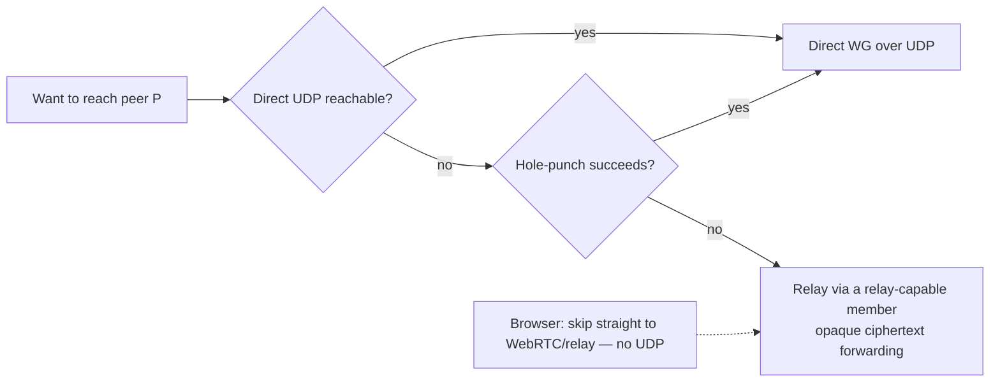

# 07 — Relay as a Distributed Node Capability (DERP-style)

**Date:** 2026-07-12
**Status:** Resolved (owner-confirmed)

## Decision

Relay is a **capability**, not a dedicated role or infrastructure. Any willing, authenticated native
node **advertises "I relay" as a gossiped node attribute**; peers it has authenticated with select
one (or several) to relay through. The capability serves **both**:

1. **Browser relay** — browsers have **no UDP at all**, so a browser peer *must* tunnel its WG
   datagrams through a relay to reach the UDP mesh ([decision 08](08-wasm-browser-and-webrtc.md)).
2. **Native NAT-traversal fallback (DERP-style)** — two native peers that cannot reach each other
   directly (symmetric NAT, cloud↔home, mobile carriers) relay through any mutually-reachable member,
   **always preferring direct UDP** when hole-punching succeeds.

Rejected: dedicated gateway nodes (reintroduces special infrastructure, against the masterless
ethos).

## Why

- **"Must it need a relay?"** For a browser, yes — the browser physically cannot open a UDP socket,
  so *something* must bridge onto UDP. But it need **not** be dedicated infra.
- Modeling relay as an emergent, gossiped capability keeps the masterless property: relays are just
  members that opted in; if one dies, pick another; no SPOF (this is exactly Tailscale's **DERP**).
- **Trustless.** A relay forwards **opaque WG ciphertext only** — it never holds keys or sees
  plaintext (the browser/native endpoints do their own WG crypto + smoltcp end-to-end). So letting
  *any* authenticated node relay is safe: a relay is a dumb bit-mover.
- Generalizing past browsers to native NAT fallback is a modest extension of the same mechanism and
  dramatically improves connectivity in hostile-NAT environments.

## What we do

### Advertisement & selection

- `Capabilities.relay = true` is set by nodes that opt in (config/macro flag; on by default for
  nodes with a public reachable endpoint). It rides SWIM gossip
  ([decision 05](05-swim-full-membership-gossip.md)) like any other attribute.
- A peer needing a relay picks candidates by health (SWIM state) + RTT + advertised load; it may use
  **several** relays concurrently for resilience and re-selects when one degrades.

### Connectivity ladder (per peer-pair)

- **Direct first.** Try the peer's advertised endpoint(s); attempt UDP hole-punching (coordinated via
  gossip: both sides send to each other's observed endpoints to open NAT mappings).
- **Relay fallback.** On failure, wrap WG datagrams in a small relay framing
  (`{ dst_peer_id, opaque_wg_bytes }`) and send to a relay member, which forwards to `dst_peer_id`'s
  session and relays return traffic. Relay never decrypts.

### Relay framing & session

- A relay maintains per-client **relay sessions** keyed by identity pubkey; forwarding is a lookup +
  `send_to`. Sessions are authenticated: a client attaches to a relay over the mesh (already a
  trusted peer) and the relay only forwards between attached, authenticated clients.
- Native relay lives in `foundation_wireguard::native`; the browser attaches over WebSocket/WebTransport
  ([decision 08](08-wasm-browser-and-webrtc.md)).

## Consequences

- Relay adds latency + load to the relaying node; mitigated by direct-preference, multi-relay
  selection, and (for browsers) WebRTC direct upgrade ([decision 08](08-wasm-browser-and-webrtc.md)).
- Because relays only see ciphertext, a compromised relay cannot read traffic — only observe
  metadata (who talks to whom, volume). Acceptable; documented.

## Related decisions

- [05 — SWIM full-membership gossip](05-swim-full-membership-gossip.md)
- [08 — wasm/browser & WebRTC](08-wasm-browser-and-webrtc.md)
- [09 — WebTransport on quinn-proto](09-webtransport-on-quinn-proto.md)
