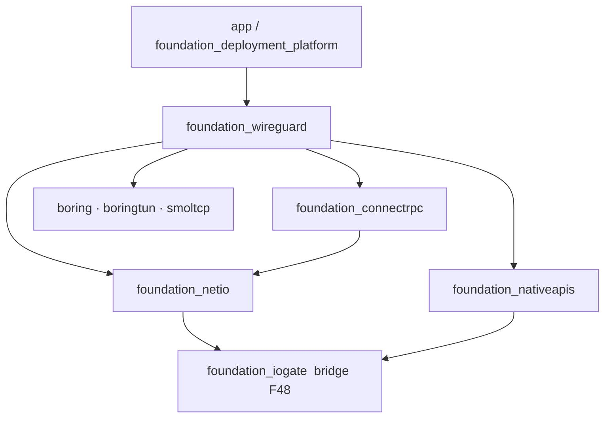

# 14 — Crate Layering: `foundation_wireguard` as the Combiner, No Cycles

**Date:** 2026-07-12
**Status:** Resolved (owner-confirmed)

## Decision

`foundation_wireguard` is the **top-level combiner**. It depends on `foundation_connectrpc`,
`foundation_netio`, `foundation_nativeapis`, and the primitive crates
(`boring`/`boringtun`/`smoltcp`) — and **nothing depends on it** except application/deployment code.
The new data-plane primitives (smoltcp netstack, kernel TUN) go **into `foundation_nativeapis`**, not
netio. No new dependency cycle is introduced.

## Why

- The owner asked for "a `foundation_wireguard` that can combine all these other crates together
  without circular dependency issues."
- WireGuard needs, from bottom to top: UDP + a data plane (nativeapis), UDP/QUIC/WebSocket/
  WebTransport/TLS transports (netio), and the Join/gossip RPC (connectrpc). Placing WG **above** all
  of them means it only ever consumes downward — the safe direction.

## What we do

- **smoltcp + kernel TUN → `foundation_nativeapis`.** They are data-plane *primitives*; nativeapis is
  where OS/net primitives already live (it owns `UdpSocket`, poll/epoll/io_uring). They do **not** go
  into netio (which is a higher transport layer).
- **WebTransport → `foundation_netio`** ([decision 09](09-webtransport-on-quinn-proto.md)) — a
  transport capability peer to websocket/http3, reusable beyond WG.
- **The one known hazard** is the pre-existing netio ↔ nativeapis relationship, already solved by the
  `foundation_iogate` bridge crate (F48). Our additions respect it: nativeapis stays a *leaf-ish*
  primitives layer; if some lower crate ever needs a WG-defined type, we introduce a **small bridge
  crate** (the iogate pattern) rather than make a lower crate depend on `foundation_wireguard`.
- **`foundation_deployment_platform` consumes `foundation_wireguard`** (top-down), for secret
  generation/injection — moved to [spec-53](../../specifications/53-docker-container-testbed/features/wireguard-mesh-integration.md) —
  never the reverse.

## Consequences

- `foundation_wireguard`'s own internal `shared/native/wasm/android/ios` split keeps
  platform-specific code out of `shared/` (`feedback_shared_module_purpose`).
- Because WG is the top, it can freely orchestrate connectrpc + netio + nativeapis without import
  gymnastics; the cost is that WG is a "heavy" crate — acceptable for a combiner, and feature-gated so
  consumers can pull only what they need (e.g. `dataplane-tun`, `relay`, `wasm`, `webtransport`).

## Related decisions

- [02 — Dual data plane](02-dual-dataplane.md)
- [09 — WebTransport on quinn-proto](09-webtransport-on-quinn-proto.md)
