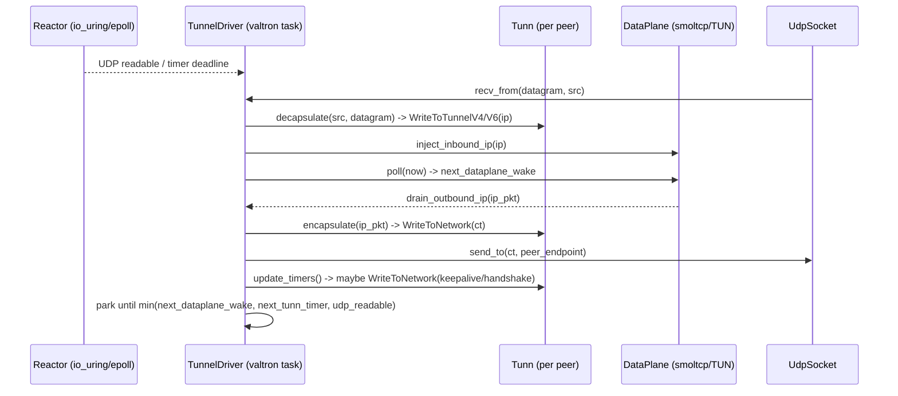

# Feature 01 — WireGuard Core & Keys

**Depends on:** 00
**Unblocks:** 02, 03, 04
**Decisions:** [01](../../decisions/01-source-crates-and-pinning.md), [03](../../decisions/03-seed-derived-keys.md), [02](../../decisions/02-dual-dataplane.md)

## WHY

Wrap `boringtun::noise::Tunn` (the pure WG crypto state machine) into a valtron-driven **tunnel** and
provide **seed-derived** and **random-identity** key handling. This is the crate's beating heart: one
valtron task drives `Tunn` timers + the `DataPlane` poll loop, moving packets app ⇄ Tunn ⇄ UDP.

## WHAT

`foundation_wireguard::shared::keys` + `shared::mesh::tunnel` (+ `native` UDP glue):

1. Key types: `WgSeed`, seed→x25519 derivation, `IdentityKeypair`, `PeerPublicKey`, hex/base64 parse.
2. `WgTunnel` — wraps one `Tunn` (one peer) + buffers; sans-I/O methods mirroring
   `encapsulate`/`decapsulate`/`update_timers`.
3. `TunnelDriver` — the valtron task that couples a set of `WgTunnel`s + one `DataPlane` + a UDP
   socket.

## HOW

### Keys ([decision 03](../../decisions/03-seed-derived-keys.md))

```rust
pub struct WgSeed([u8; N]);                 // N = 16 or 32
impl WgSeed {
    pub fn generate(bits: SeedBits) -> Self;         // OsRng
    pub fn derive_bootstrap(&self, network_id: &NetworkId) -> BootstrapKeys; // HKDF-BLAKE2s
}
pub struct BootstrapKeys { pub static_secret: x25519::StaticSecret, pub psk: [u8;32], pub tls_psk: [u8;32] }
pub struct IdentityKeypair { secret: x25519::StaticSecret, public: x25519::PublicKey }
impl IdentityKeypair { pub fn generate() -> Self; }  // random, NOT seed-derived
```

- Reuse `boringtun::x25519` types (no separate x25519-dalek dep).
- Key string parse mirrors boringtun's `KeyBytes` (hex-64 / base64-43/44) but public (boringtun's is
  `pub(crate)`); we own our parser in `keys`.

### `WgTunnel` (per-peer)

- Constructed via `Tunn::new(static_private, peer_public, Some(psk), keepalive, index, rate_limiter)`
  (infallible since 0.7.0).
- Methods: `encapsulate(ip_pkt, out) -> WgOutcome`, `decapsulate(from, udp, out) -> WgOutcome`,
  `update_timers(out) -> WgOutcome`, mapping `TunnResult` → our `WgOutcome`
  (`WriteToNetwork`/`WriteToTunnelV4/V6`/`Done`/`Err`). Handle the documented
  "repeat `decapsulate` with empty datagram until `Done`" contract.

### `TunnelDriver` (valtron task) — the core loop



- **One task drives both state machines** — no cross-executor waking. Park via valtron readiness
  (`Depends(QueueReadiness)` OR-composed with the timer + UDP readiness, per
  `project_spec41_parking_tasks_compose_cancel`).
- Uses `BoxedSendExecutionAction` (never `NoAction` — `feedback_no_noaction_use_boxedaction`).
- Buffer sizes: dst ≥ src + 32, ≥ 148 bytes (boringtun contract); use the platform buffer pool.

## Task list

1. `keys`: `WgSeed`, HKDF-BLAKE2s derivation with domain separation, `IdentityKeypair`, key parse.
2. `WgTunnel` wrapper + `WgOutcome`; unit tests mirroring boringtun's two-Tunn handshake test.
3. `TunnelDriver` valtron task coupling Tunn(s) + `DataPlane` + `UdpSocket`.
4. Native UDP glue (`nativeapis::UdpSocket`) + endpoint management.
5. Tests: two `TunnelDriver`s on one host (loopback UDP) complete a handshake and pass TCP bytes over
   smoltcp; seed determinism (same seed → same bootstrap pubkey); timer-driven keepalive.

## Test plan / success

- Deterministic derivation: `derive_bootstrap` is stable across processes.
- Two nodes, same network, direct UDP → handshake → app bytes over the overlay (success criterion 1).
- `--profile uat`; `#[valtron_test]` for the multi-task tests.
