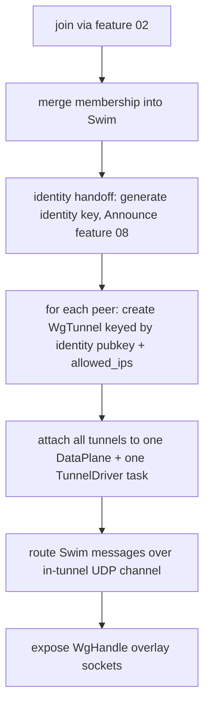

# Feature 04 — Mesh & Data-Plane Orchestration

**Status:** ⚠️ Partial (2026-07-14 audit). `WgNode`, `WgHandle`, `MeshTask`, `TunnelDriver`, IPAM, membership↔tunnel reconciliation all implemented and tested. 3-node mesh discovery + overlay traffic test passes. **Must do:** (1) Replace `std::thread::spawn` + `thread::sleep(50ms)` mesh loop with valtron `TaskIterator` driving off reactor fd readiness, not a fixed sleep poll; (2) Wire the connectivity ladder (direct → hole-punch → relay fallback) end-to-end within the mesh tick; (3) Drive the bootstrap server via valtron, not a detached `std::thread`.
**Depends on:** 00, 01, 02, 03
**Unblocks:** 05, 07, 08, 09
**Decisions:** [05](../../decisions/05-swim-full-membership-gossip.md), [06](../../decisions/06-hybrid-transport-tls-psk.md), [02](../../decisions/02-dual-dataplane.md)

## Implementation notes (2026-07-13)

`native/node` — `WgConfig` (seed/joiner), `WgNode::join`, `WgHandle`, `PeerInfo`:

- **Join**: joiners dial `seed_endpoints` via the F02 `BootstrapClient` (TLS-PSK),
  `Join` → merge membership → self is announced. Every node also keeps its **own**
  `BootstrapServer` open (masterless) so later nodes can join through it.
- **Wiring**: one `TunnelDriver` fans across all peers; a runtime thread pumps
  `drive_once` (WG + data plane) + SWIM + reconciliation each tick. **Membership→tunnels**
  is reconciled continuously: `Alive` peers get a `WgTunnel` keyed by their identity pubkey
  + the shared bootstrap WG-PSK; departed peers are dropped.
- **SWIM-in-tunnel**: an `OverlayUdp` bound to `my_ip:51999` carries gossip; `SwimOutbound`
  is routed by peer overlay IP through the data plane (so gossip is itself private).
- **IPAM**: overlay IP derived `10.x.y.z/8` from the identity key (decision 12; collision
  detection — must-do). `WgHandle` exposes `tcp_connect`/`tcp_listen`/`udp_bind`/`members`/
  `wait_for_peer`/`shutdown`.

Test (`--profile uat`, real threads + UDP + TLS-PSK, stable over repeated runs): a 3-node
mesh from one secret; **C discovers B by gossip** (not static) and reaches both A and B
over the encrypted overlay (echo); **the seed A is killed and B/C survive**; a **4th node
D joins from survivor B** and discovers C (success criteria 2 & 3). Zero warnings.

**Must do:** connectivity-ladder relay path (F05), full connectrpc framing (F02 note), and
running the runtime as a valtron task rather than a std thread (the `TunnelDriverTask`
exists; the mesh loop also drives SWIM, so it currently uses a dedicated thread).

## WHY

This is where the pieces become a **network**. The mesh orchestrator consumes membership events,
maintains one `WgTunnel` per peer, wires them into the shared `DataPlane`, routes SWIM gossip inside
the tunnel, applies the connectivity ladder, and exposes the user-facing `tcp_connect`/`tcp_listen`/
`udp_bind` API over the overlay.

## WHAT

`shared::mesh` (orchestration, peer table, routing) + the `WgNode`/`WgHandle` public API:

1. `WgNode` — owns identity, config, the `DataPlane`, the UDP socket, the peer table, the `Swim`.
2. Peer table — `identity_pubkey → { WgTunnel, endpoint state, path (direct/relay) }`.
3. Router — maps overlay dst IP → the right `WgTunnel`; feeds SWIM to the in-tunnel channel.
4. `WgHandle` — overlay sockets for the app.

## HOW

### Lifecycle wiring



- **Single driver:** one `TunnelDriver` (feature 01) task fans across all peer `WgTunnel`s + the one
  `DataPlane`. Inbound UDP is demuxed to the right `Tunn` by `receiver_idx`; outbound overlay packets
  are routed to the peer owning the dst `allowed_ips`.
- **SWIM-in-tunnel:** the reserved overlay service address ([decision 06](../../decisions/06-hybrid-transport-tls-psk.md))
  is an `OverlayUdp` bound inside the `DataPlane`; the mesh pumps `Swim::tick`/`on_message` through it.
- **Membership → tunnels:** `SwimEvent::PeerUp` → add `WgTunnel`; `PeerEndpointChanged` → update
  endpoint / re-evaluate path; `PeerDown` → drop tunnel + tombstone.

### Connectivity ladder ([decision 07](../../decisions/07-relay-as-capability.md), wired here, relay impl in 05)

- Per peer: try direct UDP to advertised endpoints; if unreachable, mark for hole-punch (feature 05);
  fall back to relay. The mesh records the chosen path and re-evaluates on endpoint changes.

### Public API

```rust
impl WgNode {
    pub fn from_config(cfg: WgConfig) -> Result<Self, WgError>;
    pub async fn join(self) -> Result<WgHandle, WgError>;   // bootstrap + handoff + wire
}
impl WgHandle {
    pub async fn tcp_connect(&self, peer_overlay_ip: IpAddr, port: u16) -> io::Result<OverlayStream>;
    pub fn tcp_listen(&self, port: u16) -> io::Result<OverlayListener>;
    pub fn udp_bind(&self, port: u16) -> io::Result<OverlayUdp>;
    pub fn members(&self) -> Vec<PeerInfo>;
}
```

## Task list

1. `WgNode`/`WgHandle`; peer table; identity/config ownership.
2. Bind bootstrap listener + integrate feature 02 join; drive feature 08 handoff on admit.
3. Attach all `WgTunnel`s to one `DataPlane` + `TunnelDriver`; inbound demux + outbound routing.
4. SWIM-in-tunnel channel; drive `Swim` from the same task's timer.
5. Connectivity-ladder path state (direct now; relay hook for feature 05).
6. Tests: **3-node** mesh over loopback — C joins via gossip (not static), reaches A and B; kill the
   seed A, verify B/C survive and a 4th node D joins from B (success criteria 2 & 3).

## Test plan / success

- 3 nodes form a mesh from one secret; late joiner discovered by gossip.
- Seed death does not partition; new joiner bootstraps from a survivor.
- App TCP stream A↔C over the overlay carries bytes correctly.
