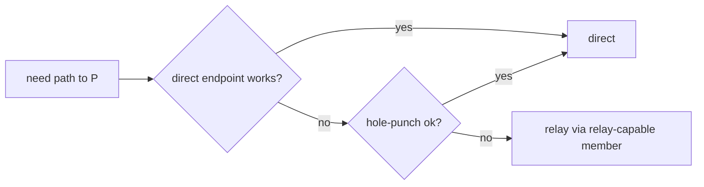

# Feature 05 — Relay & NAT Traversal

**Depends on:** 04
**Unblocks:** 07
**Decisions:** [07](../../decisions/07-relay-as-capability.md), [05](../../decisions/05-swim-full-membership-gossip.md)
**Status:** ⚠️ Partial (2026-07-14 audit). RelayServer, RelayClient, RelaySelector, HolePuncher, and relay framing all implemented + tested. **Must do:** (1) Wire reflexive endpoint discovery from gossip observations (peers learn their public address from what others report); (2) Multi-relay simultaneous selection + failover; (3) Move relay server from `std::thread::spawn` + `thread::sleep` to a valtron `TaskIterator`; (4) End-to-end test: NAT-blocked pair reaches each other via relay with ciphertext-only forwarding at the relay.

## WHY

Make connectivity work through hostile NAT and (later) for browsers: relay is a **distributed,
trustless node capability**, and native peers hole-punch before falling back to a relay.

## WHAT

`shared::relay` (framing, selection, session model) + `native::relay` (relay server, hole-punch):

1. Relay capability advertisement (gossiped) + selection.
2. Trustless ciphertext relay framing + relay sessions.
3. UDP hole-punching coordinated via gossip.
4. Connectivity-ladder resolution (direct → punch → relay).

## HOW

### Capability & selection ([decision 07](../../decisions/07-relay-as-capability.md))

- `Capabilities.relay` set by opt-in nodes (default on for nodes with a public endpoint); rides SWIM.
- Selection: pick relay candidates by SWIM health + RTT + advertised load; may use several; re-select
  on degradation.

### Trustless relay ([decision 07](../../decisions/07-relay-as-capability.md))

- Frame: `{ dst_peer_id: [u8;32], opaque_wg_bytes }`. The relay maintains authenticated **relay
  sessions** (client attaches over the mesh — already a trusted peer) and forwards by `dst_peer_id`
  lookup. **It never decrypts** — WG crypto is end-to-end between the real peers.
- Native relay server: an `OverlayUdp`/UDP endpoint accepting attach + forward; per-session rate
  limits; session GC on idle.

### Hole-punching

- Two peers that can't connect directly exchange observed endpoints via gossip and simultaneously
  send to each other to open NAT mappings (classic UDP hole-punch). Success → direct path; failure →
  relay.
- STUN-like reflexive-address discovery: a peer learns its public endpoint from what others report
  observing (gossiped `endpoints` are the observed source addresses).

### Ladder resolution (completes feature 04's hook)

## Task list

1. Relay framing + `native::relay` server (attach, forward, sessions, rate-limit, GC).
2. Relay client path in the mesh; multi-relay selection + failover.
3. Hole-punching coordinator (gossip-driven endpoint exchange + simultaneous open).
4. Reflexive endpoint discovery from gossiped observations.
5. Tests: two native nodes forced through a simulated symmetric NAT reach each other via relay;
   hole-punch succeeds in a permissive-NAT sim and drops the relay.

## Test plan / success

- NAT-blocked native pair connects via a third relay-capable member (ciphertext-only at the relay).
- Permissive-NAT pair upgrades to direct and stops relaying (success criterion 6).
