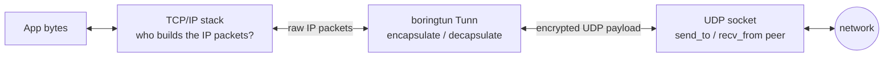
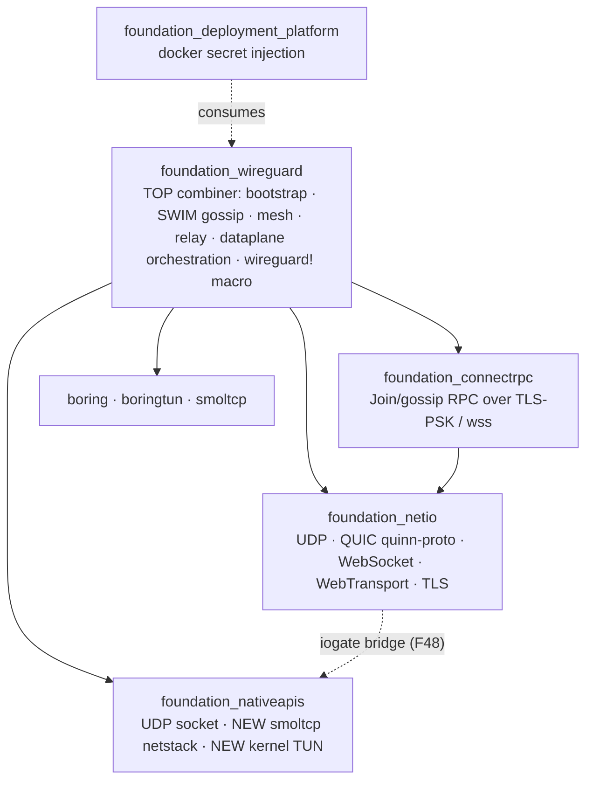

# Requirements — Spec 55: `foundation_wireguard`

**Status:** Draft (decisions resolved, awaiting implementation approval)
**Created:** 2026-07-12
**Owner:** Main Agent
**has_features:** true

---

## Summary

`foundation_wireguard` is a userspace WireGuard® crate that lets any EWE service **stand up a
private, encrypted mesh network and let other services join it** — such that only members of the
network can talk to one another, over WireGuard, entirely in userspace (no kernel WireGuard module
required, and no privileges required in the default mode).

A service starts, instantiates (or joins) a network from a single **bootstrap secret** ("the 128/256
key"), and immediately gets private connectivity to every other member. Membership spreads by
**masterless gossip** (SWIM/Serf full-membership): once any instance knows the network, it spreads
the knowledge naturally, so the network has **no single point of failure** — the first instance is
only a *seed*, and the mesh survives its death.

The bootstrap secret is **ephemeral**: it is a low-entropy-friendly seed that both derives the
initial (shared) bootstrap keypair and authenticates the encrypted join channel. Once a node has
joined, every node rotates onto its **own per-peer identity keypair**, the shared bootstrap key is
retired, and traffic thereafter is authenticated per-peer by WireGuard's own Noise handshake — with
**optional** application-layer mTLS on top for services that want it.

The crate is structured for **native, wasm/browser, Android and iOS** from day one
(`shared/ native/ wasm/ android/ ios/`), and is **easy to instantiate** — via a configuration file,
a programmatic builder, or a `wireguard!` macro — mirroring the ergonomics of `foundation_proxy`.

---

## Why

- **Private service-to-service networking with zero infra.** Services that share a secret can reach
  each other over an encrypted overlay and *nothing else can*. No VPN appliance, no coordinator
  server, no cloud networking product.
- **Resilient by construction.** Masterless gossip means the network is not tied to any one node.
  Kill the seed; the mesh keeps running and keeps accepting joiners from any surviving member.
- **Frictionless bootstrap, strong steady state.** A single pasted secret (or a
  platform-generated-and-injected one) gets you in; the mesh then upgrades itself to per-peer
  identity keys so the shared secret's compromise window is bounded.
- **Truly cross-platform.** Because the data plane can run *entirely in userspace* (see the dual
  data-plane decision), the same networking works in a browser tab, on a phone, and on a server —
  not just on privileged Linux hosts.
- **Deployment-native.** `foundation_deployment_platform`'s Docker capability can generate a network
  secret once and inject it into every container it launches, so a fleet self-assembles into a
  private mesh with no manual key distribution.

---

## Scope

### In scope

- A userspace WireGuard tunnel wrapper over **boringtun 0.7.1** (`noise::Tunn` core), with x25519
  key handling and **seed-derived** deterministic keypairs.
- Two data planes, both added to `foundation_nativeapis`: a **smoltcp userspace TCP/IP netstack**
  (default, portable, unprivileged) and a **kernel TUN device** (opt-in, native, transparent).
- A **bootstrap system**: seed → keypair derivation; a single parser accepting a self-contained
  token *or* a bare seed + separate endpoint; a **TCP+TLS-PSK** join channel (via `boring`) carrying
  a `foundation_connectrpc` `Join`/`PullMembership`/`Announce` RPC.
- **Masterless SWIM/Serf full-membership gossip** for peer discovery, endpoint updates, failure
  detection, and relay/capability advertisement — bootstrapped over the TLS channel, then run
  **inside the tunnel**.
- A **mesh orchestrator** that wires discovered peers into the data plane, drives `Tunn` timers and
  the smoltcp poll loop from a single valtron task, and exposes listener/dialer APIs.
- **Relay as a distributed node capability** (Tailscale-DERP style): browser relay + native
  NAT-traversal fallback; trustless (forwards opaque ciphertext only).
- **wasm/browser support**, implemented in this spec: browser runs `Tunn` + smoltcp, joins via
  `wss` connectrpc, relays WG datagrams over WebSocket to a peer-provided relay, **plus WebRTC**
  direct data channels when NAT permits.
- **WebTransport** transport in `foundation_netio` (porting the sans-I/O `web-transport-proto` onto
  our `quinn-proto` + `http3` substrate) as the later no-HoL relay option.
- **Identity handoff**: per-peer key generation + rotation, ephemeral-seed retirement, and optional
  app-layer mTLS.
- **Tri-config** ergonomics: `wireguard!` macro, programmatic builder, `wireguard.toml`.
- **`foundation_deployment_platform`** integration: generate + inject the network secret into
  containers.

### Out of scope (this spec)

- Kernel WireGuard (`wg`/`wg-quick`) management — we are *userspace only*.
- A general-purpose VPN client/CLI competing with `boringtun-cli` (we may ship a thin demo binary,
  but the product is the library).
- Layer-2 / Ethernet bridging (smoltcp `medium-ethernet`); we operate at **medium-ip** (L3) for the
  overlay.
- Certificate authorities / PKI issuance for the optional mTLS (we pin/derive; CA integration is a
  later concern).
- WebTransport as the *primary* relay (WebSocket is primary; WebTransport is an optimization).

---

## Sources reviewed

| Source | Version / ref | Role |
|--------|---------------|------|
| `boringtun` (Cloudflare) | **0.7.1** (crates.io pin; local master @ `6dcc889`) | Userspace WG Noise state machine (`noise::Tunn`), x25519 re-export |
| `boring` (Cloudflare BoringSSL) | crates.io pin (TBD in decision 01) | TLS-PSK bootstrap/control channel |
| `smoltcp` | **0.8.x** (crates.io; local vendor 0.8.0) | Userspace TCP/IP netstack (added to `foundation_nativeapis`) |
| `moq-dev/web-transport` | `web-transport-proto 0.6`, `web-transport-wasm 0.5` | Reference for WebTransport; proto is sans-I/O and portable onto our QUIC |

> **Crate pinning:** per the owner's direction we track the **master** of `boringtun`/`boring`, but
> the manifests **pin the published crates.io versions** (`boringtun = "0.7.1"`, `boring = "<pinned>"`)
> rather than git — see **[decision 01](decisions/01-source-crates-and-pinning.md)**.

---

## The core technical insight (why smoltcp *and* TUN, and why no tokio)

`boringtun::noise::Tunn` is a **pure crypto state machine** with **no I/O of its own**. It has two
boundaries:



- **Outer boundary (Tunn ⇄ wire):** `encapsulate()` returns ciphertext to `send_to(peer_endpoint)`;
  `decapsulate()` consumes what you `recv_from()`. This is **already fully covered** by
  `foundation_nativeapis::UdpSocket` + `foundation_netio` + io_uring/epoll. smoltcp adds nothing
  here.
- **Inner boundary (app ⇄ Tunn):** `encapsulate()` demands a **fully-formed raw IP packet**, and
  `decapsulate()` returns one. *Something must be the TCP/IP stack* that produces/consumes those L3
  packets. That is the gap our existing crates do **not** fill.

There are exactly two ways to fill it, and we ship **both** (see
**[decision 02](decisions/02-dual-dataplane.md)**):

1. **Kernel TUN** — the OS kernel *is* the TCP/IP stack; we read raw IP off a `/dev/net/tun` fd and
   feed `Tunn`. Transparent to any app, but **native-only and privileged** (`CAP_NET_ADMIN`).
2. **Userspace netstack (smoltcp)** — we run a **TCP/IP protocol implementation in-process** on
   in-memory buffers, so services get real sockets over the tunnel **with no kernel interface and no
   privileges** — the only option that works on **wasm/mobile**.

Crucially: **io_uring/epoll are readiness/completion mechanisms, not a protocol**, and our sockets
are handles into the *kernel's* stack. smoltcp is the *protocol itself*, in our process. It is
**sans-I/O and brings no async runtime** (deps: `managed`, `byteorder`, `bitflags`; **no tokio**),
so it drops into **valtron**: one task drives **both** `Tunn::update_timers()` and
`iface.poll()`, waking on (a) io_uring/epoll UDP readiness and (b) the earlier of `Tunn`'s timer and
smoltcp's `poll_at()`.

---

## High-level architecture

### Crate layering (no cycles — see [decision 14](decisions/14-crate-layering.md))



`foundation_wireguard` sits **strictly above** everything, so it introduces no new cycle. The
smoltcp + TUN additions go **into `foundation_nativeapis`** (data-plane primitives), not netio, so
they never reach back up. The one pre-existing hazard — the netio ↔ nativeapis relationship — is
already handled by the `foundation_iogate` bridge crate (F48); if a lower crate ever needs a WG
type, we repeat that pattern rather than invert the dependency.

### Internal module structure (`foundation_wireguard`)

```
foundation_wireguard/src/
├── shared/          # cross-platform only (no platform re-exports — see feedback_shared_module_purpose)
│   ├── keys/        # seed → x25519 derivation, KeyBytes parsing, identity keys
│   ├── bootstrap/   # token format + single parser (token OR seed+endpoint)
│   ├── membership/  # SWIM state machine, records, incarnation, tombstones (sans-I/O)
│   ├── mesh/        # peer table, dataplane orchestration traits, connectivity ladder
│   ├── relay/       # relay capability model, framing (opaque ciphertext), selection
│   ├── config/      # WgConfig, NetworkConfig, builder types (serde)
│   └── error/
├── native/          # UDP transport, kernel-TUN dataplane, TLS-PSK (boring), relay server, WebTransport gateway
├── wasm/            # browser: Tunn+smoltcp in wasm, wss join, WS relay client, WebRTC data channel
├── android/         # JNI/native reach + optional VpnService TUN adapter
├── ios/             # native reach + optional NetworkExtension TUN adapter
└── lib.rs           # re-exports; wireguard! macro re-export from foundation_macros
```

### The join → steady-state lifecycle

```mermaid
sequenceDiagram
    participant J as Joiner
    participant S as Seed (any member)
    participant M as Mesh (other members)

    Note over J: has bootstrap secret (seed)
    J->>J: derive bootstrap keypair + PSK from seed
    J->>S: TCP + TLS-PSK connect (seed = PSK) [boring]
    J->>S: connectrpc Join / PullMembership
    S-->>J: full membership set {pubkey, tunnel_ip, endpoint, caps, incarnation}
    J->>J: generate OWN random identity keypair
    J->>S: Announce(identity_pubkey, tunnel_ip, endpoint, caps)
    S-->>M: gossip announce (epidemic spread)
    Note over J,M: peers re-pair by per-peer identity keys; bootstrap key retired
    J->>M: WireGuard tunnels (Noise, per-peer static keys)
    Note over J,M: steady-state SWIM gossip runs INSIDE the tunnel (UDP)
    Note over J,M: optional app-layer mTLS on top (per service)
    Note over S: seed retired/rotated — later leak cannot join
```

---

## Feature map

Features are ordered so each is fully finished before the next (per `feedback_finish_features`).
Data-plane primitives land first (they unblock everything), then the WG core, then bootstrap,
discovery, mesh, and finally the platform-reach and ergonomics features.

| # | Feature | Depends on | Summary |
|---|---------|-----------|---------|
| **00** | [nativeapis data-plane primitives](features/00-nativeapis-dataplane-primitives/feature.md) | — | Add smoltcp userspace netstack + kernel TUN device to `foundation_nativeapis`; UDP completion path; the sans-I/O `DataPlane` abstraction both satisfy |
| **01** | [WireGuard core & keys](features/01-wireguard-core-and-keys/feature.md) | 00 | Wrap `boringtun::Tunn`; seed→x25519 derivation; identity keys; valtron tunnel driver (Tunn timers + smoltcp poll in one task) |
| **02** | [Bootstrap & TLS-PSK join](features/02-bootstrap-and-tls-psk-join/feature.md) | 01 | Token format + single parser; TCP+TLS-PSK channel via `boring`; `Join`/`PullMembership`/`Announce` connectrpc service |
| **03** | [SWIM gossip & membership](features/03-swim-gossip-membership/feature.md) | 01 | Sans-I/O SWIM full-membership state machine: records, incarnation, LWW endpoints, suspicion, tombstones, anti-entropy |
| **04** | [Mesh & data-plane orchestration](features/04-mesh-and-dataplane-orchestration/feature.md) | 00,01,02,03 | Wire discovered peers into the data plane; connectivity ladder (direct→relay); listener/dialer API; gossip-in-tunnel |
| **05** | [Relay & NAT traversal](features/05-relay-and-nat-traversal/feature.md) | 04 | Relay-as-capability advertisement; trustless ciphertext forwarding; DERP-style native NAT fallback; hole-punching |
| **06** | [WebTransport in netio](features/06-webtransport-netio/feature.md) | — | Port sans-I/O `web-transport-proto` onto `quinn-proto`+`http3` on valtron; `foundation_netio::webtransport` |
| **07** | [wasm/browser & WebRTC](features/07-wasm-browser-and-webrtc/feature.md) | 04,05,06 | Browser Tunn+smoltcp; wss join; WS relay client; WebRTC direct data channel + signaling over gossip |
| **08** | [Identity handoff & mTLS](features/08-identity-handoff-and-mtls/feature.md) | 04 | Bootstrap→identity rotation; ephemeral-seed retirement/revocation; optional per-service app-layer mTLS |
| **09** | [Config, macro & builder](features/09-config-macro-and-builder/feature.md) | 04 | `wireguard!` macro + programmatic builder + `wireguard.toml`; `#[wireguard_main]` entry |
| **10** | Deployment-platform integration → moved to [spec-53](../../specifications/53-docker-container-testbed/features/wireguard-mesh-integration.md) | 02,09 | Generate network secret; inject WG env into docker containers; container mesh self-assembly |

---

## Decision documents

All architectural forks resolved with the owner are captured under [`decisions/`](decisions/):

| # | Decision | Outcome |
|---|----------|---------|
| [01](decisions/01-source-crates-and-pinning.md) | Source crates & pinning | boringtun 0.7.1 + boring (BoringSSL) + smoltcp, pinned to crates.io versions (track master, pin releases) |
| [02](decisions/02-dual-dataplane.md) | Data-plane model | **Both** smoltcp userspace netstack (default) **and** kernel TUN (opt-in), added to `foundation_nativeapis` |
| [03](decisions/03-seed-derived-keys.md) | Key semantics | 128/256-bit **derivation seed** → KDF → deterministic x25519 keypair |
| [04](decisions/04-bootstrap-token-envelope.md) | Bootstrap token | **One parser** for self-contained token **or** bare seed + separate endpoint |
| [05](decisions/05-swim-full-membership-gossip.md) | Discovery | **Masterless SWIM/Serf full-membership** gossip; survives seed death |
| [06](decisions/06-hybrid-transport-tls-psk.md) | Gossip transport & bootstrap auth | **Hybrid**: TCP+**TLS-PSK** join (via `boring`, seed=PSK) → steady-state gossip **inside** the tunnel |
| [07](decisions/07-relay-as-capability.md) | Relay | **Distributed node capability** (DERP-style): browser relay + native NAT fallback; trustless |
| [08](decisions/08-wasm-browser-and-webrtc.md) | wasm/browser | Implement now: Tunn+smoltcp in browser, wss join, WS relay, **WebRTC** direct P2P |
| [09](decisions/09-webtransport-on-quinn-proto.md) | WebTransport | Port sans-I/O `web-transport-proto` onto our `quinn-proto`+`http3`; lives in `foundation_netio` |
| [10](decisions/10-identity-handoff-and-mtls.md) | Steady-state security | Bootstrap→per-peer identity keys; WG Noise auth; **optional** app-layer mTLS |
| [11](decisions/11-ephemeral-seed-lifecycle.md) | Seed lifecycle | **Ephemeral**: retire/rotate after mesh forms; admission gossiped |
| [12](decisions/12-ipam-addressing.md) | IPAM (proposed) | Tunnel IP **derived from identity pubkey** + gossip collision-detection; operator override |
| [13](decisions/13-tri-config-and-macro.md) | Config ergonomics (proposed) | `wireguard!` macro + builder + `wireguard.toml`, mirroring `foundation_proxy` |
| [14](decisions/14-crate-layering.md) | Layering | `foundation_wireguard` is the top combiner; primitives in nativeapis; iogate-bridge pattern for any inversion |

> Decisions **12** and **13** are **proposed defaults** (not yet owner-confirmed) — flagged inline
> for review.

---

## Success criteria

1. Two processes on one host, given the **same bootstrap secret**, form a WireGuard tunnel and
   exchange application traffic over smoltcp sockets with **no kernel TUN and no privileges**.
2. A third process joins later using the same secret, is discovered by **gossip** (not static
   config), and reaches both existing peers.
3. Killing the **seed** process does not partition the survivors, and a **fourth** joiner can still
   bootstrap from any survivor.
4. After join, peers are observed to be using **per-peer identity keys** (not the shared bootstrap
   key), and the **seed can be revoked** such that a new joiner with the old seed is refused.
5. A **browser** peer (wasm) joins via `wss`, relays WG datagrams through a peer-provided relay, and
   (where NAT permits) upgrades to a **direct WebRTC** path — reaching a native peer's service.
6. A native peer behind restrictive NAT reaches another via **relay fallback** while preferring
   direct UDP when hole-punching succeeds.
7. The same network is expressible three ways — `wireguard!` macro, builder, and `wireguard.toml` —
   all converging on one `WgConfig`.
8. `foundation_deployment_platform` launches N containers with a generated secret injected as env,
   and they self-assemble into one private mesh.
9. Zero `tokio` in the dependency tree; all async orchestration on **valtron**.

---

## Cross-cutting constraints

- **House Rust standards** — read the `rust-clean-code` skill before writing Rust; tests in
  `tests/`, WHY/WHAT/HOW docs, imports at file top, `tracing` not `eprintln`, valtron tasks use
  `BoxedExecutionAction`/`BoxedSendExecutionAction` (never `NoAction`).
- **Async canonical, sync wraps** — async holds the real logic; sync entry points wrap via valtron.
- **Sans-I/O cores** — `Tunn`, smoltcp, the SWIM state machine, and `web-transport-proto` are all
  driven, not self-running; keep them pure and testable, drive them from valtron tasks.
- **`--profile uat` for tests** (cranelift dev backend can't `catch_unwind`); watch the valtron
  multi-pool test-hang pitfalls (a failing assert inside a valtron task wedges the test).
- **No silent defaults** for identity/name/endpoint — error or panic, never invent.
